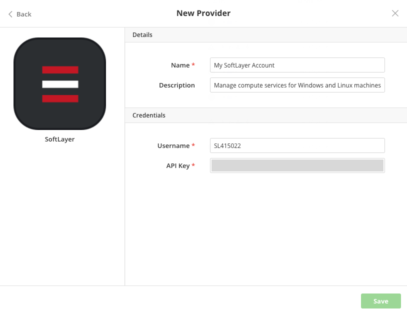

{{{
"title": "Using SoftLayer",
"date": "09-01-2016",
"author": "",
"attachments": [],
"contentIsHTML": false
}}}

### Using SoftLayer

Automate application deployments through Cloud Application Manager when you launch to Linux or Windows virtual servers in the IBM SoftLayer public cloud. Cloud Application Manager simplifies deployments with a dedicated focus on applications rather than infrastructure. See [Benefits](//www.ctl.io/cloud-application-manager/#Benefits) and [Use Cases](//www.ctl.io/cloud-application-manager/#UseCases).

**In this article:**

* Register SoftLayer provider in Cloud Application Manager
* Deploy to SoftLayer from Cloud Application Manager

### Register SoftLayer Provider in Cloud Application Manager

You need a [SoftLayer account](http://www.softlayer.com/info/free-cloud) to be able to deploy from Cloud Application Manager. When you have an account, follow these steps to register it in Cloud Application Manager to automate your deployments.

**Steps**
1. Log in to the [SoftLayer portal](https://control.softlayer.com/).

2. Under Account > Users > API Key, click **Generate** to create an API Key or click **View** to copy it. Cloud Application Manager needs the key to make API requests on your behalf.
   

3. Copy the API key.

4. In Cloud Application Manager, go to Providers > New Provider and select **SoftLayer**.

5. Enter the SoftLayer username and API Key as shown and save.
   

### Deploy to SoftLayer from Cloud Application Manager
Select from the following deployment profile options to launch workloads on Linux or Windows machines.

Note a couple of things about instances you deploy on SoftLayer through Cloud Application Manager.
* Tags. You can apply up to six provider tags on any instance you deploy on SoftLayer if you’ve [defined the tags](../Administering Your Organization/resource-tags.md) in the Cloud Application Manager admin console.
* Instance name. Depending on the number of instances you spin up through Cloud Application Manager, each instance is assigned a name that has the format of service_ID-instance_number.domain.com.

**Deployment**

| Option | Description |
|--------|-------------|
| Provider | Select a SoftLayer account registered in Cloud Application Manager. |

**Resource**

| Option | Description |
|--------|-------------|
| Cores | Select virtual CPUs for the instance. For dedicated processing speed that others don’t share, choose private. You can get up to 8 private cores and up to 16 public. |
| Memory | Allocate RAM for the instance. |
| Operating System | Select from a list of SoftLayer Linux or Windows images. Images are specific to the box service type, that is, Linux or Windows. |
| SSH Key |	Select a public key to SSH into the Linux or Windows instance. The drop-down shows keys [added to your SoftLayer account](https://knowledgelayer.softlayer.com/procedure/add-ssh-key). |
| Instances | Specify the number of instances to provision. |

**Block Devices**

By default, the machine is provisioned with 25GB local disk space. You can increase local system or portable SAN disk space. Get up to 400 local disk space or up to 2.1 TB of SAN storage

**Network**

| Option | Description |
|--------|-------------|
| Datacenter | Select a location to place the instance. |
| Uplink Port Speed	| Optionally, upgrade the speed of the instance network port. By default, it is 10 Mbps. But you can upgrade to 100 or 1000 Mbps for private use, meaning no one else shares the network interface card port. |

### Contacting Cloud Application Manager Support

We’re sorry you’re having an issue in [Cloud Application Manager](https://www.ctl.io/cloud-application-manager/). Please review the [troubleshooting tips](../Troubleshooting/troubleshooting-tips.md), or contact [Cloud Application Manager support](mailto:incident@CenturyLink.com) with details and screenshots where possible.

For issues related to API calls, send the request body along with details related to the issue.

In the case of a box error, share the box in the workspace that your organization and Cloud Application Manager can access and attach the logs.
* Linux: SSH and locate the log at /var/log/elasticbox/elasticbox-agent.log
* Windows: RDP into the instance to locate the log at ProgramDataElasticBoxLogselasticbox-agent.log
