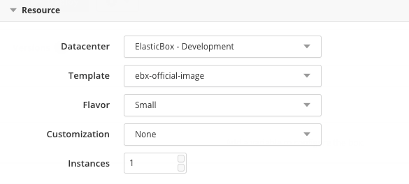
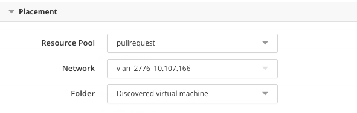
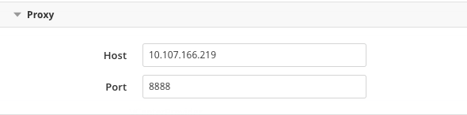
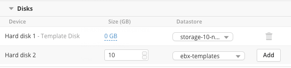

{{{ "title": "Using the VMware vCenter Private Datacenter",
"date": "05-06-2019",
"author": "CenturyLink",
"keywords": ["cam", "cloud application manager", "vmware", "vsphere", "vcenter"],
"attachments": [],
"contentIsHTML": false
}}}

**In this article:**
- [Overview](#overview)
- [Audience](#audience)
- [Prerequisites](#prerequisites)
- [Required Permissions](#required-permissions)
- [Bootstrapping virtual machine templates with the Cloud Application Manager Agent](#bootstrapping-virtual-machine-templates-with-the-cloud-application-manager-agent)
- [Registering a vCenter provider in Cloud Application Manager](#registering-a-vcenter-provider-in-cloud-application-manager)
- [Deploying in Your vCenter](#deploying-in-your-vcenter)
- [Getting General Support](#getting-general-support)
  - [Contact:](#contact)
  - [Instructions:](#instructions)

### Overview

This article is meant to assist users of Cloud Application Manager to configure a VMware vCenter provider and deploy virtual machines with it.

### Audience

All users of Cloud Application Manager using VMware vCenter providers.

### Prerequisites

* An active *Cloud Application Manager* account
* Access and credentials to a VMware vCenter 5.5 or later.
* A virtual machine template (Linux or Windows) on the vCenter server. Virtual machine templates has to be bootstrapped with the Cloud Application Manager Agent.
* If the vCenter is behind a firewall, has to be open on the firewall:
	* 443/TCP incoming to vCenter server: for Cloud Application Manager to make API calls on vCenter.
	* 443/TCP outgoing: to allow Cloud Application Manager Agents running on the deployed virtual machines to connect back to Cloud Application Manager.

### Required Permissions

A vCenter user needs at least the following permissions be able to authenticate, deploy and manage instances through Cloud Application Manager. Although this list was compiled for vCenter 5.5, similar permissions apply for later versions.

| Assign access for | With privileges |
|-------------------|-----------------|
| Datastore | <li>Allocate space</li><li>Browse datastore</li> |
| Global |	Cancel task |
| Manage custom attributes | Set custom attribute |
| Network |	Assign network |
| Resource | Assign virtual machine to resource pool |
| Scheduled task | <li>Create tasks</li><li>Run task</li> |
| Tasks | <li>Create tasks</li> |
| Virtual machine (Configuration) | <li>Add new disk</li><li>Add or remove device</li><li>Advanced</li><li>Change CPU count</li><li>Change resource</li><li>Memory</li><li>Modify device settings</li><li>Remove disk</li><li>Rename</li><li>Reset guest information</li><li>Set annotation</li><li>Settings</li> |
| Virtual machine (Interaction) | <li>Answer question</li><li>Configure CD media</li><li>Power Off</li><li>Power On</li> |
| Virtual machine (Inventory) | <li>Create from existing</li><li>Create new</li><li>Remove</li> |
| Virtual machine (Provisioning) | <li>Customize</li><li>Deploy template</li><li>Modify customization specification</li><li>Read customization specifications</li> |

### Bootstrapping virtual machine templates with the Cloud Application Manager Agent

vCenter templates need elasticbox-init to allow the Cloud Application Manager agent to execute box scripts at deploy time.

**Linux**

Follow these steps to install elasticbox-init on a Linux template.


1. Log in to the vSphere client and open the Linux virtual machine.

2. SSH into the virtual machine.

3. [Install the VMware tools.](https://www.vmware.com/support/ws55/doc/ws_newguest_tools_linux.html)

4. Run this command with root privileges to install elasticbox-init:

   ```
	 curl -L https://cam.ctl.io/agent/linux/vsphere/template_customization_script.sh | sudo bash
	 ```

   * **Note:** If running Cloud Application Manager as an appliance, replace cam.ctl.io with the appliance hostname or IP address.

**Windows**

Follow these steps to run a script that creates a scheduled task on a Windows Server 2012 template. When you deploy, Cloud Application Manager clones this template and installs the agent using the scheduled task.

1. Log in to the Windows Server 2012 virtual machine template using remote desktop protocol (RDP).

2. [Install the VMware tools](https://kb.vmware.com/selfservice/microsites/search.do?language=en_US&cmd=displayKC&externalId=1018377).

3. [Download the scheduled task script.](https://cam.ctl.io/agent/windows/vsphere/template_customization_script.ps1)

   * **Note:** If running Cloud Application Manager as an appliance, replace cam.ctl.io with the appliance hostname or IP address.

4. Right-click the script and click **Run PowerShell**.

### Registering a vCenter provider in Cloud Application Manager

In order to deploy to a vCenter private datacenter, you must first provide information to connect. Currently, Cloud Application Manager only supports the vCenter API for vSphere.

**Steps**

1. In Cloud Application Manager, click **Providers** > **New Provider**.

2. Select **VMware vSphere**.

3. Enter the endpoint URL for the vCenter server and a username, password to the vCenter API.
   * **Note:** The endpoint URL can be a hostname or an IP address, and has to be prefixed with **https://**. Be sure to use https and not http.

   

By default, newly created providers use the recent implementation of vSphere client, while existing providers stick to a legacy implementation. A toggle labeled **Legacy Mode** is introduced to migrate away from legacy mode, or to turn back to it, in case an unforseen regression would appear with the upgrade. We recommend all our customers to use the recent implementation, and to migrate away from the legacy implementation as possible.

### Deploying in Your vCenter

Select deployment metadata from a deployment profile to launch VMs to your vCenter Server.

**Deployment**

| Deployment Option | Description |
|-------------------|-------------|
| Provider | Select a vCenter account registered in Cloud Application Manager. |


**Resource**



| Deployment Option | Description |
|-------------------|-------------|
| Datacenter | Select the datacenter whose objects are available for your vCenter deployment like hosts, clusters, resource pools, folders. |
| Template | Select the OS template based on which you deploy the instance. Only Linux templates show for Linux boxes as do Windows templates for Windows boxes. |
| Flavor | Select a template size for CPU and memory. Tiny, Small, Medium are sizes Cloud Application Manager provides. Or choose from ones you added. For example, if you choose **Tiny**, the instance is provisioned with 1 CPU and 1GB of RAM. By default, Cloud Application Manager provides template sizes as flavors based on compute and memory capacity. In addition to these flavors, you can add custom ones to the vCenter account in Cloud Application Manager in the Configuration tab. Under Flavors, click **New** and specify the CPU and memory. |
| Customization | This is optional. Apply a custom specification to the instance. It usually has settings to configure the OS and network. |
| Instances | Select the number of machines to provision. |


**Placement**



| Deployment Option | Description |
|-------------------|-------------|
| Compute Resource | Place the VM in a host, cluster, vApp, or resource pool in the datacenter. Select **Any host** to place in a host Cloud Application Manager picks randomly. |
| Network |	Select the network for the instance. |
| Folder | From the folders shown, select one to place the VM. |


**Proxy**



| Option | Description |
|-------------------|-------------|
| Host |	The hostname or domain of the proxy that the agent will use to connect back to Cloud Application Manager, once it has been installed in the deployed instance. |
| Port |  The port of the proxy that the agent will use to connect back to Cloud Application Manager, once it has been installed in the deployed instance. |


**Disks dd**



| Deployment Option | Description |
|-------------------|-------------|
| Disks	| By default, an instance gets the template disk. For more storage, increase the template disk size and add up to seven more disks.<li>You can’t remove the template disk, but you can adjust its size. Type in the new size and press enter to save changes.</li><li>To add a disk, select a datastore from available ones in the datacenter. Specify the size in gigabytes, and click **Add**. Each disk can be up to 62 TB, disk can be up to 62 TB, but if the datastore doesn’t have such capacity, the instance won’t deploy.</li><li>Note that additional disks communicate through the same controller as the template disk.</li> |

### Getting General Support

Customers can contact the CenturyLink Global Operations Support center (support desk) directly for getting help with Cloud Application Manager as well as any other supported product that they’ve subscribed to.  Below are three ways to get help.

#### Contact:

1. **Phone:** 888-638-6771

2. **Email:** incident@centurylink.com

3. **Create Ticket in Cloud Application Manager:** Directly within the platform, users can “Create Ticket” by clicking on the “?” symbol in upper right corner near the users log-in profile icon.  This takes users directly to the Managed Servicers Portal where they can open, track and review status of issues that have been raised with the support desk.  Additionally, this is how a TAM can be engaged as well.

#### Instructions:

1. Provide your name
2. Cloud Application Manager account name
3. A brief description of your request or issue for case recording purposes

The support desk will escalate the information to the Primary TAM and transfer the call if desired.
