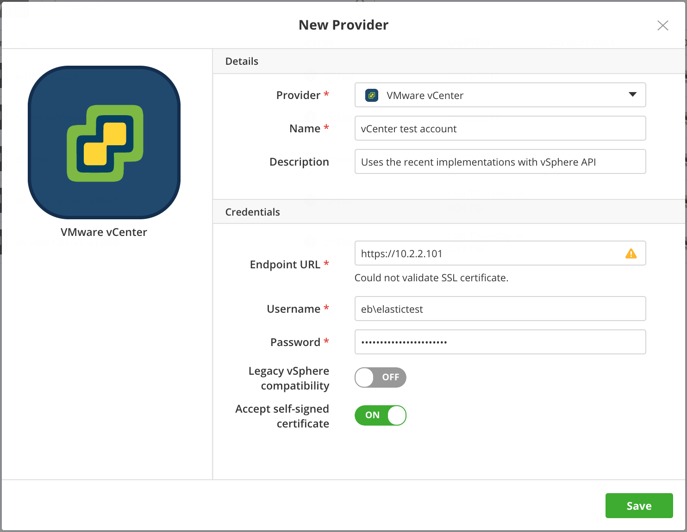

{{{ "title": "Using the VMware vCenter Private Datacenter",
"date": "09-01-2016",
"author": "",
"attachments": [],
"contentIsHTML": false
}}}


### Using the VMware vCenter Private Datacenter

**In this article:**

* Prerequisites
* Registering your vCenter in Cloud Application Manager
* Deploying in your vCenter

### Prerequisites

* vCenter server is version 5.0 or later.
* vCenter has at least one Windows or Linux template to connect your account successfully in Cloud Application Manager.
* vCenter templates are bootstrapped with the Cloud Application Manager agent.
* If your vCenter datacenter is behind a firewall, open the following ports to allow Cloud Application Manager users, the Cloud Application Manager agent, and instances to communicate with each other.
	* Ports 443: Allows users behind a firewall to access Cloud Application Manager and allow the vCenter VMs to talk to Cloud Application Manager.
	* Port 8085: Allows Cloud Application Manager to communicates over this port with vCenter, sync with vCenter configuration, and run instance operations on virtual machines.

### Minimum User Permissions

A vCenter user needs minimum rights to be able to authenticate, deploy and manage instances through Cloud Application Manager. Although these are for vCenter 5.5, similar permissions apply for earlier versions.

| Assign access for | With privileges |
|-------------------|-----------------|
| Datastore | <li>Allocate space</li><li>Browse datastore</li> |
| Global |	Cancel task |
| Manage custom attributes | Set custom attribute |
| Network |	Assign network |
| Resource | Assign virtual machine to resource pool |
| Scheduled task | <li>Create tasks</li><li>Run task</li> |
| Tasks | <li>Create tasks</li> |
| Virtual machine (Configuration) | <li>Add new disk</li><li>Add or remove device</li><li>Advanced</li><li>Change CPU count</li><li>Change resource</li><li>Memory</li><li>Modify device settings</li><li>Remove disk</li><li>Rename</li><li>Reset guest information</li><li>Set annotation</li><li>Settings</li> |
| Virtual machine (Interaction) | <li>Answer question</li><li>Configure CD media</li><li>Power Off</li><li>Power On</li> |
| Virtual machine (Inventory) | <li>Create from existing</li><li>Create new</li><li>Remove</li> |
| Virtual machine (Provisioning) | <li>Customize</li><li>Deploy template</li><li>Modify customization specification</li><li>Read customization specifications</li> |

### Bootstrapping VM Templates with the Cloud Application Manager Agent

vCenter templates need elasticbox-init to allow the Cloud Application Manager agent to execute box scripts at deploy time.

**Linux**
Follow these steps to install elasticbox-init on a Linux template.

**Steps**
1. Log in to the vSphere client and open the Linux virtual machine.

2. SSH into the virtual machine.

3. [Install the VMware tools.](https://www.vmware.com/support/ws55/doc/ws_newguest_tools_linux.html)

4. Run this command with root privileges to install elasticbox-init:

   ```
	 curl -L https://cam.ctl.io/agent/linux/vsphere/template_customization_script.sh | sudo bash
	 ```

   * **Note:** If running Cloud Application Manager as an appliance, replace cam.ctl.io with the appliance hostname or IP address.

**Windows**

Follow these steps to run a script that creates a scheduled task on a Windows Server 2012 template. When you deploy, Cloud Application Manager clones this template and installs the agent using the scheduled task.

**Steps**
1. Log in to the Windows Server 2012 virtual machine template using remote desktop protocol (RDP).

2. [Install the VMware tools](https://kb.vmware.com/selfservice/microsites/search.do?language=en_US&cmd=displayKC&externalId=1018377).

3. [Download the scheduled task script.](https://cam.ctl.io/agent/windows/vsphere/template_customization_script.ps1)

   * **Note:** If running Cloud Application Manager as an appliance, replace cam.ctl.io with the appliance hostname or IP address.

4. Right-click the script and click **Run PowerShell**.

### Registering Your vCenter in Cloud Application Manager

In order to deploy to a vCenter private datacenter, you must first provide information to connect. Currently, Cloud Application Manager only supports the vCenter API for vSphere.

**Steps**
1. In Cloud Application Manager, click **Providers** > **New Provider**.

2. Select **VMware vSphere**.

3. Enter the endpoint URL for the vCenter server and a username, password to the vCenter API.
   * **Note:** The endpoint URL must be in the form of **https://<servername>** or **https://<ipaddress>**. Be sure to use https and not http.

   

### Deploying in Your vCenter

Select deployment metadata from a deployment profile to launch VMs to your vCenter Server.


**Deployment**

| Deployment Option | Description |
|-------------------|-------------|
| Provider | Select a vCenter account registered in Cloud Application Manager. |


**Resource**

| Deployment Option | Description |
|-------------------|-------------|
| Datacenter | Select the datacenter whose objects are available for your vCenter deployment like hosts, clusters, resource pools, folders. |
| Template | Select the OS template based on which you deploy the instance. Only Linux templates show for Linux boxes as do Windows templates for Windows boxes. |
| Flavor | Select a template size for CPU and memory. Tiny, Small, Medium are sizes Cloud Application Manager provides. Or choose from ones you added. For example, if you choose **Tiny**, the instance is provisioned with 1 CPU and 1GB of RAM. By default, Cloud Application Manager provides template sizes as flavors based on compute and memory capacity. In addition to these flavors, you can add custom ones to the vCenter account in Cloud Application Manager in the Configuration tab. Under Flavors, click **New** and specify the CPU and memory. |
| Customization | This is optional. Apply a custom specification to the instance. It usually has settings to configure the OS and network. |
| Instances | Select the number of machines to provision. |


**Placement**

| Deployment Option | Description |
|-------------------|-------------|
| Compute Resource | Place the VM in a host, cluster, vApp, or resource pool in the datacenter. Select **Any host** to place in a host Cloud Application Manager picks randomly. |
| Network |	Select the network for the instance. |
| Folder | From the folders shown, select one to place the VM. |


**Disks dd**

| Deployment Option | Description |
|-------------------|-------------|
| Disks	| By default, an instance gets the template disk. For more storage, increase the template disk size and add up to seven more disks.<li>You can’t remove the template disk, but you can adjust its size. Type in the new size and press enter to save changes.</li><li>To add a disk, select a datastore from available ones in the datacenter. Specify the size in gigabytes, and click **Add**. Each disk can be up to 62 TB, disk can be up to 62 TB, but if the datastore doesn’t have such capacity, the instance won’t deploy.</li><li>Note that additional disks communicate through the same controller as the template disk.</li> |

### Contacting Cloud Application Manager Support

We’re sorry you’re having an issue in [Cloud Application Manager](https://www.ctl.io/cloud-application-manager/). Please review the [troubleshooting tips](../Troubleshooting/troubleshooting-tips.md), or contact [Cloud Application Manager support](mailto:incident@CenturyLink.com) with details and screenshots where possible.

For issues related to API calls, send the request body along with details related to the issue.

In the case of a box error, share the box in the workspace that your organization and Cloud Application Manager can access and attach the logs.
* Linux: SSH and locate the log at /var/log/elasticbox/elasticbox-agent.log
* Windows: RDP into the instance to locate the log at ProgramDataElasticBoxLogselasticbox-agent.log
