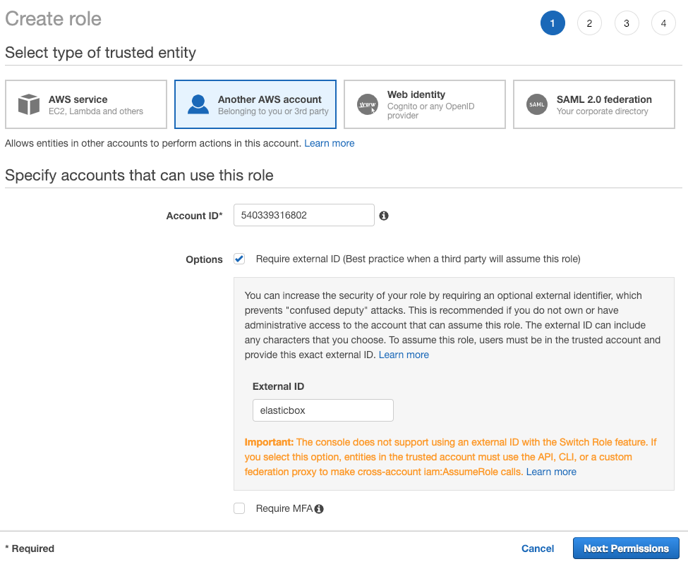
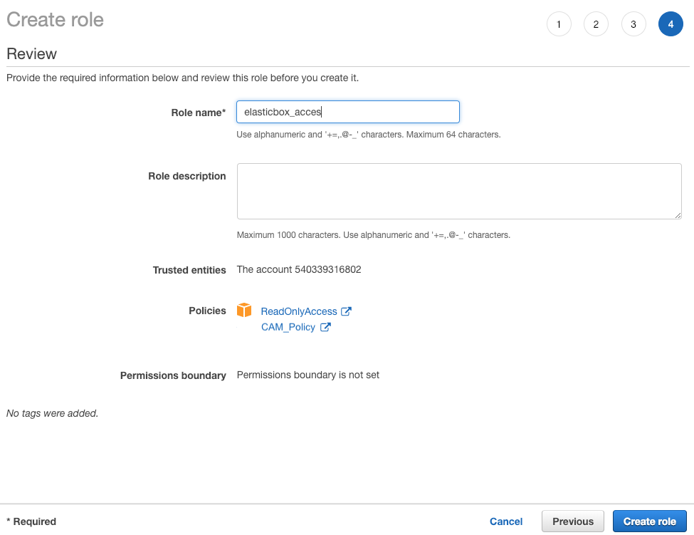
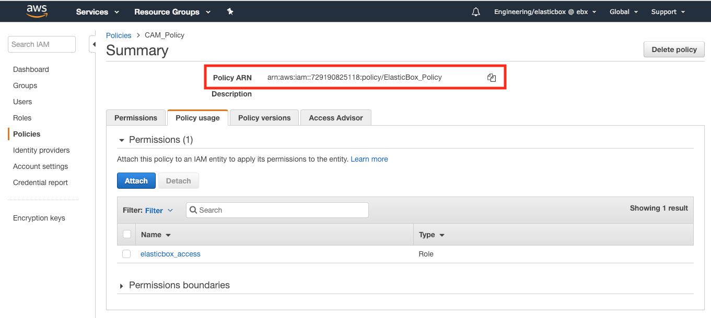
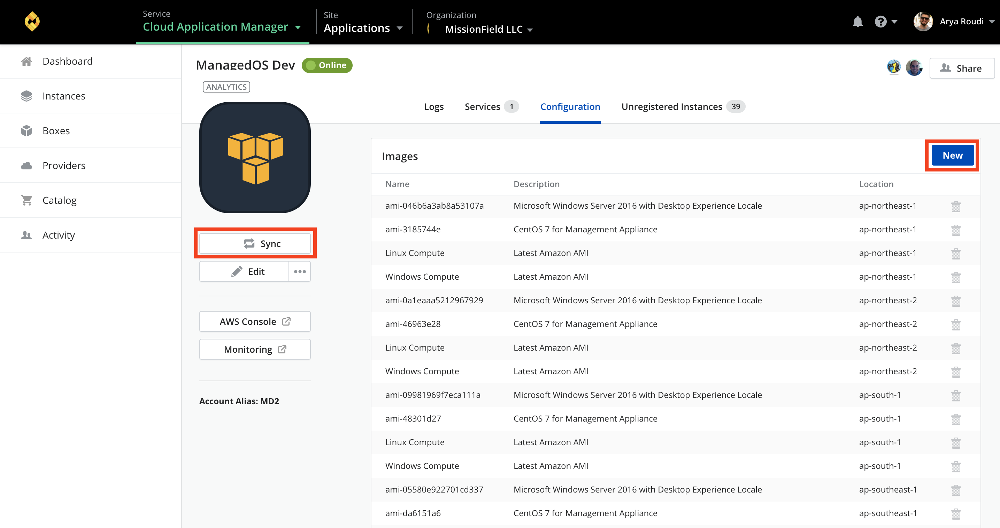
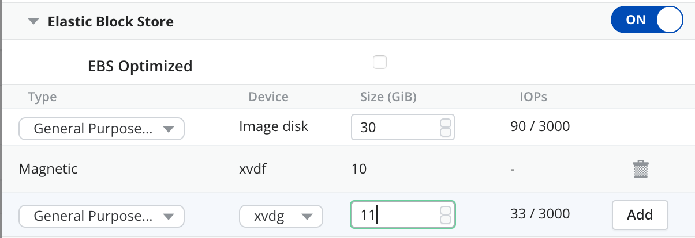

{{{
"title": "Using AWS",
"date": "12-28-2018",
"author": "Guillermo Sanchez, Julio Castanar",
"keywords": ["aws", "ecs", "deploy"],
"attachments": [],
"contentIsHTML": false
}}}

**In this article:**

* [Overview](#overview)
* [Audience](#audience)
* [Prerequisites](#prerequisites)
* [Connect your AWS Account in Cloud Application Manager](#connect-your-aws-account-in-cloud-application-manager)
* [Create a custom AWS Policy](#create-a-custom-aws-policy)
* [Create an IAM Role with the Policy chosen](#create-an-iam-role-with-the-policy-chosen)
* [Add Custom AMIs in Cloud Application Manager](#add-custom-amis-in-cloud-application-manager)
* [Deploy to your AWS Account](#deploy-to-your-aws-account)
* [EC2 (Linux and Windows)](#ec2-linux-and-windows)
* [AWS ECS](#aws-ecs)
* [Shutdown and Terminate Instances in AWS](#shutdown-and-terminate-instances-in-aws)
* [Contacting Cloud Application Manager Support](#contacting-cloud-application-manager-support)

### Overview

This article is meant to assist users of Cloud Application Manager to learn how to deploy any workload to AWS from Cloud Application Manager as follows.

* For EC2 (Linux and Windows) use [deployment policies](../Automating Deployments/deploymentpolicy-box.md). Select a policy when you launch workloads from boxes.
* For any other AWS service, configure a custom [CloudFormation box](../Automating Deployments/template-box.md), selecting as provider `AWS Provider`.

Cloud Application Manager orchestrates with AWS APIs in the backend to provision, install, and manage the lifecycle of your workloads based on the box configuration.

### Audience

All Cloud Application Manager users who wants to deploy workloads into AWS.

### Prerequisites

* Access to Cloud Application Manager [Management site](https://account.cam.ctl.io/#/providers?type=Amazon-Web-Services).
* The user must have an existing AWS account or should be an Administrator of the organization in Cloud Application Manager to [create](../Cloud Optimization/partner-cloud-integration-aws-new.md) or [bring](../Cloud Optimization/partner-cloud-integration-aws-existing.md) an AWS account to be managed by CenturyLink.

### Connect your AWS Account in Cloud Application Manager

Before you deploy in AWS, you need to connect your AWS account in Cloud Application Manager. The following steps walks you through this process. 


### Create a custom AWS Policy

1. Go to [AWS Services console](https://console.aws.amazon.com) and login into your account.  
You can reach this console from the **AWS Console** button located in your AWS Provider details page in Cloud Application Manager and you will be directly logged in.

2. Create a custom AWS Policy.  
Go to top **Services** menu and in Security, Identity, & Compliance section, select **IAM**. Then select **Policies** in the left side menu.


3. Click on **Crete policy** button and select Create your own policy.  
   There are several ways to add a policy. Here we will describe how to use a JSON snippet.  
   Select **JSON** tab in new Amazon Create policy page and continue editing the snippet displayed below in [Choosing the right policy](#choosing-the-right-policy).


4. When edited, click on **Review policy** and if there are no errors you will be prompted to give a name and a description for this policy. Save changes clicking on **Create policy** at the bottom of the page.


In this example we give the name *CAM_Policy*. It will be used later.

#### Choosing the right policy

The AWS IAM Policy regulates what Cloud Application Manager is allowed to do and see from your account. Depending on your usage you might want to restrict more or less the operations allowed.

To be able to deploy AWS CloudFormation you will need to have the appropriated permissions in the policy, so you should give access to the services you are planning to use.

For example, if you are planning to deploy RDS and ElastiCache from CloudFormation templates, it useful to give the permissions for them like in the next lines:  

```json
"rds:*",
"elasticache:*"
```

Here is a complete example of a common policy that give access to some AWS services but not all:

```json
{
    "Version": "2012-10-17",
    "Statement": [
        {
            "Action": [
                "autoscaling:*",
                "cloudformation:*",
                "cloudwatch:DescribeAlarms",
                "dynamodb:*",
                "ec2:*",
                "ecs:ListClusters",
                "elasticache:*",
                "elasticloadbalancing:*",
                "iam:CreateUser",
                "iam:DeleteUser",
                "iam:ListAccessKeys",
                "iam:ListUserPolicies",
                "iam:ListServerCertificates",
                "iam:PutUserPolicy",
                "iam:GetUser",
                "iam:CreateAccessKey",
                "iam:DeleteUserPolicy",
                "iam:DeleteAccessKey",
                "iam:PassRole",
                "iam:ListRoles",
                "iam:ListInstanceProfilesForRole",
                "iam:CreatePolicy",
                "iam:DeletePolicy",
                "iam:CreateRole",
                "iam:DeleteRole",
                "iam:AttachRolePolicy",
                "iam:DetachRolePolicy",
                "rds:*",
                "route53:*",
                "route53domains:*",
                "s3:*",
                "sns:*",
                "ce:*",
                "support:*",
                "sts:AssumeRole"
            ],
            "Sid": "Stmt1378777340000",
            "Resource": [
                "*"
            ],
            "Effect": "Allow"
        }
    ]
}
```

The full list of possible actions is described [here](http://docs.aws.amazon.com/IAM/latest/UserGuide/reference_policies_actionsconditions.html).

If you are not planning to use CloudFormation template boxes and you want to use Script Boxes and Deployment Policy Boxes, here is the minimal policy required for them to work:

```json
{
    "Version": "2012-10-17",
    "Statement": [
        {
            "Action": [
                "autoscaling:CreateAutoScalingGroup",
                "autoscaling:CreateLaunchConfiguration",
                "autoscaling:DeleteAutoScalingGroup",
                "autoscaling:DeleteLaunchConfiguration",
                "autoscaling:DescribeScalingActivities",
                "autoscaling:DescribeAutoScalingGroups",
                "autoscaling:DescribeAutoScalingInstances",
                "autoscaling:DescribeLaunchConfigurations",
                "autoscaling:ResumeProcesses",
                "autoscaling:SuspendProcesses",
                "autoscaling:TerminateInstanceInAutoScalingGroup",
                "autoscaling:UpdateAutoScalingGroup",
                "cloudformation:CreateStack",
                "cloudformation:DeleteStack",
                "cloudformation:DescribeStackEvents",
                "cloudformation:DescribeStackResource",
                "cloudformation:DescribeStackResources",
                "cloudformation:DescribeStacks",
                "cloudformation:GetTemplate",
                "cloudformation:ListStacks",
                "cloudformation:ListStackResources",
                "cloudformation:UpdateStack",
                "cloudformation:ValidateTemplate",
                "cloudwatch:DescribeAlarms",
                "dynamodb:CreateTable",
                "dynamodb:DeleteTable",
                "dynamodb:DescribeTable",
                "dynamodb:ListTables",
                "ec2:AssociateAddress",
                "ec2:AttachVolume",
                "ec2:AllocateAddress",
                "ec2:AuthorizeSecurityGroupEgress",
                "ec2:AuthorizeSecurityGroupIngress",
                "ec2:CopyImage",
                "ec2:CreateImage",
                "ec2:CreateSecurityGroup",
                "ec2:CreateSnapshot",
                "ec2:CreateSubnet",
                "ec2:CreateTags",
                "ec2:CreateVolume",
                "ec2:DeleteSecurityGroup",
                "ec2:DeleteSubnet",
                "ec2:DeleteTags",
                "ec2:DeleteVolume",
                "ec2:DescribeAccountAttributes",
                "ec2:DescribeAddresses",
                "ec2:DescribeAvailabilityZones",
                "ec2:DescribeImageAttribute",
                "ec2:DescribeImages",
                "ec2:DescribeInstanceAttribute",
                "ec2:DescribeInstanceStatus",
                "ec2:DescribeInstances",
                "ec2:DescribeKeyPairs",
                "ec2:DescribePlacementGroups",
                "ec2:DescribeRegions",
                "ec2:DescribeSecurityGroups",
                "ec2:DescribeSubnets",
                "ec2:DescribeTags",
                "ec2:DescribeVolumeAttribute",
                "ec2:DescribeVolumeStatus",
                "ec2:DescribeVolumes",
                "ec2:DescribeVpcAttribute",
                "ec2:DescribeVpcs",
                "ec2:DescribeVpnConnections",
                "ec2:DetachVolume",
                "ec2:RebootInstances",
                "ec2:RegisterImage",
                "ec2:ReleaseAddress",
                "ec2:RevokeSecurityGroupEgress",
                "ec2:RevokeSecurityGroupIngress",
                "ec2:RunInstances",
                "ec2:StartInstances",
                "ec2:StopInstances",
                "ec2:TerminateInstances",
                "ecs:ListClusters",
                "elasticache:*",
                "elasticloadbalancing:ConfigureHealthCheck",
                "elasticloadbalancing:CreateLoadBalancer",
                "elasticloadbalancing:CreateLoadBalancerPolicy",
                "elasticloadbalancing:DeleteLoadBalancer",
                "elasticloadbalancing:DeleteLoadBalancerPolicy",
                "elasticloadbalancing:DeregisterInstancesFromLoadBalancer",
                "elasticloadbalancing:DescribeInstanceHealth",
                "elasticloadbalancing:DescribeLoadBalancerPolicies",
                "elasticloadbalancing:DescribeLoadBalancers",
                "elasticloadbalancing:DescribeTargetGroups",
                "elasticloadbalancing:DescribeTargetHealth",
                "elasticloadbalancing:ModifyLoadBalancerAttributes",
                "elasticloadbalancing:RegisterInstancesWithLoadBalancer",
                "elasticloadbalancing:RegisterTargets",
                "elasticloadbalancing:SetLoadBalancerPoliciesOfListener",
                "iam:CreateUser",
                "iam:DeleteUser",
                "iam:ListAccessKeys",
                "iam:ListUserPolicies",
                "iam:ListServerCertificates",
                "iam:PutUserPolicy",
                "iam:GetUser",
                "iam:CreateAccessKey",
                "iam:DeleteUserPolicy",
                "iam:DeleteAccessKey",
                "iam:PassRole",
                "iam:ListRoles",
                "iam:ListInstanceProfilesForRole",
                "iam:CreatePolicy",
                "iam:DeletePolicy",
                "iam:CreateRole",
                "iam:DeleteRole",
                "iam:AttachRolePolicy",
                "iam:DetachRolePolicy",
                "rds:AuthorizeDBSecurityGroupIngress",
                "rds:AddTagsToResource",
                "rds:CreateDBInstance",
                "rds:CreateDBSecurityGroup",
                "rds:CreateDBSnapshot",
                "rds:DeleteDBInstance",
                "rds:DeleteDBSecurityGroup",
                "rds:DeleteDBSnapshot",
                "rds:DescribeDBInstances",
                "rds:DescribeDBParameterGroups",
                "rds:DescribeDBParameters",
                "rds:DescribeDBSecurityGroups",
                "rds:DescribeDBSnapshots",
                "rds:DescribeDBEngineVersions",
                "rds:DescribeDBSubnetGroups",
                "rds:DescribeOptionGroups",
                "rds:ModifyDBInstance",
                "rds:ModifyDBSubnetGroup",
                "rds:RebootDBInstance",
                "rds:RemoveTagsFromResource",
                "rds:RestoreDBInstanceFromDBSnapshot",
                "rds:RevokeDBSecurityGroupIngress",
                "s3:CreateBucket",
                "s3:DeleteBucket",
                "s3:DeleteBucketPolicy",
                "s3:GetBucketAcl",
                "s3:GetBucketCORS",
                "s3:GetBucketLocation",
                "s3:ListAllMyBuckets",
                "s3:ListBucket",
                "s3:PutBucketAcl",
                "s3:PutBucketCORS",
                "s3:PutBucketPolicy",
                "s3:PutBucketTagging",
                "ce:GetCostAndUsage",
                "ce:GetReservationUtilization",
                "ce:GetDimensionValues",
                "ce:GetTags",
                "support:*",
                "sts:AssumeRole"
            ],
            "Sid": "Stmt1378777340000",
            "Resource": [
                "*"
            ],
            "Effect": "Allow"
        }
    ]
}
```

**Note:** You can edit these permissions or add new ones anytime later if you find that an operation in Cloud Application Manager fails because of the lack of any permission.

### Create an IAM Role with the Policy chosen

1. Once you have created a custom AWS policy (in the example "*CAM_Policy*") go to main left side menu and select **Roles** option.

    Create an **IAM role** by clicking the create role button.  Then select the **Another AWS Account tab**. Provide the information below

   * **Account ID**: 540339316802
   * **External ID**: elasticbox
   * **Require MFA**: Leave unselected

    

2. Add the policy you created **CAM_Policy** as well as the policy called **ReadOnlyAccess**.

    

3. Optionally give some tags

   


4. Register the IAM role in Cloud Application Manager.  
   Give a role name, verify that appears the two policies selected before and click on Create Role

   * **Important:** If you use Cloud Application Manager as an appliance, connect to your AWS account using the secret and key credentials.

   

After you create this Role, it is attached to the policies selected (in the example, *CAM_Policy* and *ReadOnlyAccess*). You can check it by accesing to the Policy details. Select in the main left side menu **Policies**, search your Policy and click on it to see detail.  

The tab *Policy usage* shows you the permissions attached to your policy. Here you can see the Role created before or attach an existing Role. 

   

**Note** in the policy detail, the **Policy ARN** id will be used to reference this Policy from Cloud Application Manager.  Copy it by clicking on the copy icon right to the policy ARN value.

### Add Custom AMIs in Cloud Application Manager

Going back to Cloud Application Manager, you must first add your account as a new Provider to Providers list.  

1. Go to **Providers** in the left side menu of Cloud Application Manager
2. Click on **New** and give a name to your AWS Provider. Then, paste the **ARN id** copied before.


 
When the provider is created all its default resources are synchronized. If the provider already exists, you can synchronize its resources by clicking on the **Sync** button.



Afterwards, we can see previously added configuration in AWS Provider. By default, Cloud Application Manager adds the latest AWS Linux and Windows AMIs along with any custom AMIs available in your AWS account.

You can remove some of them from the view if you won't use them by clicking on the trash icon on each one.

You can add others by clicking **New** and entering the AMI identifier.


**Note:** For this to work you may have go to the AWS marketplace and accept the license agreement for that AMI. Although most AMIs come pre-installed with [cloud-init](https://cloudinit.readthedocs.org/en/latest/), some may not, in which case you must install it. Cloud Application Manager requires cloud-init to bootstrap the Cloud Application Manager agent.

### Deploy to your AWS Account

When you deploy a box, we show [deployment policies](../Automating Deployments/deploymentpolicy-box.md) whose claims match the required tags of the box.

RDS, DynamoDB, and Memcached are CloudFormation boxes. To deploy to an RDS service, such as MySQL, MS SQL, Oracle, or PostgresSQL, configure its CloudFormation box.

* EC2 (Linux and Windows)
* AWS ECS
* AWS CloudFormation

**Note:** If your AWS account has new AMIs, key pairs, security groups, and the like, you must sync with the AWS account in Cloud Application Manager to pick up all the changes.

### EC2 (Linux and Windows)
To deploy workloads to an EC2 instance, create a [deployment policy](../Automating Deployments/deploymentpolicy-box.md) and select Virtual or Phisical Machine for an AWS account or use the one your admin shared with you. 


#### Deployment

| Deployment Option | Description |
|-------------------|-------------|
| Provider | This shows the name or GUID of the AWS provider account in Cloud Application Manager. If you don’t have access to the provider account, you see the GUID. |

#### Resource


| Deployment Option | Description |
|-------------------|-------------|
| Region | Select the region where you want to create the instance, for example, us-east-1.|
| AMI | Select a public, private, or shared AWS or an AWS community based AMI available by location.|
| Instance Type | Select an instance type that’s pre-determined by the size of compute, memory, and network resources from the list that AWS provides, for example, db.t1.micro.|
| Keypairs | Select a key pair you created in AWS to connect to the instance or select None if you don’t want SSH access to the instance.|
| IAM Role | Select one to assign an existing IAM role to the instance. This allows the instance to make and accept API requests securely using the permissions defined by the role. To let Cloud Application Manager view and pass the existing role to the instance, update the Cloud Application Manager IAM role policy with the listed permissions. To learn more about IAM roles, see the [AWS docs](https://docs.aws.amazon.com/AWSEC2/latest/UserGuide/iam-roles-for-amazon-ec2.html#permission-to-pass-iam-roles).|
| Instances | Select the number of instances to launch. |
| Delegate Management | Only visible if this feature is available in your account. Delegate the instance management to CenturyLink. For more information see [Managed Services Anywhere](../Managed Services/getting-started-with-cam-enable-managed-provider.md)|

#### Placement


| Deployment Option | Description |
|-------------------|-------------|
| Network Type | Select to deploy an instance in EC2 or in a Virtual Private Cloud (VPC) that you created in AWS. |
| Autoscaling | Turn on to allow AWS to automatically scale to the number of instances you specified (under Instances). |
| Availability Zone | Select an availability zone, such as us-east-1a if deploying in EC2 or select a subnet if deploying in your VPC. |

#### Network


| Deployment Option | Description |
|-------------------|-------------|
| Security Groups |	Select security groups to route traffic to the instance. If you didn’t create a security group in AWS for EC2 or a VPC, select **Automatic** for Cloud Application Manager to create one on your behalf. |
| Placement Group |	Select an existing placement group from AWS to cluster instances for high network performance. Some instances can get 10 Gbps connectivity depending on their instance type. To learn more, see the [AWS docs](//docs.aws.amazon.com/AWSEC2/latest/UserGuide/placement-groups.html). To let Cloud Application Manager view and direct the instance to the placement group, update the Cloud Application Manager IAM role policy with the [listed permissions](using-your-aws-account.md). |
| Elastic IP |	When launching to AWS, select Elastic IP to allocate a fresh static IP address from the EC2 or VPC pool and associate it to the instance depending on whether you’re deploying to EC2 classic or your VPC. If you’re using dynamic DNS to assign an IP address in EC2 or want to allow internet traffic to communicate with your instance in a non default VPC, then use Elastic IPs to guarantee public access. **Note:** You can’t autoscale the instance when you choose an Elastic IP for it. For more information, see the [AWS help](https://docs.aws.amazon.com/AWSEC2/latest/UserGuide/elastic-ip-addresses-eip.html). |

#### Proxy


| Option | Description |
|-------------------|-------------|
| Host |	The hostname or domain of the proxy that the agent will use to connect back to Cloud Application Manager, once it has been installed in the deployed instance. |
| Port |  The port of the proxy that the agent will use to connect back to Cloud Application Manager, once it has been installed in the deployed instance. |


#### Other


| Deployment Option | Description |
|-------------------|-------------|
| Elastic Block Storage | Instance types come with a default root device volume. To get storage on top of the default volume, add EBS volumes under Elastic Block Store. |
| Target Groups | This allows you to attach an instance to both types of load balancers automatically. |
| Classic Load Balancer |  In addition to the Application Load Balancer and the Network Load Balancer, Cloud Application Manager also support the Classic Load Balancers. |



Select from General Purpose (SSD), Provisioned IOPS (SSD) or Magnetic volume types. Optionally, EBS-optimize them to dedicate I/O throughput from the instance to the volumes. Check **EBS Optimized** for any of the supported instance types: m3.xlarge, m3.2xlarge, c3.xlarge, c3.2xlarge, c3.4xlarge, g2.2xlarge, r3.xlarge, r3.2xlarge.

**Note:** Some instance types are EBS-optimized by default, so you’ll see the option automatically selected for c4.large, c4.xlarge, c4.2xlarge, c4.4xlarge, c4.8xlarge.

Follow these steps to add more volumes.

#### Adding Volumes

Configure volumes. Select a [type](https://docs.aws.amazon.com/AWSEC2/latest/UserGuide/EBSVolumeTypes.html), [device mapping](https://docs.aws.amazon.com/AWSEC2/latest/UserGuide/block-device-mapping-concepts.html), size, and IOPS where available.

| Type | Usage | Size | IOPS |
|------|-------|------|------|
|General Purpose (SSD) | System boot volumes, virtual desktops, small to medium size databases, dev and test environments. | 1 GiB to 1024 GiB |  Cannot set value as its default. Can burst to 3000 IOPS with a base performance of 3 IOPS/GiB.|
| Provisioned IOPS (SSD) | Critical business applications and large databases like MongoDB, Microsoft SQL Server, MySQL, PostgreSQL, and Oracle. | 10 GiB to 1024 GiB | Set the IOPS as a ratio of the volume size. For example, to get 3000 IOPS, the volume must be sized at least 100 GiB. Volumes perform up to 4000 maximum IOPS. |
| Magnetic (standard) | Workloads with lowest storage cost and infrequent data access. | 1 GiB to 1024 GiB | Cannot set value as it’s default. Volumes average 100 IOPS and can burst to hundreds of IOPS. |

Click **Add** to register each volume in the instance deployment profile.
When you save the profile and launch instances with additional volumes, we create and attach them to the instance. However, you still need to format the volumes before using them.
**Note:** At this time, you cannot encrypt the volumes or take volume snapshots through Cloud Application Manager.

#### Auto Scaling

Turn on to allow AWS to automatically scale to the number of instances you specified (under Instances). Cloud Application Manager creates a launch configuration and an auto scaling group that lets AWS scale an instance up or down based on CPU usage. If the usage reaches the 80 percent threshold, AWS launches a new instance. The number of instances launched is limited to the maximum number specified under Instances.

#### Load Balancing

Load balancing evenly distributes load to your application instances hosted on EC2 or a VPC across all availability zones in a region.
AWS supports three kinds of load balancers, classic load balancer, application load balancer and network load balancer.

Both Application Load Balancers and Network Load Balancers send their traffic to Target Groups. Cloud Application Manager supports adding every machine of an instance to a Target Group and remove them once the instance is terminated. This allows you to attach an instance to both types of load balancers automatically. In addition to that, you can select multiple Target Groups. This allows the same instance to belong to several Load Balancers simultaniously.


#### Classic load balancers

In addition to the Application Load Balancer and the Network Load Balancer, Cloud Application Manager also support the Classic Load Balancers. When you enable and configure it for an instance, Cloud Application Manager automatically sets up the classic load balancing.

To set up, add a new listener or select an existing one. Then specify the protocol and ports through which traffic flows from the client to the load balancer node (front-end) and from the load balancer to the instance (backend). To allow traffic over HTTPS, SSL, you must [upload a certificate](https://docs.aws.amazon.com/ElasticLoadBalancing/latest/DeveloperGuide/US_SettingUpLoadBalancerHTTPS.html) to AWS. The default settings require that your EC2 servers are active and accept requests via the port specified for the load balancing listener. Accepted ports are 25, 80, 443, and 1024 to 65535.


When deploying via AWS, we register the instance to the load balancer and automatically create a security group for the load balancer so that it can communicate with the instance through the protocols and ports you set in the deployment profile.

**Note:** Since you more frequently update or replace applications than load balancers, we recommend you reuse existing load balancers in production environments. This will help retain DNS settings that forward traffic to the instance.

### AWS ECS

To deploy workloads to an ECS instances:

* AWS ECS
* Image Lifecycle
* Deploy the Instance

**Note:** This documentation assumes that you have an ECS cluster already deployed in your AWS account. If you don’t have one, you can deploy a [CloudFormation Box](../Automating Deployments/template-box.md) using this [CloudFormation template](http://docs.aws.amazon.com/AWSCloudFormation/latest/UserGuide/quickref-ecs.html) as blueprint. After the instance is deployed, don’t forget to synchronize the provider in order to fetch the latest changes.

Create a new policy box of type “Amazon EC2 Container Service” or use the one your admin shared with you.

#### Deployment

| Deployment Option | Description |
|-------------------|-------------|
| Provider | This shows the name or GUID of the AWS provider account in Cloud Application Manager . If you don’t have access to the provider account, you see the GUID. |

#### Resource

| Deployment Option | Description |
|-------------------|-------------|
| Region | Select the region where you want to create the instance, for example, us-east-1.|
| Cluster | Select the cluster where you want to deploy you container. |
| CPU Units | The number of cpu units to reserve for the container. A container instance has 1,024 cpu units for every CPU core.|
| Memory | The number of MiB of memory to reserve for the container. If your container attempts to exceed the memory allocated here, the container is killed.|
| IAM Role | Select one to assign an existing IAM role to the instance. This allows the instance to make and accept API requests securely using the permissions defined by the role. To let Cloud Application Manager view and pass the existing role to the instance, update the Cloud Application Manager IAM role policy with the listed permissions. To learn more about IAM roles, see the [AWS docs](https://docs.aws.amazon.com/AWSEC2/latest/UserGuide/iam-roles-for-amazon-ec2.html#permission-to-pass-iam-roles).|
| Instances | Select the number of instances to launch. |

#### Network

| Deployment Option | Description |
|-------------------|-------------|
| Load Balancing | Select the load balancer to be used by the container. |
| Port Mappings | Maps the ports between the container port and the host port. |

#### Image Lifecycle

##### Build the Image

Use the ebcli to build the image.

**Sintax**

```sh
ebcli build ”<box ID>” [-t “<image name>”] [--image <image name>] [--boxes-path <boxes path>]
```

**Parameters**

| Deployment Option | Description |
|-------------------|-------------|
| -t | Name of the image to be build. |
| –image | Name of the base image to be used. E.g. ubuntu:14.04 or Centos. |
| –boxes-path |	Path where the boxes are located. |

##### Push the Image

Use the docker client to push the image to your favorite docker registry. If you have questions about this step, check out the official Docker documentation about images.

Syntax:

```sh
docker push “<image name>”
```

##### Post the Image

Use the ebcli to post the image to your box

Syntax:

```sh
ebcli post “<docker image>”
```

#### Deploy the Instance

Deploy the instance as you would do for a regular deployment, but instead, select the previously created deployment profile. The box will be deployed as a container within the ECS cluster selected in the Deployment Policy.

### Shutdown and Terminate Instances in AWS

As soon as the state of an instance changes to shutdown or terminated, you stop incurring charges for that instance.

#### Shutdown Instance

When a shutdown operation is executed from Cloud Application Manager, the instance is stopped. AWS don't charge hourly usage for a stopped instance, or data transfer fees, but AWS do charge for the storage for any Amazon EBS volumes. Each time you start a stopped instance AWS charge a full instance hour, even if you make this transition multiple times within a single hour.

While the instance is stopped, you can treat its root volume like any other volume, and modify it.

You can modify the following attributes of an instance only when it is stopped:

* Instance type
* User data
* Kernel
* RAM disk

#### Terminate Instance

When you terminate an instance, the whole history of the instance is kept in Cloud Application Manager and you can use it as a reference for other instances, to copy the variables or to clone the instance. The instance in AWS is terminated.

After you terminate an instance, it remains visible in the AWS console for a short while, and then the entry is automatically deleted. After an instance is terminated, resources such as tags and volumes are gradually disassociated from the instance.

When an instance terminates, the data on any instance store and EBS volumes associated with that instance are deleted.

You can't connect to, restart or recover an instance after you've terminated it.

Before you terminate the instance, verify that you won't lose any data by checking that your Amazon EBS volumes won't be deleted on termination and that you've copied any data that you need from your instance store volumes to Amazon EBS or Amazon S3.

### Contacting Cloud Application Manager Support

We’re sorry you’re having an issue in [Cloud Application Manager](https://www.ctl.io/cloud-application-manager/). Please review the [troubleshooting tips](../Troubleshooting/troubleshooting-tips.md), or contact [Cloud Application Manager support](mailto:incident@CenturyLink.com) with details and screenshots where possible.

For issues related to API calls, send the request body along with details related to the issue.

In the case of a box error, share the box in the workspace that your organization and Cloud Application Manager can access and attach the logs.

* Linux: SSH and locate the log at /var/log/elasticbox/elasticbox-agent.log
* Windows: RDP into the instance to locate the log at \ProgramData\ElasticBox\Logs\elasticbox-agent.log
