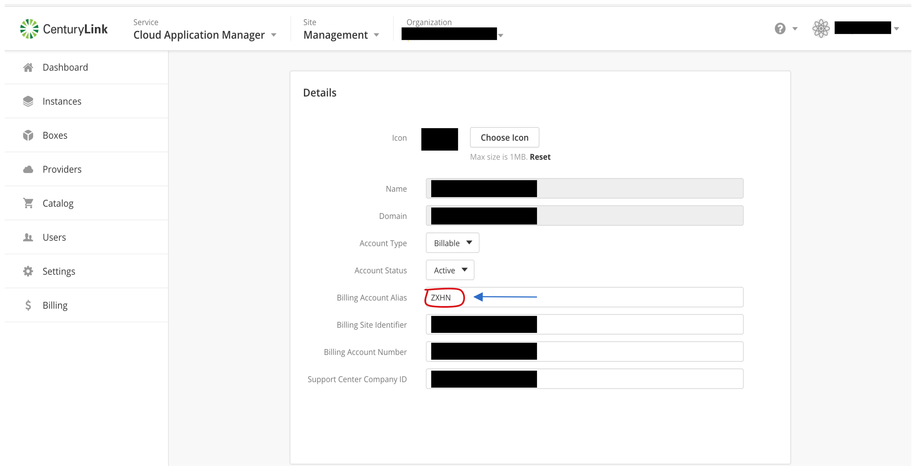
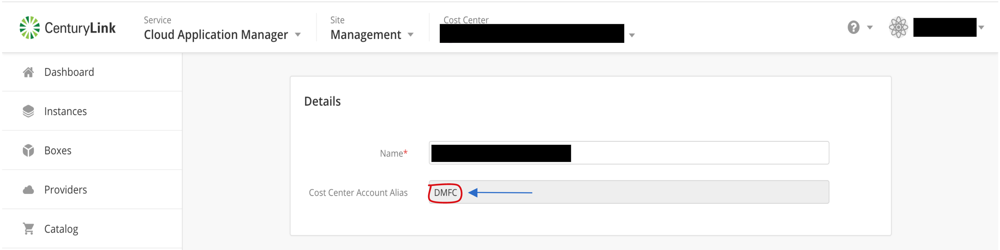
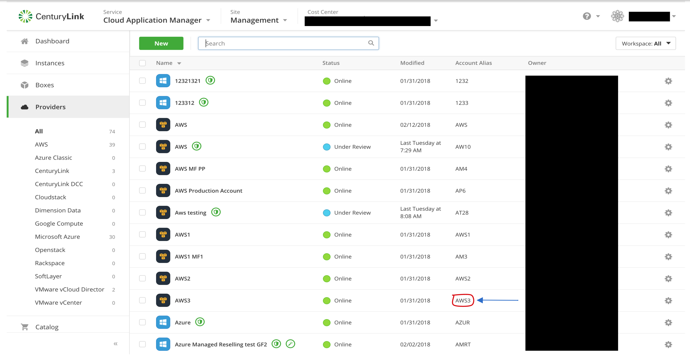
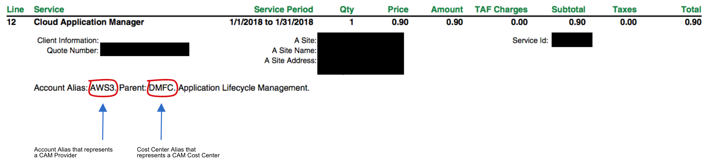

{{{
"title": "FAQ",
"date": "05-18-2017",
"author": "Thomas Broadwell and Guillermo Sánchez",
"attachments": [],
"contentIsHTML": false,
"sticky": true
}}}

Here you will find any frequently asked questions for different topics.

**In this article:**

* [Costs](#costs)
* [Support](#support)
* [Invoice](#invoice)

___

### Costs

##### How is the Managed Services Anywhere (MSA) charge calculated?

MSA charges are calculated based on the spend on all managed providers.  

##### When is a customer charged with Application Lifecycle Management (ALM) charges?

ALM charges are accrued on a per hour basis for instances that are deployed via Cloud Application Manager boxes and running within a non-managed (MSA) provider.  When instances that have been deployed via the cloud provider's console are registered within Cloud Application Manager, the accrual of ALM charges will likewise occur.

##### Is Application Lifecycle Management (ALM) included in Managed Services Anywhere (MSA) charges?

Yes, ALM is included in MSA.  No additional ALM charges are billed for instances that are on a managed provider.

##### Is platform support included in Managed Services Anywhere (MSA) charges?

Yes, platform support is included in MSA.  No additional platform support charges are billed for managed providers.

##### What if an Application box has multiple script boxes?

On a non-managed provider, each instance representing a script box or a template within an application box is considered its own instance and ALM charges will be accrued per instance.  

##### If a customer deploys a script box on an existing instance will there be any additional charge?

No. There will not be any additional charge if the customer deploys a script box on an existing instance that was deployed using a deployment policy.

##### Is the platform support fee optional on a non-managed provider?

No, platform support is not optional on non-managed providers.  Platform support is included for managed providers.

##### How is an instance defined?

An instance is the output of execution of one of the following box types. Application box may have more than one instance. In terms of Application Lifecycle Management billing, an instance is charged only for the uptime of the instance.

* Application box
* Script box
* Template
* Container
* Deployment Policy

##### A Template Box can be used to deploy a collection of virtual machines along with more than one cloud native service. Is it still a single instance from billing perspective?

Yes, an execution of a Template Box is considered a single instance from an Application Lifecycle Management (non-mangage provider) billing perspective even though the template can be used to deploy several virtual machines or cloud native services.

##### When does a brown-field instance starts billing?

After registering an auto-discovered instance on a non-managed provider, all brown-field instances will start charging according to the Application Lifecycle Management pricing. 

##### How are charges represented on the invoice?

Cloud Application Manager charges are represented on the invoice as one or more of the following line items Product/Service

* Cloud Application Manager
* Cloud Application Manager Appliance
* AWS Services IaaS
* AWS Services SaaS
* Microsoft Azure Services SaaS
* Microsoft Azure Services IaaS
* Cloud Application Manager Support

##### What is included in calculating Platform Support charges?

Platform Support charges are calculated on the combined spend of the following charges

* Application Lifecycle Management
* AWS Services
* Azure Services

___

### Support

##### What is included as part of Platform Support?

Platform Support constitutes

* Application Lifecycle Management support (https://www.ctl.io/cloud-application-manager/support/)
* Azure platform support comparable to Azure Professional Direct (https://azure.microsoft.com/en-us/support/plans/prodirect/)
* AWS platform support comparable to AWS Business Support (https://aws.amazon.com/premiumsupport/business-support/)
* Managed Services

Full details of Platform Support are published at https://www.ctl.io/legal/cloud-application-manager/service-guide/

##### What if the customer has an existing Enterprise Support with AWS or Premier Support with Azure?

Customers can keep their plan by upgrading the Platform Support for additional charges.

___

### Invoice

##### How are Cloud Application Manager charges represented on my invoice?

Charges on your CenturyLink invoice are represented by an alias. Cloud Application Manager currently has three different types of alias' including Billing Account Alias, Cost Center Account Alias and Account Alias.

##### What is a Billing Account Alias?

A billing account alias represents any charges directly associated to the organization level. Currently no charges are applied directly to the billing account alias.

Cloud Application Manager Billing Account Alias

##### What is a Cost Center Account Alias?

A cost center account alias represents any charges directly associated to the cost center. Currently no charges are applied directly to the cost center alias.

Cloud Application Manager Cost Center Alias

##### What is a Account Alias?

An account alias represents any charges directly associated to a provider. Currently, all charges of Cloud Application Manager are directly associated to each provider.

Each provider is associated to a cost center and is shown as such in the bill.

Cloud Application Manager Account Alias

Invoice Example

##### Where can I see more detail for my bill?

Customers can login to their Cloud Application Manager account for a [Detailed Billing Report](../Cloud Optimization/partner-cloud-integration-detailed-billing-report.md).  

Customers can also check out our knowledge base for more billing information for [Cloud Optimization charges](../Cloud Optimization/partner-cloud-integration-consolidated-billing.md).

##### What if I have more questions about the bill?

If you have any other questions about your bill please contact [Cloud Application Manager Support](https://www.ctl.io/cloud-application-manager/#Support).
