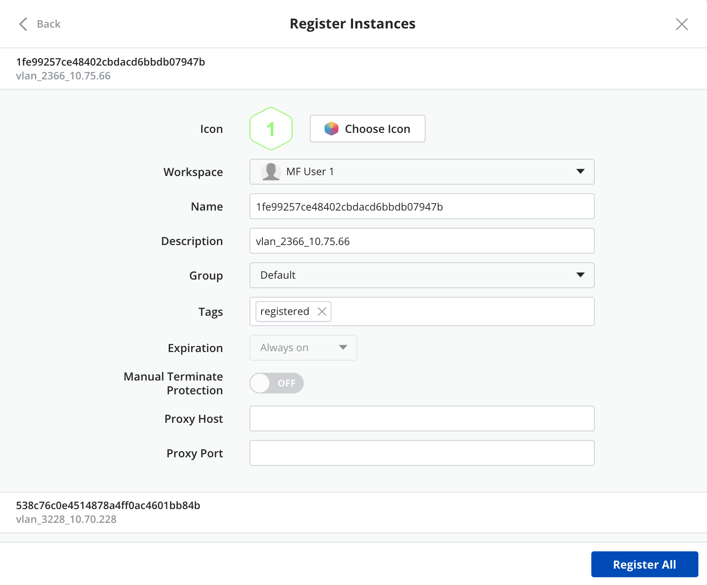

{{{
"title": "Auto-discover CenturyLinkCloud instances",
"date": "09-19-2018",
"author": "Guillermo Sanchez",
"keywords": ["cam", "instances", "auto-discovery", "register", "clc", "centurylink-cloud"],
"attachments": [],
"contentIsHTML": false
}}}

### Auto-discover CenturyLink Cloud VM instances

**In this article:**

* [Overview](#overview)
* [Audience](#audience)
* [Prerequisites](#prerequisites)
* [When you add CenturyLink Cloud as a provider for the first time](#when-you-add-centurylink-cloud-as-a-provider-for-the-first-time)
* [If you have existing CenturyLink Cloud provider in Cloud Application Manager](#if-you-have-existing-centurylink-cloud-provider-in-cloud-application-manager)
* [Auto-discover and register CenturyLink Cloud Server instances in Cloud Application Manager](#auto-discover-and-register-centurylink-cloud-server-instances-in-cloud-application-manager)
* [Contacting Cloud Application Manager Support](#contacting-cloud-application-manager-support)

### Overview

Cloud Application Manager can auto-discover your existing CenturyLink Cloud VM instances that have been provisioned directly using the provider console outside of Cloud Application Manager. With this capability, even if some of your teams are using CenturyLink Cloud Console to provision instances, you can import them into Cloud Application Manager and manage their lifecycle and also view them as part of the Admin Console Cloud Reports. The discovered instances will exist only as an instance. Cloud Application Manager does not create a corresponding Deployment Policy as part of registration process.

### Audience

Users who want to register their CenturyLink Cloud instances into Cloud Application Manager to enable lifecycle management on them.

### Prerequisites

An active Cloud Application Manager account and an existing CenturyLink Cloud account with active instances.

### When you add CenturyLink Cloud as a provider for the first time

As soon as you add CenturyLink Cloud as a provider in your workspace, Cloud Application Manager will auto-discover those instances that exist in CenturyLink Cloud and save them in the Unregistered instances tab under the Provider details. These unregistered instances will also be shown in the Instances page under All or Unregistered submenu items. You can follow the on-screen instructions to register them in Cloud Application Manager.

### If you have existing CenturyLink Cloud provider in Cloud Application Manager

The next time you click on sync, Cloud Application Manager will auto-discover those instances that exist in CenturyLink Cloud but have not been provisioned using Cloud Application Manager and save them in the Unregistered instances tab under the Provider details. You can follow the on-screen instructions to register them in Cloud Application Manager.

### Auto-discover and register CenturyLink Cloud Server instances in Cloud Application Manager

You can register your instances either from the Unregistered Instances tab of your provider details page, where you can import a single instance or select many of them and execute a bulk register, or from the Instances page where you can register one instance at a time.

In both cases, you should be in the target workspace scope where you want to register the instance for the register option to be enabled.

#### Register an instance or instances from the Unregistered Instances tab

Click on the register icon of an instance:

Or choose several unregistered instances of your CenturyLink Cloud provider and click **Bulk Actions > Register**.

Then, follow the steps of the [Register process](#register-process) below.

#### Register an instance from the Instances page

You must be in the All or Unregistered view of the Instances page and click on the register icon of the instance you want to register.

Then, follow the steps of the [Register process](#register-process) below.

#### Register process

* Start registering. If you are performing a bulk register, a first step appears in the dialog providing the option to apply property values to all instances to register

    

* The next step of the bulk import will allow you to set the properties for each instance to be registered

    
    
* If you are registering a single instance, a single step dialog appears asking for information to complete the register process:

    

* When you click on Register button, the instance details page show the result of the register process:

    

### Contacting Cloud Application Manager Support

We’re sorry you’re having an issue in [Cloud Application Manager](https://www.ctl.io/cloud-application-manager/). Please review the [troubleshooting tips](../Troubleshooting/troubleshooting-tips.md), or contact [Cloud Application Manager support](mailto:incident@CenturyLink.com) with details and screenshots where possible.

For issues related to API calls, send the request body along with details related to the issue.

In the case of a box error, share the box in the workspace that your organization and Cloud Application Manager can access and attach the logs.

* Linux: SSH and locate the log at /var/log/elasticbox/elasticbox-agent.log
* Windows: RDP into the instance to locate the log at ProgramDataElasticBoxLogselasticbox-agent.log
