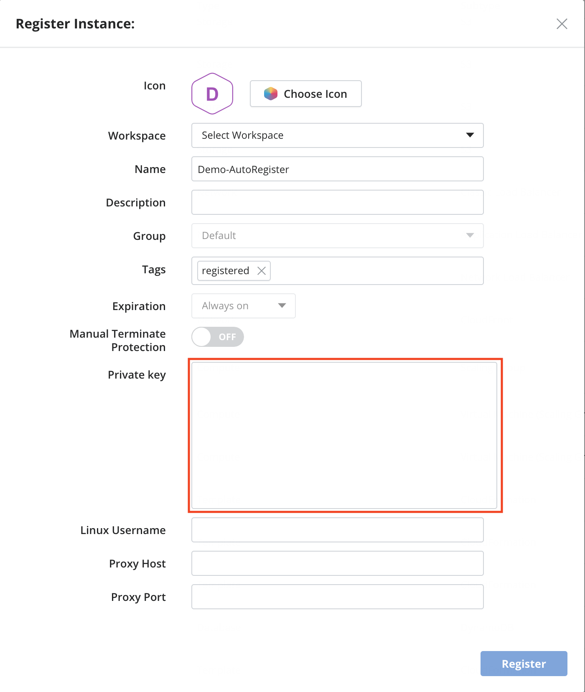

{{{
"title": "Auto-discover AWS EC2 instances",
"date": "12-13-2018",
"author": "Guillermo Sanchez & Sergio Quintana",
"keywords": ["cam", "instances", "auto-discovery", "register", "aws"],
"attachments": [],
"contentIsHTML": false
}}}

**In this article:**
* [Overview](#overview)
* [Audience](#audience)
* [Prerequisites](#prerequisites)
* [Considerations when registering AWS EC2 instances into Cloud Application Manager](#considerations-when-registering-aws-ec2-instances-into-cloud-application-manager)
* [Register AWS EC2 instances in Cloud Application Manager](#register-aws-ec2-instances-in-cloud-application-manager)
* [Contacting Cloud Application Manager Support](#contacting-cloud-application-manager-support)

### Overview
This tutorial will show you how to import an existing instance that was auto-discovered in your *AWS* provider using [Cloud Application Manager](https://www.ctl.io/cloud-application-manager).
For further information about instance registering using *Cloud Application Manager*, please visit [Register an Existing Instance](./register-existing-instance.md).

### Audience

Users who want to register their *AWS EC2* instances into *Cloud Application Manager* to enable lifecycle management on them.

### Prerequisites

* An active *Cloud Application Manager* account 
* An existing *AWS* account with active *EC2* instances
* Having configured an *AWS* provider with that *AWS* account. [More information](../Deploying Anywhere/using-your-aws-account.md)

### Considerations when registering AWS EC2 instances into Cloud Application Manager

To register an *AWS EC2* instance, an additional step might be required. *Cloud Application Manager* uses *UserData* to install its agent on provision time. Since the instance was initially provisioned outside of *Cloud Application Manager*, users have to execute a script to install the agent. But this step will not be necessary if the *Private Key* and *Linux/Windows Username* is provided; in this case, *Cloud Application Manager* would automatically access the machine, install the agent and complete the whole registering process. The following image shows the dialog displayed when registering an *AWS EC2* instance:

#### Types of instances you can register

The following types of instances can be registered into *Cloud Application Manager*:

1. **EC2 regular instances**: stand-alone *EC2* deployed instances.
2. **EC2 CloudFormation instances**: instances deployed as part of a *CloudFormation* template. Only the *EC2* instance will be imported, and when deleted, only that instance would be affected, so no other resources that might have been deployed by the same *CloudFormation* template would be deleted along with the instance.
3. **CloudFormation stacks**: stack created as a collection of AWS resources that you can manage as a single unit. All the resources in a stack are defined by the AWS *CloudFormation* template (a JSON or YAML formatted test file). The stack as a whole will be imported as a single template instance into Cloud Application Manager. If you want to register the inner virtual machine instances as well, you need to register them individually.
4. **EC2 instances from an Auto-scaling group or template**: the instances belonging to an *Auto Scaling Group* or *Template* will be shown grouped under the *Register Instances* page, and will be imported as a whole into a single instance that will contain all the related machines. Once properly registered (either by providing the certificate for *Cloud Application Manager* to access the machines and install the agent or by installing the agent manually), all the corresponding machines will be displayed in *Cloud Application Manager* into the instance details page, all auto-scaling events would be detected and the instance details updated so that the current machines available into the group are shown. If you terminate the instance in *Cloud Application Manager*, all the machines of the group would be terminated.

### Register AWS EC2 instances in Cloud Application Manager

To see the full registration process in detail, please visit [Register an Existing Instance](./register-existing-instance.md).

### Contacting Cloud Application Manager Support

We’re sorry you’re having an issue in [Cloud Application Manager](https://www.ctl.io/cloud-application-manager/). Please review the [troubleshooting tips](../Troubleshooting/troubleshooting-tips.md), or contact [Cloud Application Manager support](mailto:incident@CenturyLink.com) with details and screenshots where possible.

For issues related to API calls, send the request body along with details related to the issue.

In the case of a box error, share the box in the workspace that your organization and Cloud Application Manager can access and attach the logs.

* Linux: SSH and locate the log at /var/log/elasticbox/elasticbox-agent.log
* Windows: RDP into the instance to locate the log at ProgramDataElasticBoxLogselasticbox-agent.log
