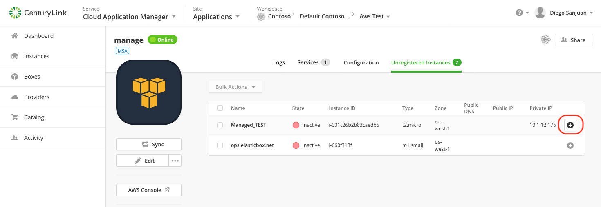
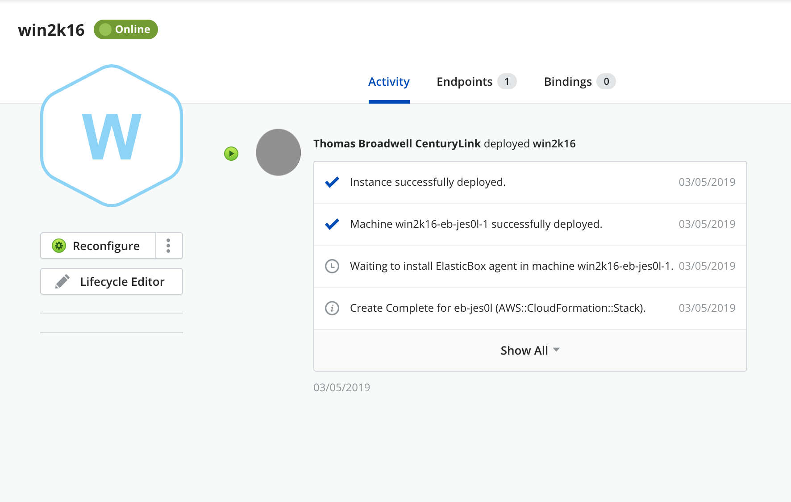

{{{
"title": "Auto-discover AWS EC2 instances",
"date": "09-19-2018",
"author": "Guillermo Sanchez",
"keywords": ["cam", "instances", "auto-discovery", "register", "aws"],
"attachments": [],
"contentIsHTML": false
}}}

### Auto-discover AWS EC2 instances

**In this article:**
* [Overview](#overview)
* [Audience](#audience)
* [Prerequisites](#prerequisites)
* [When you add AWS as a provider for the first time](#when-you-add-aws-as-a-provider-for-the-first-time)
* [If you have an existing AWS provider in Cloud Application Manager](#if-you-have-an-existing-aws-provider-in-cloud-application-manager)
* [Type of instances you can register](#type-of-instances-you-can-register)
* [Auto-discover and register AWS EC2 instances in Cloud Application Manager](#auto-discover-and-register-aws-ec2-instances-in-cloud-application-manager)
* [Contacting Cloud Application Manager Support](#contacting-cloud-application-manager-support)

### Overview
Cloud Application Manager can auto-discover your existing AWS EC2 instances that have been provisioned directly using the provider console outside of Cloud Application Manager. With this capability, even if some of your teams are using AWS EC2 Console to provision instances, you can import them into Cloud Application Manager and manage their lifecycle and also view them as part of the Dashboard Cloud Reports. The discovered instances will exist only as an instance. Cloud Application Manager does not create a corresponding Deployment Policy as part of registration process.

### Audience

Users who want to register their AWS EC2 instances into Cloud Application Manager to enable lifecycle management on them.

### Prerequisites

An active Cloud Application Manager account and an existing AWS account with active EC2 instances.

### When you add AWS as a provider for the first time

As soon as you add AWS as providers in your workspace, Cloud Application Manager will auto-discover those instances that exist in AWS and save them in the Unregistered instances tab under the Provider details. You can follow the on-screen instructions to register them in Cloud Application Manager.

### If you have an existing AWS provider in Cloud Application Manager

The next time you click on sync, Cloud Application Manager will auto-discover those instances that exist in AWS EC2 but have not been provisioned using Cloud Application Manager and save them in the Unregistered instances tab under the Provider details. You can follow the on-screen instructions to register them in Cloud Application Manager.

To register AWS EC2 instance, an additional step is required. Cloud Application Manager uses UserData to install the Cloud Application Manager agent on provision time. Since the instance was initially provisioned outside of Cloud Application Manager, users have to execute a script to install the Cloud Application Manager agent.

### Type of instances you can register

You can register the following type of instances into Cloud Application Manager:

1. **EC2 regular instances**: stand-alone EC2 deployed instances.
2. **EC2 CloudFormation instances**: instances deployed as part of a CloudFormation template. Only the EC2 instance will be imported, and when deleted only the instance would be affected, no other resources that might have been deployed by the same Cloud Formation template would be deleted along with the instance.
3. **EC2 instances from an Auto-scaling group or template**: the instances belonging to an Auto Scaling Group or Template will be shown grouped under the Register Instances page and they will be imported as a whole into a single instance that will contain all the related machines. Once properly registered (either providing the certificate for Cloud Application Manager to access the machines and install the agent or when the agent is installed manually), all the machines would be shown in Cloud Application Manager into the instance details page, and all auto-scaling events would be detected and the instance details updated to show the current machines available into the group. If you terminate the instance in Cloud Application Manager, all the machines of the group would be terminated.

### Auto-discover and register AWS EC2 instances in Cloud Application Manager

You can register your instances either from the Unregistered Instances tab of your provider details page, where you can import a single instance or select many of them and execute a bulk register, or from the Instances page where you can register one instance at a time.

In both cases, you should be in the target workspace scope where you want to register the instance for the register option to be enabled.

#### Register an instance or instances from the Unregistered Instances tab

Click on the register icon of an instance:

Or choose several unregistered instances of your AWS provider and click **Bulk Actions > Register**.

Follow the steps of the [Register process](#register-process) below.

#### Register an instance from the Instances page

You must be in the All or Unregistered view of the Instances page and click on the register icon of the instance you want to register:

Then, follow the steps of the [Register process](#register-process) below.

#### Register process

* Start registering. If you are performing a bulk register, a first step appears in the dialog providing the option to apply property values to all instances to register

    

* The next step of the bulk import, or the single step if you are registering a single instance will allow you to set the properties for each  instance to be registered

    

* Unsuccessful Registration

    

* Go to the instance details

    

* Get the endpoint address for ssh connection

    

* Use your token key-pair and connect to the instance

    

* Copy the snippet for manual creation of the agent script

    

* Use your favorite editor to create the shell script by pasting the copied snippet and change execution permission

    

* Start agent

    

* The instance is now successfully registered

    

### Contacting Cloud Application Manager Support

We’re sorry you’re having an issue in [Cloud Application Manager](https://www.ctl.io/cloud-application-manager/). Please review the [troubleshooting tips](../Troubleshooting/troubleshooting-tips.md), or contact [Cloud Application Manager support](mailto:incident@CenturyLink.com) with details and screenshots where possible.

For issues related to API calls, send the request body along with details related to the issue.

In the case of a box error, share the box in the workspace that your organization and Cloud Application Manager can access and attach the logs.

* Linux: SSH and locate the log at /var/log/elasticbox/elasticbox-agent.log
* Windows: RDP into the instance to locate the log at ProgramDataElasticBoxLogselasticbox-agent.log
