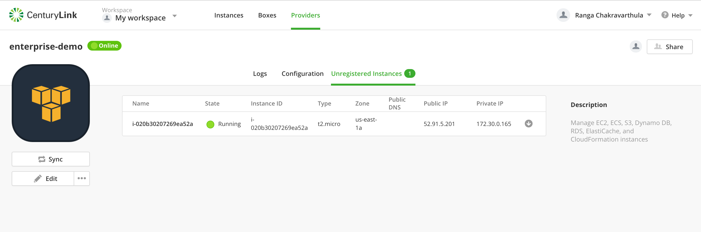
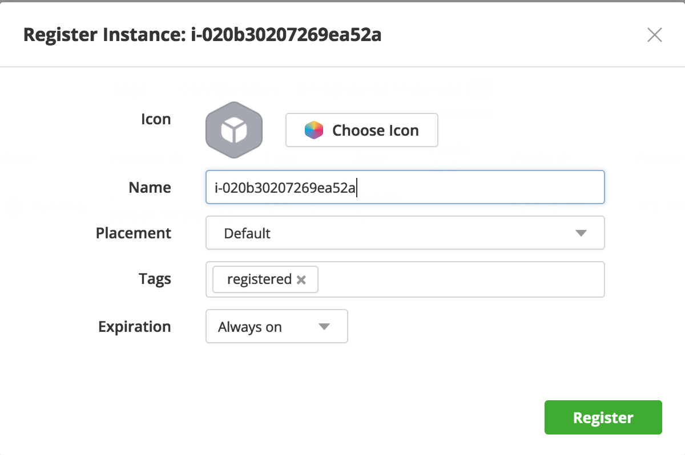
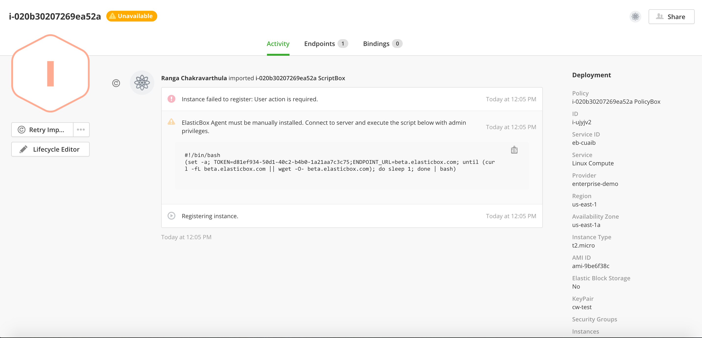
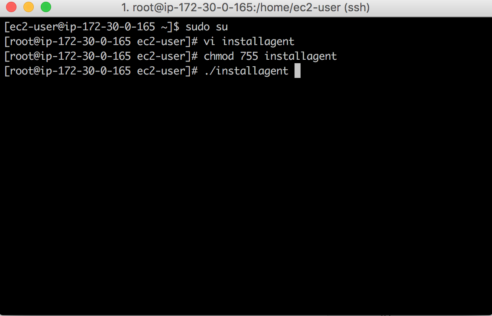
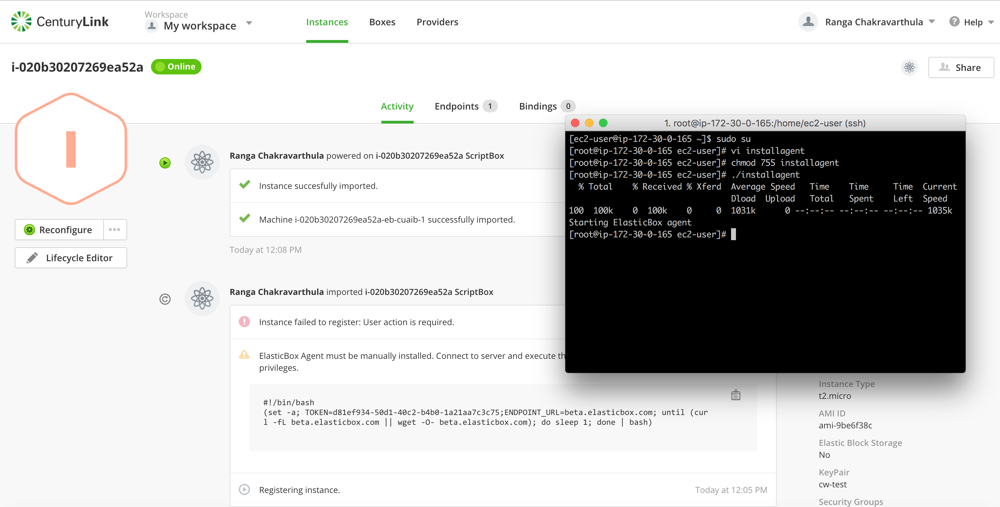

{{{
"title": "Auto-discover AWS EC2 instances",
"date": "02-15-2016",
"author": "Ranga Chakravarthula",
"attachments": [],
"contentIsHTML": false
}}}

### Auto-discover AWS EC2 instances

Cloud Application Manager can auto-discover your existing AWS EC2 instances that have been provisioned directly using the provider console outside of Cloud Application Manager. With this capability, even if some of your teams are using AWS EC2 Console to provision instances, you can import them into Cloud Application Manager and manage their lifecycle and also view them as part of the Admin Console Cloud Reports. The discovered instances will exist only as an instance. Cloud Application Manager does not create a corresponding Deployment Policy as part of registration process.

### When you add AWS as a provider for the first time

As soon as you add AWS as providers in your workspace, Cloud Application Manager will auto-discover those instances that exist in AWS and save them in the Unregistered instances tab under the Provider details. You can follow the on-screen instructions to register them in Cloud Application Manager.

### If you have an existing AWS provider in Cloud Application Manager

The next time you click on sync, Cloud Application Manager will auto-discover those instances that exist in AWS EC2 but have not been provisioned using Cloud Application Manager and save them in the Unregistered instances tab under the Provider details. You can follow the on-screen instructions to register them in Cloud Application Manager.

To register AWS EC2 instance, an additional step is required. Cloud Application Manager uses UserData to install the Cloud Application Manager agent on provision time. Since the instance was initially provisioned outside of Cloud Application Manager, users have to execute a script to install the Cloud Application Manager agent.

### Auto-discover and register AWS EC2 instances in Cloud Application Manager

### Contacting Cloud Application Manager Support

We’re sorry you’re having an issue in [Cloud Application Manager](https://www.ctl.io/cloud-application-manager/). Please review the [troubleshooting tips](../Troubleshooting/troubleshooting-tips.md), or contact [Cloud Application Manager support](mailto:cloudsupport@centurylink.com) with details and screenshots where possible.

For issues related to API calls, send the request body along with details related to the issue.

In the case of a box error, share the box in the workspace that your organization and Cloud Application Manager can access and attach the logs.
* Linux: SSH and locate the log at /var/log/elasticbox/elasticbox-agent.log
* Windows: RDP into the instance to locate the log at ProgramDataElasticBoxLogselasticbox-agent.log
