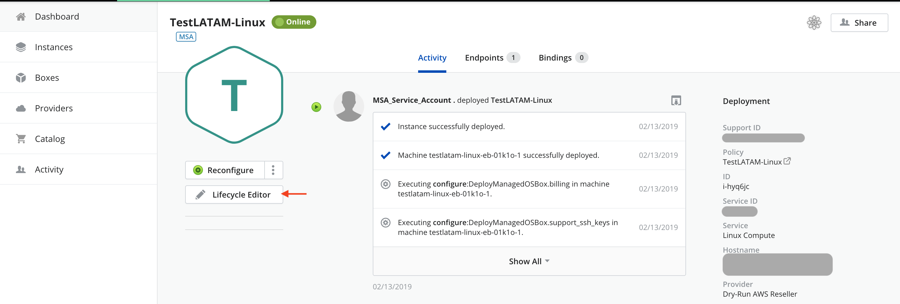
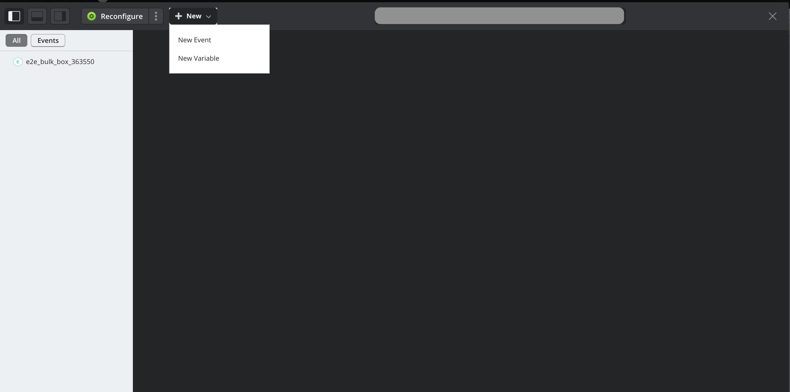
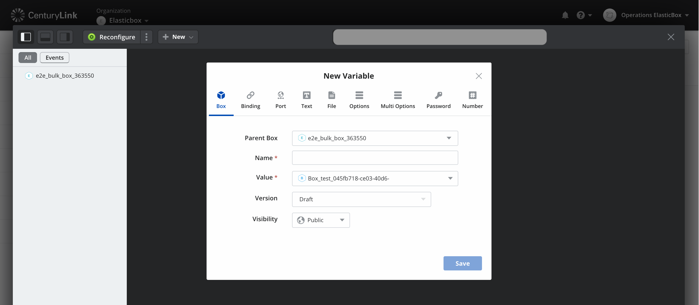
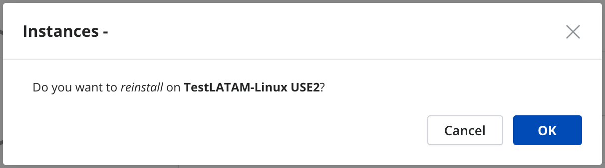

{{{
"title": "Deploy a Script box to a Registered Instance",
"date": "02-08-2018",
"author": "Ignacio Martin",
"attachments": [],
"contentIsHTML": false
}}}

### Introduction

This tutorial will show you how to deploy a script box to a registered instance that was auto-discovered in your AWS provider using [Cloud Application Manager](https://www.ctl.io/cloud-application-manager).

### Register an exisiting AWS Linux Instance

The first step on this tutorial is to follow the steps to [Register an exisiting AWS Linux Instance](https://www.ctl.io/knowledge-base/cloud-application-manager/getting-started/register-existing-aws-linux-instance/#find-an-aws-linux-instance)

Once this part is done you will see your newly registered instance on your list of instances.

### Add a new Box Script Variable

Once inside the instance details, click on **Lifecycle Editor**

Open the **New** menu and click on **New Variable**

Give your box variable a name and select the Script Box you want to add from the drop down list. Then you can click **Save**

### Reinstall the instance

After adding the new variable you just need to **reinstall** the instance and you will have successfully deployed the scipt box variable.

And you will need to select **Ok** on the confirmation dialog.

This reinstall operation will also execute all lifecycle scripts of the box that has just been added as variable, concluding this tutorial.