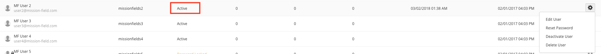
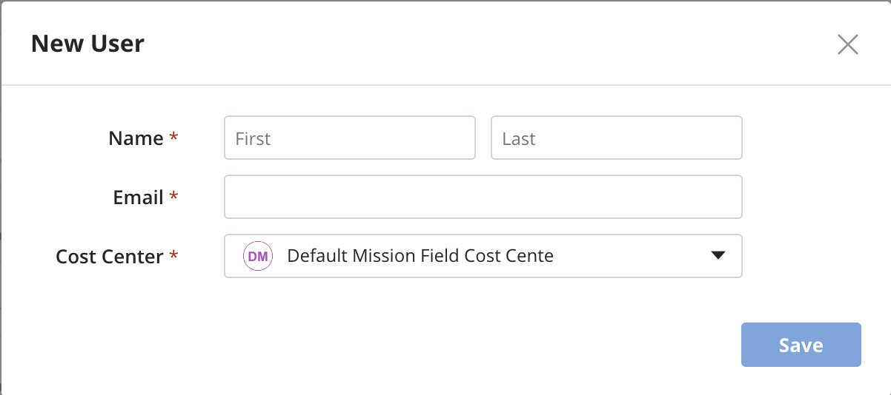

{{{
"title": "Creating Cloud Application Manager Users",
"date": "05-16-2017",
"author": "",
"keywords": ["cam", "user", "users", "create user", "delete user"],
"attachments": [],
"contentIsHTML": false,
"sticky": true
}}}

### Getting started - User Management

**In this article:**

* [Overview](#overview)
* [Audience](#audience)
* [Prerequisites](#prerequisites)
* [User Management page](#user-management-page)
* [User Management options](#user-management-options)
* [Creating Cloud Application Manager Users](#creating-cloud-application-manager-users)
* [Logging In to Cloud Application Manager](#logging-in-to-cloud-application-manager)
* [Getting General Support](#getting-general-support)

### Overview

This article goes through the User Management capabilities that Cloud Application Manager provides for any user with administrator privileges.

### Audience

All users with Cloud Application Manager organization administrator access.

### Prerequisites

* Access to Cloud Application Manager, [Management site](https://account.cam.ctl.io/#/users).

* The user must be an Administrator of the organization in Cloud Application Manager.

* The user should be at the organization level scope to access the Users option in the left side menu.

### User Management page

A Cloud Application Manager administrator can access the User Management page from within [Management site](https://account.cam.ctl.io/#/users) and he can find there all the existing users in the organization with some useful data of each user such as:

* **Name** and **email**
* **Id**
* **Status** (Invited, Active, Deactivated, Password Locked)
* **Instances**, **Boxes** and **Provider** (the number of each that he owns)
* **Last Login** (date of last login, or empty if never logged in)
* **Created** (date when the user was created)
* **Gear icon** (clicking on it provides a dropdown menu with the actions that the administrator can  perform on the user account)

There is also a search field in the top page of the screen to look for users that matches the search term in their name, email or id fields.

### User Management options

Each user in the users list has an associated gear button that provides the ability for an administrator to access some the following options, depending on the state of the user:

* **Edit User**: to change first or last name of the user
* **Resend Invitation**: to resend invitation email to an invited user who has not yet logged in
* **Reset Password**: to trigger the password reset flow, sending an email to the user to reset his password
* **Unlock Password**: to unlock the password of a password locked user (does not change it), resetting the count of failed password attempts
* **Deactivate User**: to disable an active user
* **Activate User**: to enable a deactivated user
* **Delete User**: to remove the user from the system. If the user has existing assets (instances, boxes or providers) the confirmation pop-up window will ask the administrator to select a target workspace where the user assets will be transferred to.

Depending on the state of the user, the options may change. 

* If the user state is **active**, then available options are:

  

* If the user state is **deactivated**, then available options are:

  

* If the user state is **invited**, then available options are:

  

If the user state is blocked, then available options are:

  

### Creating Cloud Application Manager Users

From the User Management page, the administrator can press the **New** button to create new users into the organization.

The administrator can also selects the Cost Center the user will be associated with, so all the assets that the user creates would be billed to that Cost Center, if necessary.

Once the Administrator fills in the New User form and clicks on Save, an email will be sent to the specified email address inviting the user to access into Cloud Application Manager.

When the user clicks the "Access My Account" button located in the email received, he will be redirected to the Cloud Application Manager login page, where he would be able to create a password to log in or use any of the available login mechanisms as explained below.

### Logging In to Cloud Application Manager

You have a few options:

* Sign in to Cloud Application Manager at https://[companyname].cam.ctl.io/#/login with a username and password created using the process above.
* Log-in with an existing Google account.
* Log-in with your current GitHub credentials if your org admin has enabled GitHub sign in for Cloud Application Manager.
* Enter your company Active Directory credentials in the username, password fields if your admin enabled LDAP integration with Cloud Application Manager.
* Log-in with your company SAML credentials if your admin enabled and configured SAML integration with Cloud Application Manager.
* Log-in with your CenturyLink Cloud credentials if your admin enabled CenturyLink Cloud authentication integration with Cloud Application Manager.

**Note**: When you log in with your AD credentials, GitHub, Google, SAML or CenturyLink Cloud accounts, Cloud Application Manager does not have access to your password. We use your email to create a profile and workspace for you.

___

### Getting General Support

Customers can contact the CenturyLink Global Operations Support center (support desk) directly for getting help with Cloud Application Manager as well as any other supported product that they’ve subscribed to.  Below are three ways to get help.

**Contact:**

1. **Phone:** 888-638-6771

2. **Email:** incident@centurylink.com

3. **Create Ticket in Cloud Application Manager:**
Directly within the platform, users can “Create Ticket” by clicking on the “?” symbol in the upper right corner near the user's login profile icon. This takes users directly to the Managed Support Portal where they can open, track and review the status of issues that have been raised with the support desk.  Additionally, this is how a TAM can be engaged as well.

    

**Instructions:**

1. Provide your name
2. CAM account name
3. A brief description of your request or issue for case recording purposes

The support desk will escalate the information to the Primary TAM and transfer the call if desired.
