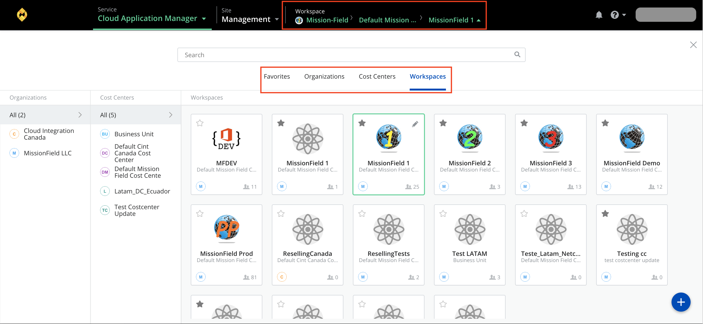
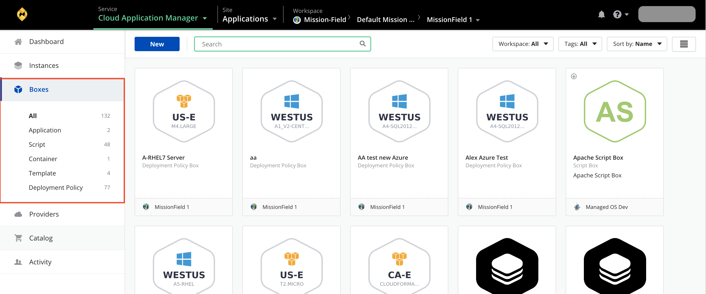
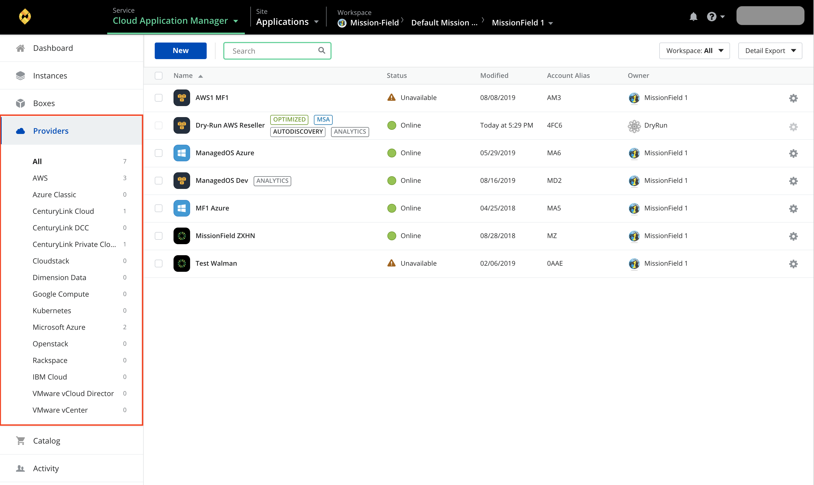

{{{
"title": "Login and Quick Tour",
"date": "09-01-2016",
"author": "",
"attachments": [],
"contentIsHTML": false,
"sticky": true
}}}

### Login and Quick Tour

**In this article:**

* Login
* Quick tour

___

### Login

**Where to log in?**

* To access Cloud Application Manager in the cloud, browse to http://elasticbox.com/login or your Cloud Application Manager company URL.
* To access Cloud Application Manager inside a private network, ask your administrator for the login URL.

   **Note**: Enable JavaScript on the browser to use Cloud Application Manager. If not, some elements of the web interface may not work or render properly. We support Cloud Application Manager on the latest Chrome, Safari, Firefox, and Internet Explorer browsers.

**How to log in?**

You have a few options:

* Sign up for an Cloud Application Manager account with a username and password.
* Log in with an existing Google account.
* Log in with your current GitHub credentials if your org admin has enabled GitHub sign in for Cloud Application Manager.
Enter your company Active Directory credentials in the username, password fields if your admin enabled LDAP integration with Cloud Application Manager.

   **Note**: When you log in with your AD credentials, GitHub or Google accounts, Cloud Application Manager does not have access to your password. We use your email to create a profile and workspace for you.

___

### Quick Tour

When you log in, the top navigation bar guides you to the main areas of Cloud Application Manager.

* Workspaces
* Instances
* Boxes
* Providers
* Your Account
* Help

**Workspaces**

When you log in, you’re in your personal workspace. From the workspace drop-down, you can access team workspaces if you belong to them, or create one and add others to share Cloud Application Manager assets and collaborate. To learn more, see [Workspaces & Sharing](../Core Concepts/workspaces-and-collaboration.md).

___

**Instances**

* Click **New Instance** to launch instances of boxes to a provider environment in the public or private cloud.
* Manage instances you’ve [launched](../Deploying Anywhere/deploying-managing-instances.md) through the web interface, the API, or on [any infrastructure using the Cloud Application Manager agent](../Deploying Anywhere/deploying-on-anyinfra.md). Here you can quickly [manage the lifecycle](../Deploying Anywhere/deploying-managing-instances.md) of several instances from the Bulk Actions menu or handle them individually from the gear menu.
* Find an instance by searching any part of its name, or click filtered views of instances you launched or that were shared with you. Or locate them by tags.

___

**Boxes**

The Boxes page shows everything you create including boxes shared with you.

* Click **New** to create a box. Automate configuration by selecting a box type: Script, Deployment Policy, CloudFormation, Container.
* Cloud Application Manager provides a public service box catalog, which you find when you filter by the public tag. Public boxes are available to all users. These are pre-configured, which means you can directly deploy or nest them in other boxes. Since they’re publicly available to everyone, you can’t modify their configuration, but you can pass your own parameters before deploying. Examples of public boxes include MongoDB, Puppet, Chef Solo, Rails, Redis, RabbitMQ, WordPress among others.
   **Note**: Some public boxes require an Internet connection to install software. So if you’re using Cloud Application Manager as an appliance in your private datacenter without Internet access, these boxes will not deploy.
* Organize boxes as icons or as a list. Sort alphabetically by name, most recently viewed, or by the owner.
* Search for a box by name, owner, or filter by technology under Requirements. The owner is a user or a workspace.

___

**Providers**

* Connect to a provider to orchestrate deployments. Click **New Provider** to add AWS, Azure, vSphere, Google Cloud, OpenStack, or CloudStack.
* Locate a provider through search or by type.
* Sync or delete provider accounts using Bulk Actions.

___

**Your Account**

* From the username drop-down, access your account profile where you can change your username or reset password if you’re using username and password to log in.
* Access the Admin Console from here to administer your Cloud Application Manager organization.
* Get tokens to use Cloud Application Manager via the CLI or API with Authentication Tokens.

___

**Help**

Please review the [troubleshooting tips](../Troubleshooting/troubleshooting-tips.md) for help. Or you may contact [support](mailto:cloudsupport@centurylink.com) from within the Cloud Application Manager interface.

For issues related to API calls, send the request body along with details related to the issue.

In the case of a box error, share the box in the workspace that your organization and Cloud Application Manager can access and attach the logs.
* Linux: SSH and locate the log at /var/log/elasticbox/elasticbox-agent.log
* Windows: RDP into the instance to locate the log at ProgramDataElasticBoxLogselasticbox-agent.log
