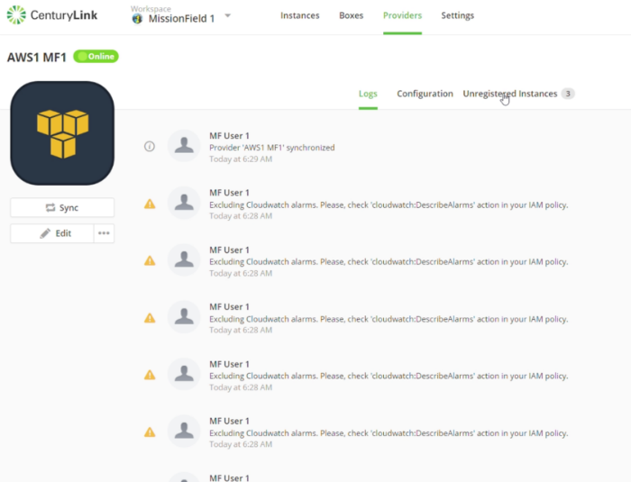
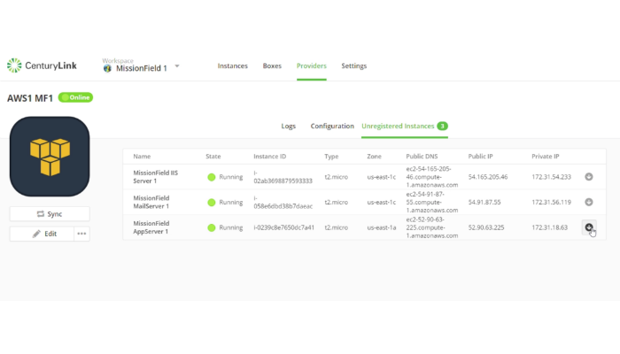
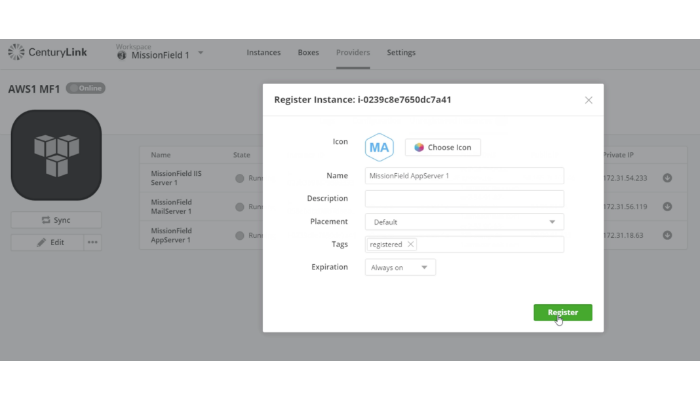
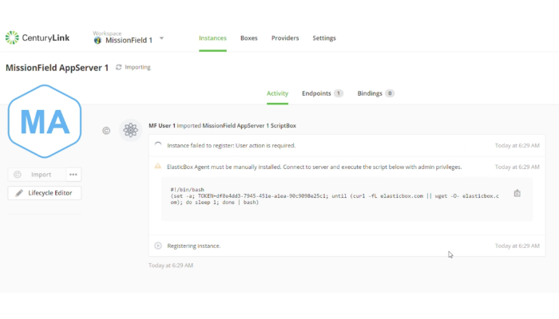
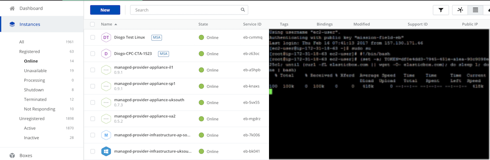

{{{
"title": "Register an Existing AWS Linux Instance",
"date": "03-30-2017",
"author": "Thomas Broadwell",
"attachments": [],
"contentIsHTML": false
}}}

<iframe width="560" height="315" src="https://player.vimeo.com/video/210493178" frameborder="0" allowfullscreen></iframe>

### Introduction

This tutorial will show you how to import an existing Linux instance that was auto-discovered in your AWS provider using [Cloud Application Manager](https://www.ctl.io/cloud-application-manager).

### Find an AWS Linux Instance

Within the Cloud Application Manager workspace, navigate to your AWS provider and run the sync function by clicking **Sync**.

The sync process will discover unregistered AWS instances and list them under the **Unregistered Instances** tab.

### Register the Instance

Under the Unregistered Instances tab, click the instance you want to import and register.

Provide any details for the instance in the fields provided.

Click **Register** to register the instance.

Cloud Application Manager returns an error message because the agent installation script that allows CenturyLink to register the instance is not yet executed on this instance.

### Install the Agent Installation Script

Copy the agent installation script provided in the **Activity** tab in the log details.

Log-in to the instance residing in your AWS provider.

Execute the agent installation script.

Once the script is executed, the instance will be available in Cloud Application Manager.

You can now use lifecycle application management features on this instance in Cloud Application Manager.
