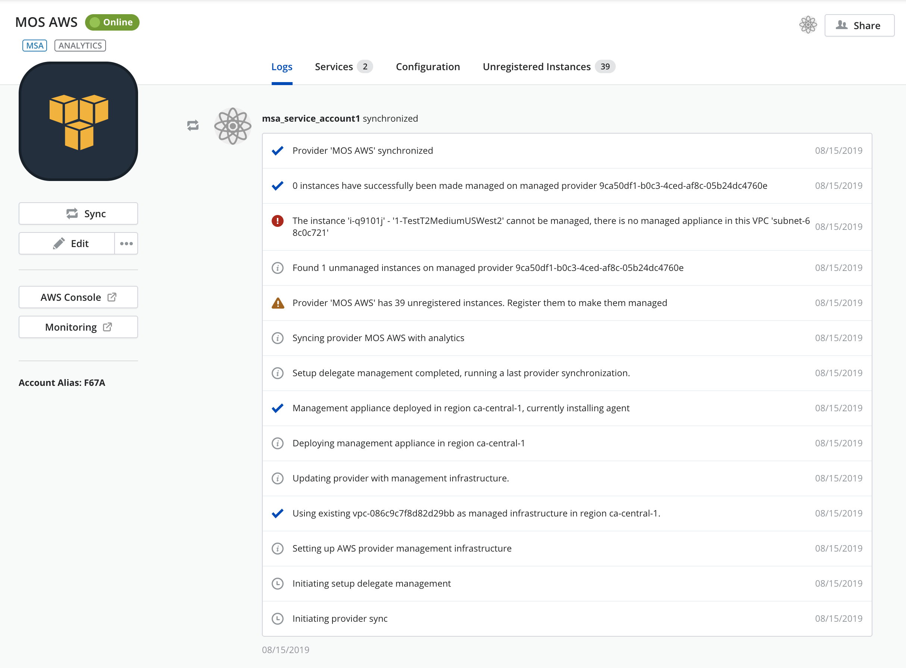
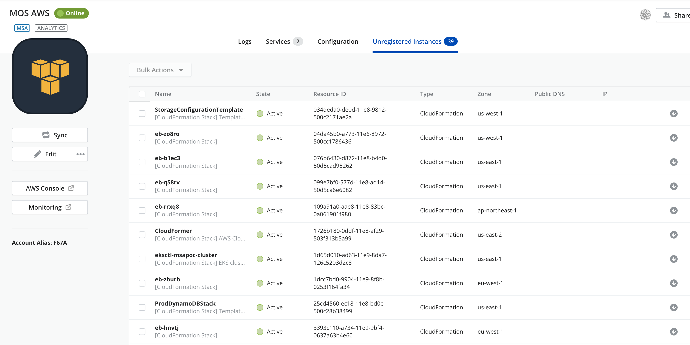
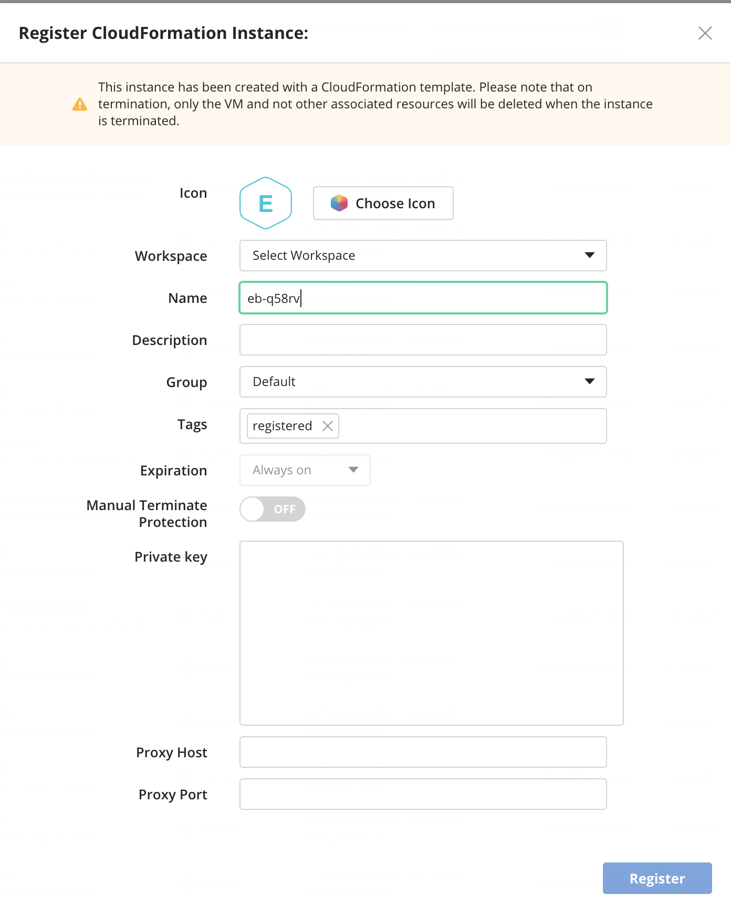
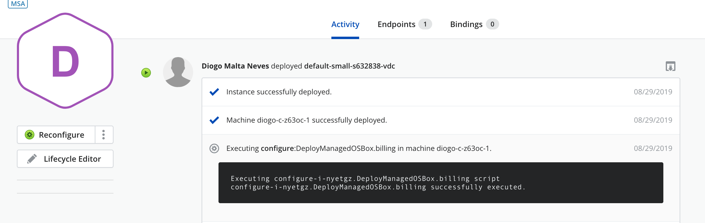
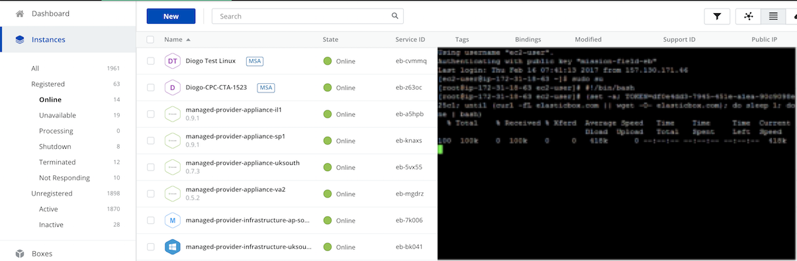

{{{
"title": "Register an Existing AWS Linux Instance",
"date": "01-29-2019",
"author": "Sergio Quintana & Guillermo Sanchez",
"keywords": ["cam", "instances", "auto-discovery", "register", "linux", "aws"],
"attachments": [],
"contentIsHTML": false
}}}

**In this article:**

* [Overview](#overview)
* [Audience](#audience)
* [Prerequisites](#prerequisites)
* [Find an AWS Linux instance](#find-an-aws-linux-instance)
* [Register the instance](#register-the-instance)
* [Install the Agent Installation Script manually](#install-the-agent-installation-script-manually)
* [Contacting Cloud Application Manager Support](#contacting-cloud-application-manager-support)

### Overview

This tutorial will show you how to import an existing *Linux* instance that was auto-discovered in your *AWS* provider using [Cloud Application Manager](https://www.ctl.io/cloud-application-manager).
For further information about instance registering using *Cloud Application Manager*, please visit [Register an Existing Instance](./register-existing-instance.md).

You can check the full process by watching the following video: 

<iframe width="560" height="315" src="https://player.vimeo.com/video/210493178" frameborder="0" allowfullscreen></iframe>

### Audience

Users who want to register their *Linux* instances into *Cloud Application Manager* to enable lifecycle management on them.

### Prerequisites

* A *Linux* machine
* An active *Cloud Application Manager* account 
* An existing *AWS* account with active instances

### Find an AWS Linux instance

Within the *Cloud Application Manager* workspace, navigate to your *AWS* provider and run the sync function by clicking **Sync**.

The sync process will discover unregistered *AWS* instances and list them under the **Unregistered Instances** tab.

### Register the instance

Under the **Unregistered Instances** tab or within the *Instances* page, click the instance you want to import and register.

Provide any details for the instance in the fields provided.

Click **Register** to register the instance.

If you did not provide the *Private Key* and *Linux Username* fields, or the instance IP address is not accesible from the internet, an error message is returned because the agent installation script that allows *Cloud Application Manager* to register the instance has not been executed on it yet. You can then proceed to the manual instalation process described below.

### Install the Agent Installation Script manually

Copy the agent installation script provided in the **Activity** tab in the log details.

Log-in to the instance residing in your *AWS* provider.

Execute the agent installation script.

Once the script is executed, the instance will be available in *Cloud Application Manager*.

You can now use lifecycle application management features on this instance in *Cloud Application Manager*.

### Contacting Cloud Application Manager Support

We’re sorry you’re having an issue in [Cloud Application Manager](https://www.ctl.io/cloud-application-manager/). Please review the [troubleshooting tips](../Troubleshooting/troubleshooting-tips.md), or contact [Cloud Application Manager support](mailto:incident@CenturyLink.com) with details and screenshots where possible.

For issues related to API calls, send the request body along with details related to the issue.

In the case of a box error, share the box in the workspace that your organization and Cloud Application Manager can access and attach the logs.

* Linux: SSH and locate the log at /var/log/elasticbox/elasticbox-agent.log
* Windows: RDP into the instance to locate the log at ProgramDataElasticBoxLogselasticbox-agent.log