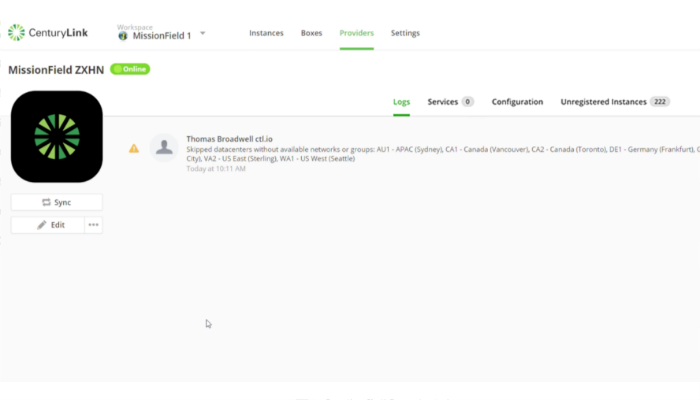
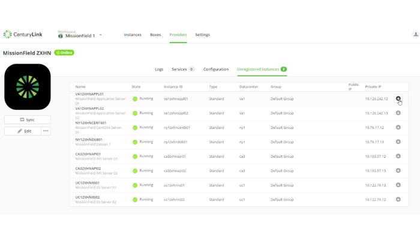

{{{
"title": "Register an Existing CenturyLink Cloud Instance",
"date": "03-30-2017",
"author": "Thomas Broadwell",
"attachments": [],
"contentIsHTML": false
}}}

<iframe width="560" height="315" src="https://player.vimeo.com/video/210485902" frameborder="0" allowfullscreen></iframe>

### Introduction

This tutorial will show you how to import an existing VM instance that was auto-discovered in your CenturyLink Cloud provider using [Cloud Application Manager](https://www.ctl.io/cloud-application-manager).

### Find a CenturyLink Cloud Windows Instance

Within the Cloud Application Manager workspace, navigate to your CenturyLink Cloud provider and run the sync function by clicking **Sync**.

The sync process will discover unregistered CenturyLink Cloud instances and list them under the **Unregistered Instances** tab.

### Register the Instance

Under the Unregistered Instances tab, click the instance you want to import and register.

Provide any details for the instance in the fields provided.

Click **Register** to register the instance.

You can now use lifecycle application management features on this instance in Cloud Application Manager.
