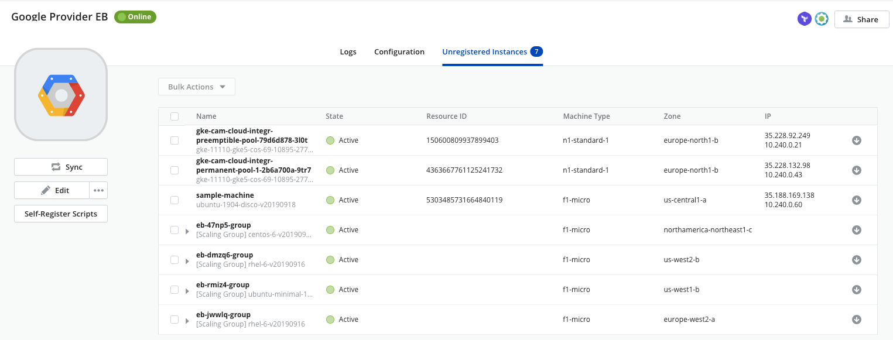
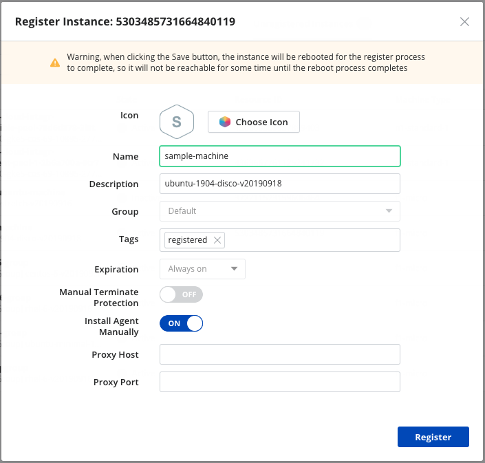
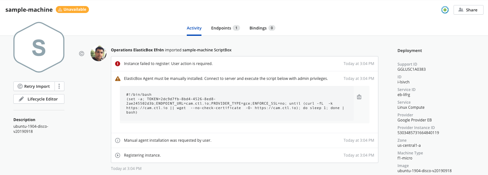
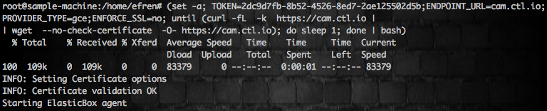
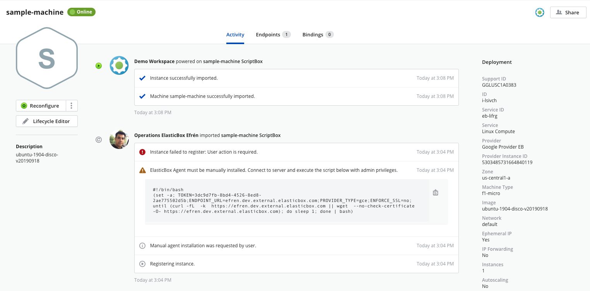

{{{
"title": "Register an Existing Google Cloud Instance",
"date": "09-30-2019",
"author": "Efren Rey and Guillermo Sanchez",
"keywords": ["cam", "instances", "register", "google"],
"attachments": [],
"contentIsHTML": false
}}}

**In this article:**

* [Overview](#overview)
* [Audience](#audience)
* [Prerequisites](#prerequisites)
* [Find a Google Cloud instance](#find-a-google-cloud-instance)
* [Register the instance](#register-the-instance)
* [Execute the Agent Installation Script manually](#execute-the-agent-installation-script-manually)
* [Contacting Cloud Application Manager Support](#contacting-cloud-application-manager-support)

### Overview

This tutorial will show you how to import an existing instance that was discovered in your *Google Cloud* provider using [Cloud Application Manager](https://www.ctl.io/cloud-application-manager).
For further information about instance registering using *Cloud Application Manager*, please visit [Register an Existing Instance](./register-existing-instance.md).

### Audience

Users who want to register their *Google Cloud* instances into *Cloud Application Manager* to enable lifecycle management on them.

### Prerequisites

* A *Google Cloud* machine
* An active *Cloud Application Manager* account
* An existing *Google Cloud* account with active instances

### Find a Google Cloud instance

Within the *Cloud Application Manager* workspace, navigate to your *Google Cloud* provider and run the sync function by clicking **Sync**.

The sync process will discover unregistered *Google Cloud* instances and list them under the **Unregistered Instances** tab.

### Register the instance

Under the **Unregistered Instances** tab or within the *Instances* page, click the instance you want to import and register.

Provide any details for the instance in the fields provided.

The automatic registration process will require reboot the virtual machines, or regenerated in case of an scaling group.
To avoid the restart operation, the *Install Agent Manually* toggle can be enabled to install manually the Cloud Application Manager (CAM) agent.

Click **Register** to register the instance.

If *Install Agent Manually* toggle was enabled, then an error message is returned because the agent installation script that allows *Cloud Application Manager* to register the instance has not been executed on it yet. You can then proceed to the manual installation process described below to fix the issue.

### Execute the Agent Installation Script manually

Copy the agent installation script provided under the **Activity** tab, in the log details section of the instance details page. This script is unique for each instance.

Log-in to the instance residing in your **Google Cloud** provider.

Execute the agent installation script.

Once the script is executed, the instance will be available in *Cloud Application Manager* as a registered instance.

Now you can use application lifecycle management features on this instance from within *Cloud Application Manager*.

### Contacting Cloud Application Manager Support

We’re sorry you’re having an issue in [Cloud Application Manager](https://www.ctl.io/cloud-application-manager/). Please review the [troubleshooting tips](../Troubleshooting/troubleshooting-tips.md), or contact [Cloud Application Manager support](mailto:incident@CenturyLink.com) with details and screenshots where possible.

For issues related to API calls, send the request body along with details related to the issue.

In the case of a box error, share the box in the workspace that your organization and Cloud Application Manager can access and attach the logs.

* Linux: SSH and locate the log at /var/log/elasticbox/elasticbox-agent.log
* Windows: RDP into the instance to locate the log at \ProgramData\ElasticBox\Logs\elasticbox-agent.log
