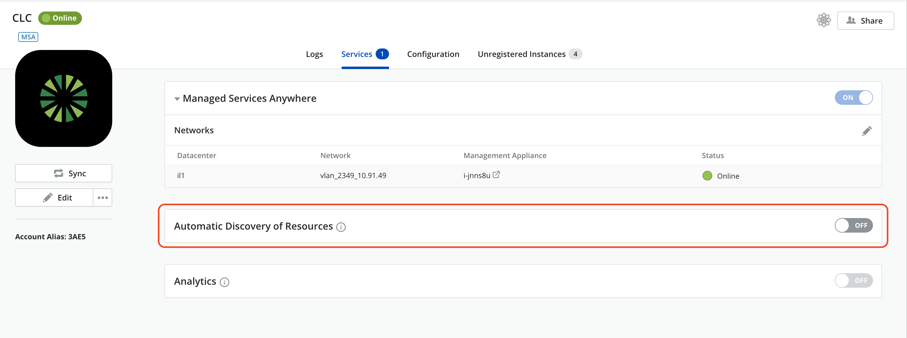
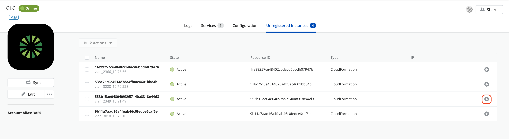
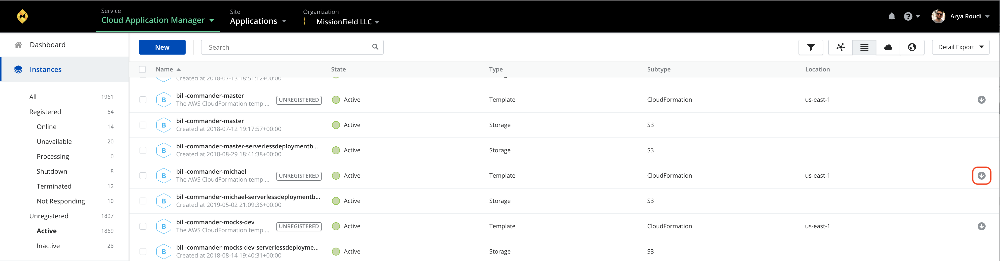
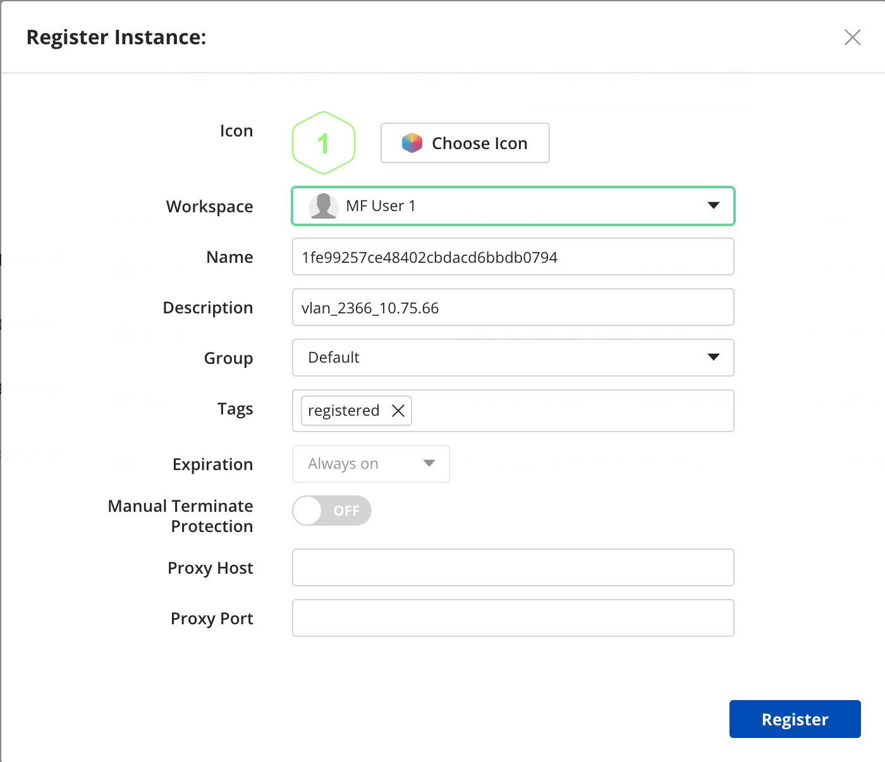
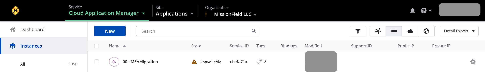
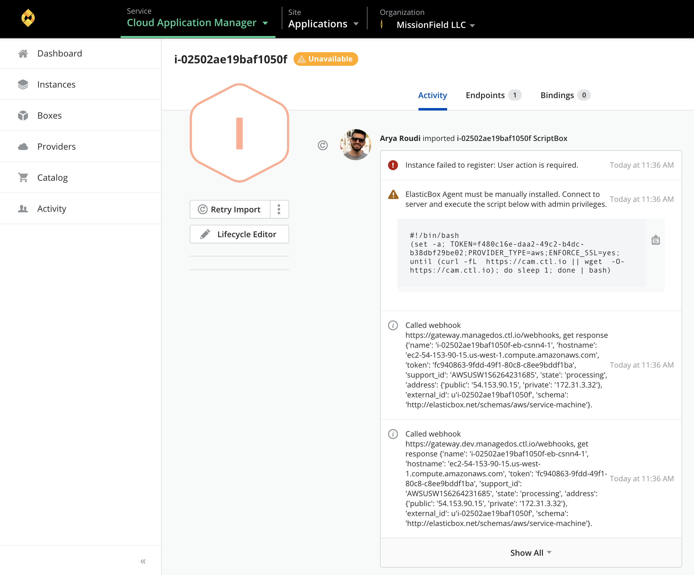
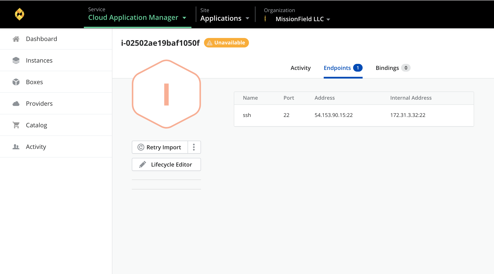
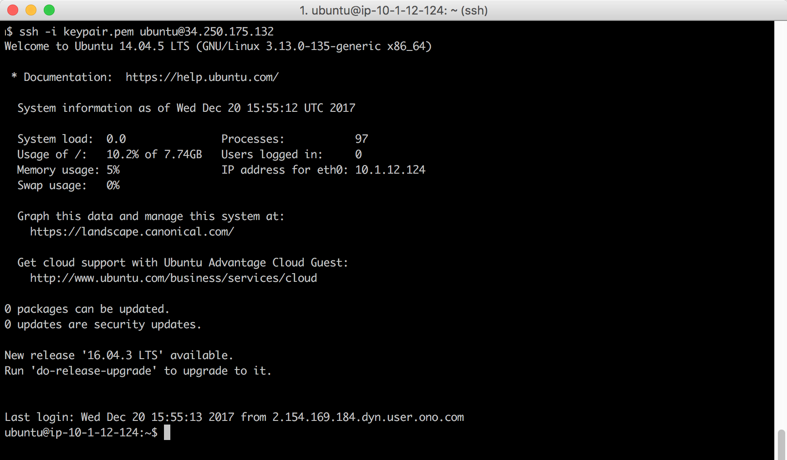
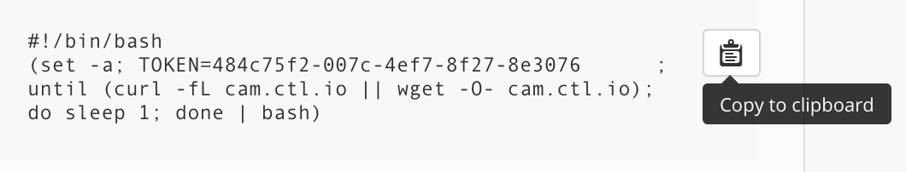

{{{
"title": "Register an Existing Instance",
"date": "12-13-2018",
"author": "Guillermo Sanchez & Sergio Quintana",
"keywords": ["cam", "instances", "auto-discovery", "register"],
"attachments": [],
"contentIsHTML": false
}}}

**In this article:**

* [Overview](#overview)
* [Audience](#audience)
* [Prerequisites](#prerequisites)
* [Discovering the unregistered instances](#discovering-the-unregistered-instances)
* [Registering an instance](#registering-an-instance)
* [Contacting Cloud Application Manager Support](#contacting-cloud-application-manager-support)

### Overview

*Cloud Application Manager* can auto-discover existing instances that have been provisioned directly using the provider console outside of *Cloud Application Manager*. With this capability, even if some of your teams are using the provider's console to provision instances, you can import them into *Cloud Application Manager* and manage their lifecycle as well as view them as part of the *Cloud Reports*. 
It is important to realize that discovered instances will exist only as an instance. In addition, *Cloud Application Manager* does not create a corresponding *Deployment Policy* as part of registration process.

You can check the full process by watching the following video:

<iframe width="560" height="315" src="https://player.vimeo.com/video/210485902" frameborder="0" allowfullscreen></iframe>

### Audience

Users who want to register their instances into *Cloud Application Manager* to enable lifecycle management on them.

### Prerequisites

* An active *Cloud Application Manager* account
* An existing account of some provider with active instances
* Having configured the provider with that account

### Discovering the unregistered instances

* When adding a provider for the first time
* When having an existing provider in *Cloud Application Manager*
* When enabling automatic discovery of resources

Let's see them in detail below:

#### When adding a provider for the first time

As soon as you add a provider in your workspace, *Cloud Application Manager* will auto-discover all existing instances in that provider and save them in the *Unregistered Instances* tab under the provider details. These unregistered instances will also be shown in the Instances page under *All* or *Unregistered* submenu items. Then, you can follow the on-screen instructions to register them in *Cloud Application Manager*.

#### When having an existing provider in Cloud Application Manager

If you have an existing provider in *Cloud Application Manager*, the next time you click on *Sync* all the instances that exist in that provider, but have not been provisioned yet using *Cloud Application Manager*, will be auto-discovered and saved in the *Unregistered Instances* tab under the provider details. Then, you can follow the on-screen instructions to register them in *Cloud Application Manager*.

#### When enabling Automatic Discovery of Resources

You can enable the *Automatic Discovery of Resources* toggle in the provider *Services* tab.

When enabled, it will cause an automatic synchronization just for unregistered instances every 20 minutes to check for any change in the available instances and their corresponding state. The *Unregistered Instances* tab in the provider details as well as the *Instances* page where unregistered instances are shown will display the state from latest synchronization, triggered either automatically or explicitly by pressing the *Sync* button.

This feature is only available for Optimized or Managed providers.

### Registering an instance

Instances can be registered either from the *Unregistered Instances* tab of your provider details page, where you can import a single instance or select many of them and execute a bulk register, or from the *Instances* page where you can register one instance at a time.

Currently, it is not necessary anymore to be in the target workspace scope where you want to register the instance, since instance registering from a scope other than a workspace is allowed.

#### Register an instance or instances from the *Unregistered Instances* tab

Click on the register icon of an instance:

Or choose several unregistered instances of your provider and click **Bulk Actions > Register**.

Then, follow the steps of the [Registration process](#registration-process) below.

#### Register an instance from the *Instances* page

You must be in the *All* or *Unregistered* view of the *Instances* page and click on the register icon of the instance you want to register.

Then, follow the steps of the [Registration process](#registration-process) below.

#### Registration process

* Start registering. When performing a bulk register, a previous step appears in the dialog providing the option to apply property values to all instances to register. The following image shows the dialog displayed when bulk registering in a *CenturyLink Cloud* provider type:

    

* The next step of the bulk import will allow you to set the properties for each instance to be registered:

    
    
* If you are registering a single instance, a single step dialog appears asking for information to complete the register process:

    

* It is important to note that if you are not placed into a workspace scope, a target workspace must be provided:

    

* When you click on Register button, the instance details page show the result of the register process:

    

* If an Unsuccessful Registration occurred, either if the credentials are not valid or the instance IP address is not accessible through the internet:

    

* Go to the instance details where you should find the command to be executed into the instance to manually register it:

    

* Get the endpoint address for ssh connection:

    

* Use your token key-pair and connect to the instance:

    

* Copy the snippet for manual creation of the agent script:

    

* Use your favorite editor to create the shell script by pasting the copied snippet and change execution permission:

    

* Start agent:

    

* The instance is now successfully registered:

    

The previous process was done using a *CenturyLink Cloud* provider but, depending on the provider or the used *OS* it may be necessary to perform additional steps after or before the ones stated above. 
Please, visit these links for further information:

* [Auto-discover AWS EC2 instances](./autodiscover-ec2-instances.md)

* [Register an Existing AWS Linux instance](./register-existing-aws-linux-instance.md)

* [Register an Existing AWS Windows instance](./register-existing-aws-windows-instance.md)

### Contacting Cloud Application Manager Support

We’re sorry you’re having an issue in [Cloud Application Manager](https://www.ctl.io/cloud-application-manager/). Please review the [troubleshooting tips](../Troubleshooting/troubleshooting-tips.md), or contact [Cloud Application Manager support](mailto:incident@CenturyLink.com) with details and screenshots where possible.

For issues related to API calls, send the request body along with details related to the issue.

In the case of a box error, share the box in the workspace that your organization and Cloud Application Manager can access and attach the logs.

* Linux: SSH and locate the log at /var/log/elasticbox/elasticbox-agent.log
* Windows: RDP into the instance to locate the log at ProgramDataElasticBoxLogselasticbox-agent.log
