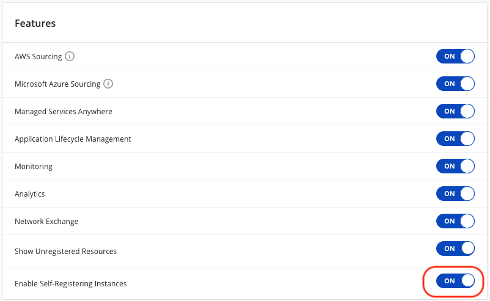
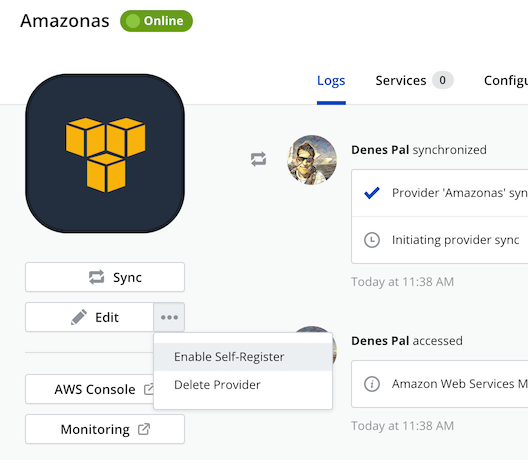
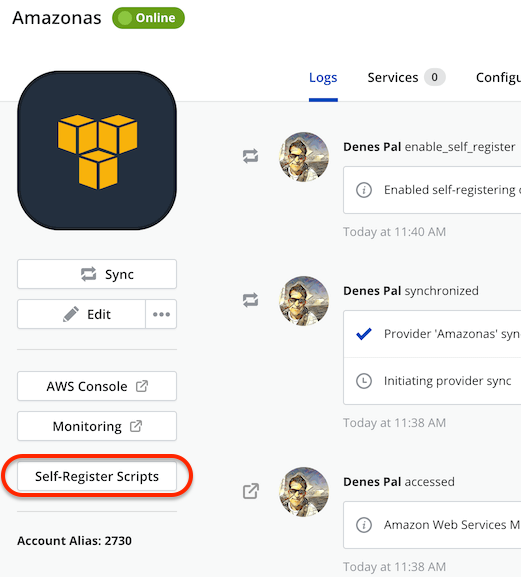
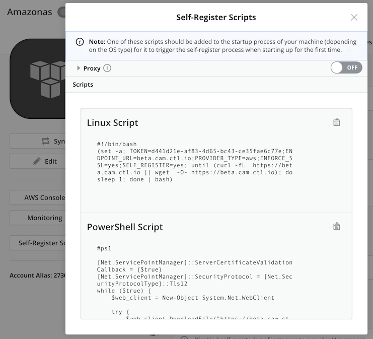

{{{ "title": "Self-Registering Virtual Machines",
"date": "09-04-2019",
"author": "Denes Pal and Guillermo Sanchez",
"attachments": [],
"contentIsHTML": false,
"keywords": ["cam","self-register", "register", "auto register", "provider"]
}}}
**In this article:**

* [Overview](#overview)
* [Audience](#audience)
* [Prerequisites](#prerequisites)
* [Supported provider types](#supported-provider-types)
* [Supported instance types](#supported-instance-types)
* [Enabling the self-registration feature for your organization](#enabling-the-self-registration-feature-for-your-organization)
* [Enabling self-registration on a provider](#enabling-self-registration-on-a-provider)
* [Obtaining the self-registration script](#obtaining-the-self-registration-script)
* [Managing self-registered instances](#managing-self-registered-instances)
* [Contacting Cloud Application Manager Support](#contacting-cloud-application-manager-support)

### Overview

The self-Registering feature allow virtual machines that have been deployed outside of Cloud Application Manager to register themselves automatically into a provider in Cloud Application Manager as imported instances.

The self-registration process is triggered by a command snippet available through the self-register enabled provider details page that has to be attached to the virtual machine first startup sequence. This snippet downloads and installs the Cloud Application Manager agent and registers the instance automatically into Cloud Application Manager.

From there on, Cloud Application manager can be used to manage the lifecycle of the imported instance, as with any other deployed or manually registered instance.

### Audience

All Cloud Application Manager users who want to get their virtual machines deployed directly to the underlying provider or with any other deployment management tool to be automatically registered in Cloud Application Manager.

### Prerequisites

* Access to Cloud Application Manager [Management site](https://account.cam.ctl.io/#/providers?type=Amazon-Web-Services).
* The user must have access to an already configured [provider](../Core Concepts/providers.md) in Cloud Application Manager, that supports the self-registration of virtual machines.
* Access to the underlying cloud provider account with authorization to deploy virtual infrastructure.

### Supported provider types

These are the Provider types supporting self-registration of virtual machines:

* Amazon AWS/EC2
* CenturyLink Cloud
* Google Cloud Platform

### Supported instance types

The self-Registering feature supports:

* Single virtual machine instances
* Virtual machines that belongs to a scaling group. All machines belonging to the same auto-scaling group will be registered as a single instance in Cloud Application Manager of type auto-scaling group.

### Enabling the self-registration feature for your organization

in order to allow enabling self-registration on a Provider, the administrator of the organization has to first switch on the self-register feature flag in the Organization settings page.

### Enabling self-registration on a provider

Once the self-register organization feature toggle has been switched on, you can enable the feature for a given provider among the supported provider types by accessing the provider details page, and clicking on the _Enable Self-Register_ option that appears under the three dots dropdown next to the _Edit_ button.

When it is enabled for a provider, a new button _Self-Register Scripts_ appears on the provider details page, allowing the user to retrieve the provider-specific run-once command snippet that is needed to bootstrap the virtual machine with in order to trigger the self-registration process for the instance.

### Obtaining the self-registration script

Once it has been enabled in the provider, when the user clicks the _Self-Register Scripts_ button, a dialog will show the command snippets to be used for both Linux and Windows based machines. It will also provide the ability to specify proxy settings, to allow instances being deployed behind a proxy server to contact back Cloud Application Manager through it for the self-registration process to be successful.

The self-registration command snippets are customized per provider, and will only be valid for self-register instances being deployed on the corresponding underlying cloud account. You should copy the corresponding command snippet (either for Linux and Unix-like OS-es as Bash script, or for Windows as PowerShell script) and include it in the bootstrap process of the virtual machine definition or template to be made self-registered.

When the self-register instances feature is enabled in a provider, the dropdown option changes to  _Disable Self-Register_, which you can use to disable the feature in the provider, so that no newly deployed instances will be self-registered, even if they include and execute the self-register snippet.

### Managing self-registered instances

A virtual machine deployed with self-registration will pop up in Cloud Application Manager as an imported instance automatically, belonging to the provider whose self-registration script was used.

If the virtual machine belongs to a scaling group, a single instance will appear as imported in Cloud Application Manager, containing all the machines included in the scaling group.

Once the instance is available in Cloud Application Manager, you can manage it as any other instance type, execute lifecycle events or edit it through the [Lifecycle Editor](../Core Concepts/lifecycle-editor.md), such as [deploying a Script Box](./deploy-script-box-to-registered-instance.md) on the instance.

### Contacting Cloud Application Manager Support

We’re sorry you’re having an issue in [Cloud Application Manager](https://www.ctl.io/cloud-application-manager/). Please review the [troubleshooting tips](../Troubleshooting/troubleshooting-tips.md), or contact [Cloud Application Manager support](mailto:incident@CenturyLink.com) with details and screenshots where possible.

For issues related to API calls, send the request body along with details related to the issue.

In the case of a error registering an instance, share the instance to a workspace that your organization and Cloud Application Manager support group can access and attach the logs.

* Linux: SSH into the instance and locate the log at /var/log/elasticbox/elasticbox-agent.log
* Windows: RDP into the instance to locate the log at \ProgramData\ElasticBox\Logs\elasticbox-agent.log

