{{{
"title": "Launching Slaves via Cloud Application Manager",
"date": "05-16-2019",
"author": "Gavin Lai and Julio Castanar",
"keywords": ["cam","cloud application manager", "Jenkins", "plugin", "slave", "box", "deployment policy"],
"attachments": [],
"contentIsHTML": false
}}}

**In this article:**
* [Overview](#overview)
* [Audience](#audience)
* [Prerequisites](#prerequisites)
* [Configure a Slave Box](#configure-a-slave-box)
* [Configure the Slave Deployment Policy](#configure-the-slave-deployment-policy)
* [Configure Jenkins Server to Build with Slaves Using Cloud Application Manager](#configure-jenkins-server-to-build-with-slaves-using-cloud-application-manager)
* [Find a Slave from Cloud Application Manager](#find-a-slave-from-cloud-application-manager)
* [Contacting Cloud Application Manager Support](#contacting-cloud-application-manager-support)

### Overview

Slave nodes run Jenkins tasks on remote machines in any cloud. If you configure cloud plugins like AWS to launch slaves and then write command line scripts to set up slave build environments then Cloud Application Manager and the Cloud Application Manager Jenkins plugin can save you the hassle of both tasks.  
By configuring the slave node once in Cloud Application Manager, you can reuse it across development, testing, staging, and production.  
Using Cloud Application Manager, you can launch slaves on any OS, flavor, and cloud.

### Audience

If you use Cloud Application Manager and also use Jenkins to continuously test and integrate code changes in development, staging, or production, you’d want to use the [Jenkins Cloud Application Manager plugin](https://wiki.jenkins-ci.org/display/JENKINS/ElasticBox+CI) to fully automate touchless deployments.

### Prerequisites

* Access to Cloud Application Manager, [Applications site](https://cam.ctl.io/login) as an authorized user of an active Cloud Application Manager account.
* GitHub account token access

### Configure a Slave Box

Configure a Jenkins slave in Cloud Application Manager. Later, you’ll call this slave from Jenkins using the Cloud Application Manager plugin.  
**IMPORTANT:** This slave configuration is Debian based, so remember to select a Debian Ubuntu Linux image in the policy at deploy time.

Perform the following steps:

#### 1. Log in to Cloud Application Manager.

#### 2. Create a Jenkins slave box.  
   From the Boxes page, click **New** > **Script**. Name the box, tag it Linux, and save.  

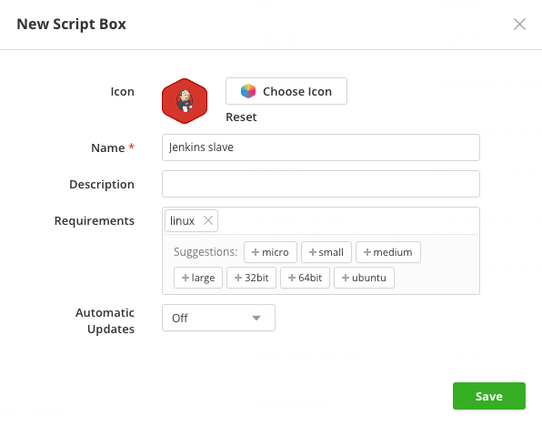

#### 3. Configure the box variables.  
   Under Code > Variables, create next two text variables in uppercase and leave their values empty.

   | Name | Type | Description |
   |------|------|-------------|
   | JENKINS_URL | Text | Provides space where Jenkins Url is stored. |
   | JNLP_SLAVE_OPTIONS | Text | Provides space where slave options are stored. |

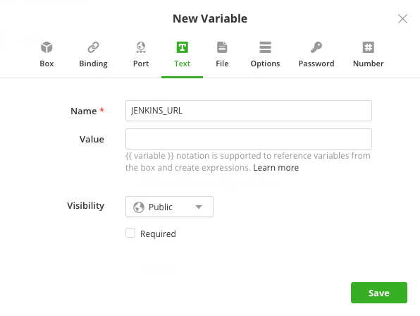

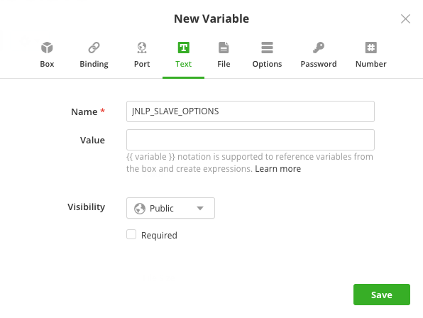


#### 4. Configure the box event scripts.  
   Under Code > Events, add an *install*, *start*, and *stop* script. Copy, paste each script below and save:

##### Install event. 
This script installs the latest version of Java if unavailable and downloads the slave agent from the Jenkins server.

   ```
   #!/bin/bash
	 sudo groupadd jenkins
	 sudo useradd -m -d /var/lib/jenkins -G sudo -g jenkins jenkins
   apt-get -y update
	 JENKINS_HOME=~jenkins
   if [ -z $(which java 2>/dev/null) ]
   then
       apt-get install default-jre -y
   fi

      apt-get -y install git

   # Download the Jenkins agent
   wget {{ JENKINS_URL }}/jnlpJars/slave.jar -O ${JENKINS_HOME}/slave.jar
   ```

##### Start event.
 This script starts the slave agent.

   ```
   #!/bin/bash

	 JENKINS_HOME=~jenkins
	 # Execute the agent and save the PID
	 cd ${JENKINS_HOME}
	 nohup java -jar ${JENKINS_HOME}/slave.jar {{ JNLP_SLAVE_OPTIONS }} > ${JENKINS_HOME}/slave.log 2>&1 &

	 echo $! > ${JENKINS_HOME}/slave.pid
   ```

##### Stop event.
This script kills the agent when the retention period on Jenkins ends.

   ```
   #!/bin/bash

   # Stop the agent
   SLAVE_PID=$(cat slave.pid)
   if [ -n ${SLAVE_PID} ]
   then
       kill -9 ${SLAVE_PID}
   fi

   ```

---

After box code configuration, you will see the code page in this manner

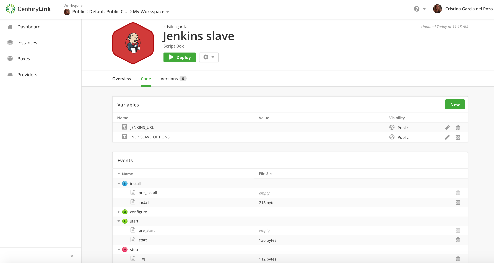

### Configure the Slave Deployment Policy

Create a deployment policy with infrastructure metadata to build the Jenkins slave environment.  

   * IMPORTANT: Don’t deploy the Jenkins slave box! Just create the policy. Jenkins will use the policy to launch the slave on-demand via Cloud Application Manager to the cloud provider you choose.

Perform the following steps:

#### 1. Create a Deployment Policy box.  

On the Boxes page, click New > Deployment Policy. In the dialog, select a provider account, and name the policy.  
Under Claims, type or select a linux tag. 
   * Claim tags define the policy at a high level. It defines the type of platform, flavor, image, and so on. When configuring the slave in Jenkins, you provide this claim tag to deploy the slave. The claim tag must match the requirement tag in the Jenkins slave box.

  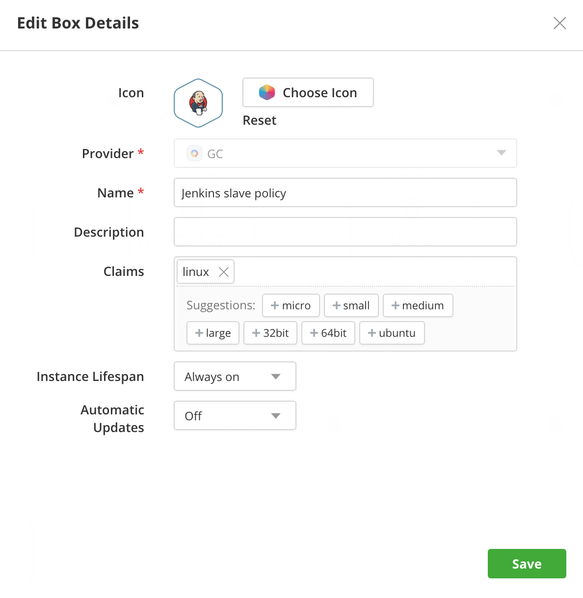

#### 2. Configure the Deployment Policy box.  
Under Code > Policy, edit the policy clicking the pencil on the right side.

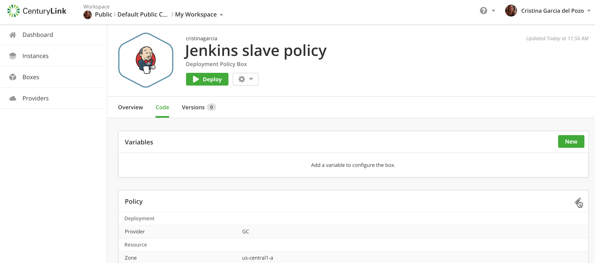

Make sure you select a Debian Ubuntu Linux image, select a firewall rule that allows traffic to the instance, and make the machine IP ephemeral to open it to Internet traffic. Save the policy.

   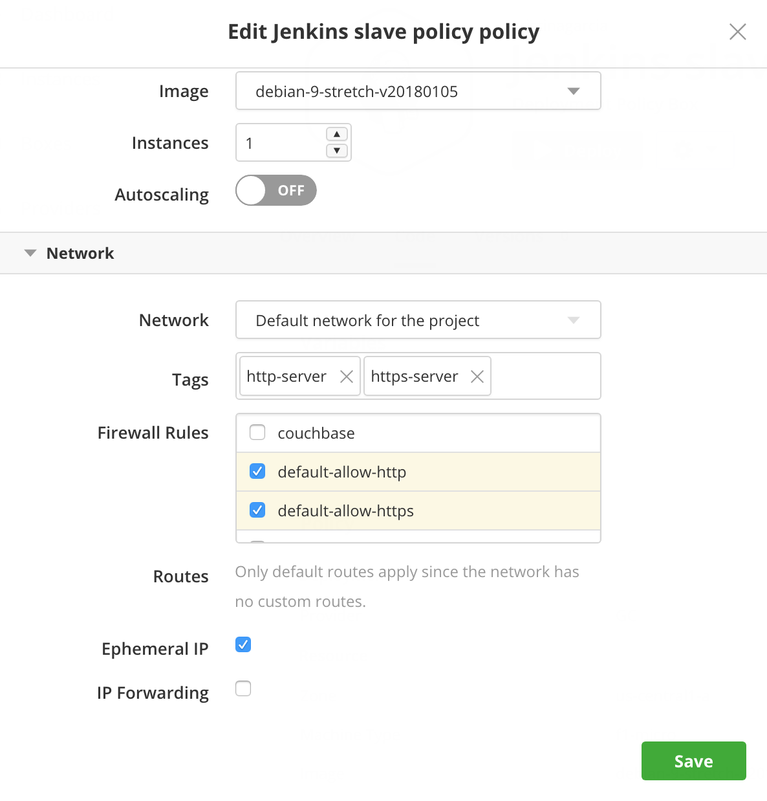

### Configure Jenkins Server to Build with Slaves Using Cloud Application Manager

Run Jenkins jobs using slaves launched via Cloud Application Manager on any cloud. 
- Be sure to [connect your Cloud Application Manager account](jenkins-cloud-application-manager-setup.md) in Jenkins before setting up the slave.
- Install [ElasticBox plugin](https://plugins.jenkins.io/elasticbox) on your Jenkins server. You can find more information [here](https://plugins.jenkins.io/elasticbox).


#### Configure access to your Cloud Application Manager account

1. Go to Manage Jenkins > Configure System page at **http://\<your Jenkins host\>/configure.** 

2. Under **Cloud** select **Add a new cloud** and choose the **ElastciBox** option.  
   You must have installed  **ElasticBox plugin** before. See above.

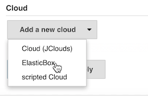

   Configure your access to selected cloud and verify the authentication token

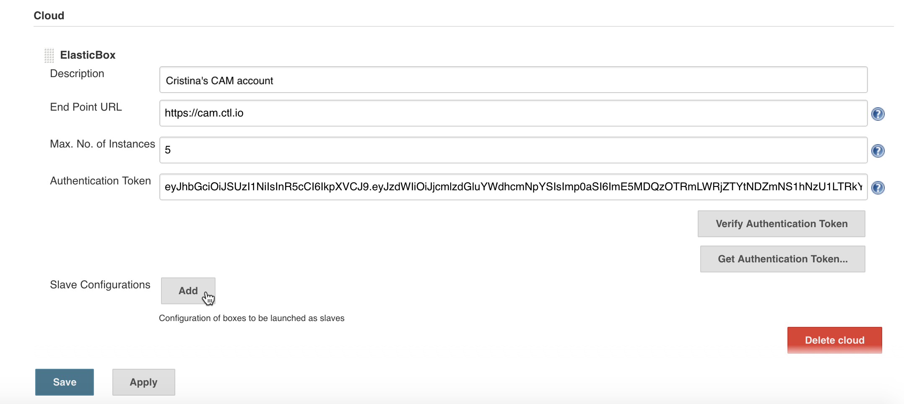

#### Add Jenkins Slaves

3. Set up Jenkins to launch slaves using the slave box. Click **Add** for **Slave Configurations**.  
    In this section, select the slave box from the Cloud Application Manager workspace.  
    Optionally, tag the slave instance.

	 Set **Min. No. of Instances** to 0 when you don’t want to keep idle slaves alive.  
    Set **Max. No. of Instances** to the number of slaves you want at any given time to run Jenkins jobs.
 
   Add a **label** to identify the slave to Jenkins. Use underscores or dashes, but not spaces.  
   **IMPORTANT**: When you create a build job (as we’ll do in the next section), you can provide this label to make Jenkins select this type of slave for executing the job.

	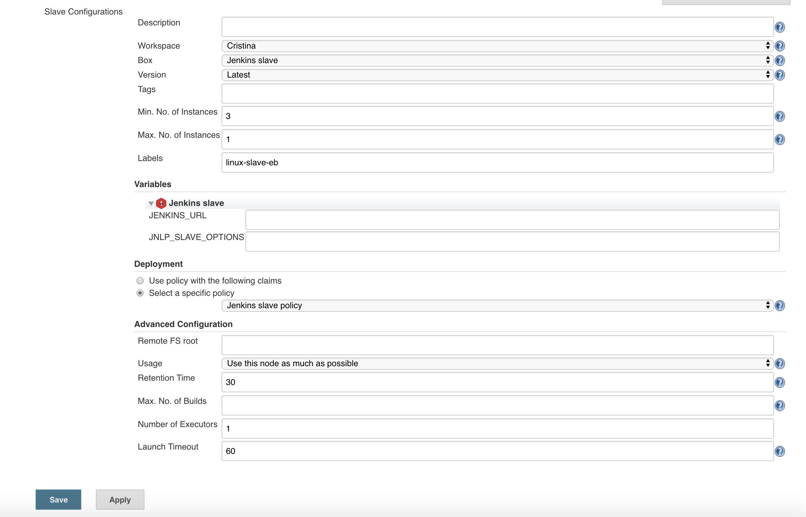

   The plugin uses the JENKINS_URL and JNLP_SLAVE_OPTIONS variables to pass Jenkins server information slaves need to connect. Leave them empty.

   Under Deployment, select a policy from the Cloud Application Manager workspace.  
   You can also enter a claim tag to use any policy that matches this tag in the Cloud Application Manager workspace.

   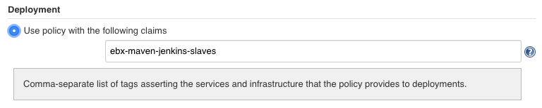

	Click Advanced.  

    For **Retention Time**, specify in minutes how long the plugin should wait before terminating an idle slave. If the slave is idle for more than 30 minutes, which is the default, the plugin terminates the slave from your provider. But for this to work, your slave must be connected to the Jenkins server.

   Under **Max. No. of Builds**, set the most builds the slave can execute. If the slave hits that number, the plugin terminates it.

4. Save the slave setup.


#### Enable Slaves to connect through a Port

When defining the [Jenkins server box](jenkins-cloud-application-manager-setup.md), we opened port 55555 on the cloud provider network to allow slaves to connect to the Jenkins server. In these steps, we open this port (or another you chose) in Jenkins server.

1. Go to Manage Jenkins > Configure global security page at **http://\<your Jenkins host\>/configureSecurity/.**

2. Select **Enable Security**.  
   Set in the **Agents** section the TCP port to **Fixed** 55555 as shown.

  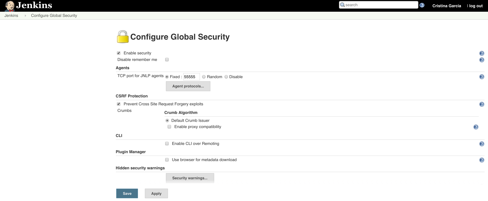

3. Save the setting.

#### Attach Slave to a Build Job

Follow these steps to attach a slave from Cloud Application Manager to run Jenkins build jobs.

1. From the Jenkins server management interface, create a new job or click **Configure** on any built job.

2. Select **Restrict where this project can be run**.   
   Under **Label Expression**, type and select the label for the Cloud Application Manager slave that you gave when setting it up in Jenkins. This causes Jenkins to pick any available slave by that label.

	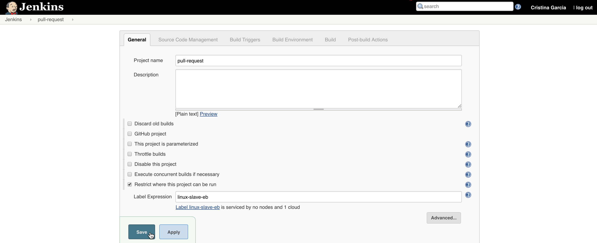

3. Save the job.


### Find a Slave from Cloud Application Manager

Follow these steps to locate slaves launched via Cloud Application Manager in case you need to debug.

1. Go to your Jenkins server management interface at **http://\<your Jenkins host\>:8080.**

	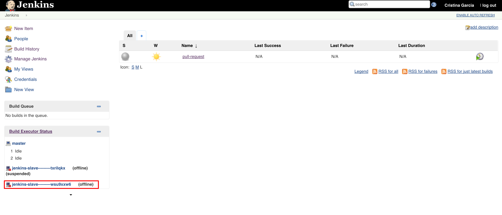

2. Click the slave if active in the left pane. It’s typically named as <Jenkins slave box environment name——–ID>. 
   Detailed information regarding this slave is shown. Here’s an example.

   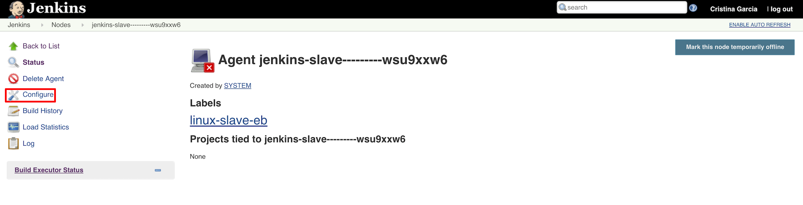

3. Click Configure. This shows settings for the slave.

   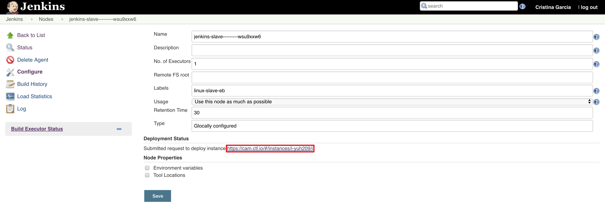

4. Notice the Cloud Application Manager link to the slave instance. Click to open the slave instance in Cloud Application Manager. From there, you can debug the slave in the lifecycle editor or check the logs.


### Contacting Cloud Application Manager Support

We’re sorry you’re having an issue in [Cloud Application Manager](https://www.ctl.io/cloud-application-manager/). Please review the [troubleshooting tips](../Troubleshooting/troubleshooting-tips.md), or contact [Cloud Application Manager support](mailto:incident@CenturyLink.com) with details and screenshots where possible.

For issues related to API calls, send the request body along with details related to the issue.

In the case of a box error, share the box in the workspace that your organization and Cloud Application Manager can access and attach the logs.
* Linux: SSH and locate the log at /var/log/elasticbox/elasticbox-agent.log
* Windows: RDP into the instance to locate the log at /ProgramData/ElasticBox/Logs/elasticbox-agent.log
