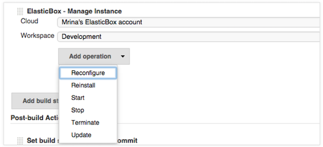

{{{
"title": "Cloud Application Manager plugin for CI/CD with Jenkins ",
"date": "05-16-2019",
"author": "Julio Castanar",
"keywords": ["cam","cloud application manager", "Jenkins", "plugin", "CI/CD" ],
"attachments": [],
"contentIsHTML": false
}}}

**In this article:**

* [Overview](#overview)
* [Audience](#audience)
* [Prerequisites](#prerequisites)
* [Slaves management](#slaves-management)
* [Deploy Box](#deploy-box)
* [Manage Instance](#manage-instance)
* [Update Box](#update-box)
* [Contacting Cloud Application Manager Support](#contacting-cloud-application-manager-support)

### Overview

The [Cloud Application Manager Jenkins plugin](https://wiki.jenkins-ci.org/display/JENKINS/ElasticBox+CI) automates CI/CD on any cloud and SCM.  

In this article, we see the capabilities this plugin offers you for CI/CD in a Jenkins Server project:  
  **Slaves management** and the build steps **Deploy Box**, **Manage Instance** and **Update Box**.

### Audience

If you use Cloud Application Manager and you also use Jenkins to continuously test and integrate code changes in development, staging, or production, you’d want to use the [Jenkins Cloud Application Manager plugin](https://wiki.jenkins-ci.org/display/JENKINS/ElasticBox+CI) to fully automate touchless deployments.

### Prerequisites

* You must have an active Cloud Application Manager Account
* A [Jenkins server with the GitHub and Cloud Application Manager plugins](jenkins-cloud-application-manager-setup.md).

### Slaves management

Using Cloud Application Manager, you can launch slaves on any OS, flavor, and cloud. You can configure these slaves to automatically execute build Jenkins jobs concurrently. Slaves help to speed up builds, build in a specific OS, runtime stack, or build changesets for small or large dev teams.

You can see a complete guide to use it in the [Launching Slaves via Cloud Application Manager](./jenkins-cloud-application-manager-slaves.md) article.

### Deploy Box

In a Jenkins project you can add a build step that uses the Cloud Application Manager to deploy a box in any cloud through Cloud Application Manager.

You can see a complete example showing how to do this in [Jenkins CI/CD setting up - Deploy Box build step](./setting-up-ci-cd.md)

### Manage Instance

In a Jenkins project you can add a build step that runs automation and lifecycle operations for workloads defined in Cloud Application Manager boxes in the Jenkins job build steps.
 

You can see a complete example showing how to do this in [Jenkins CI/CD setting up - Manage instances build step](./setting-up-ci-cd.md)

### Update Box

In a Jenkins project you can add a build step that uses the Cloud Application Manager to launch code updates on to build environments in any cloud.

You can see a complete example showing how to do this in [Jenkins CI/CD setting up - Update Box build step](./setting-up-ci-cd.md)

### Contacting Cloud Application Manager Support

We’re sorry you’re having an issue in [Cloud Application Manager](https://www.ctl.io/cloud-application-manager/). Please review the [troubleshooting tips](../Troubleshooting/troubleshooting-tips.md), or contact [Cloud Application Manager support](mailto:incident@CenturyLink.com) with details and screenshots where possible.

For issues related to API calls, send the request body along with details related to the issue.

In the case of a box error, share the box in the workspace that your organization and Cloud Application Manager can access and attach the logs.
* Linux: SSH and locate the log at /var/log/elasticbox/elasticbox-agent.log
* Windows: RDP into the instance to locate the log at ProgramDataElasticBoxLogselasticbox-agent.log

