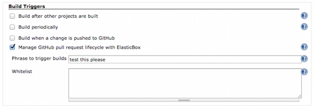
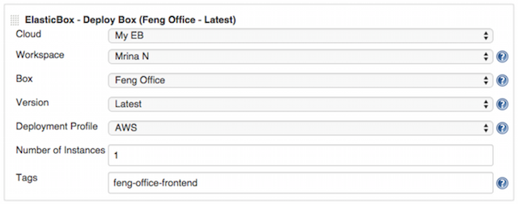
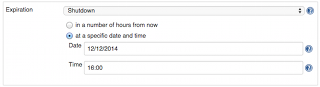
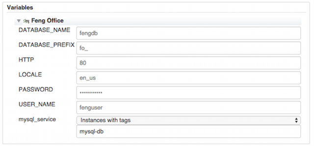
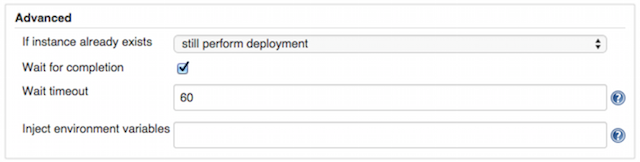
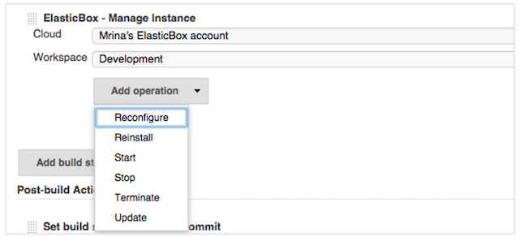
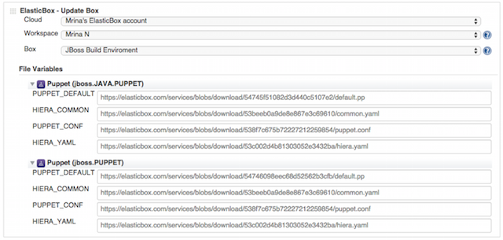

{{{
"title": "Setting Up CI/CD with Cloud Application Manager, Jenkins and GitHub",
"date": "09-01-2016",
"author": "",
"attachments": [],
"contentIsHTML": false
}}}

### Setting Up CI/CD with Cloud Application Manager, Jenkins and GitHub

The [Cloud Application Manager Jenkins plugin](https://wiki.jenkins-ci.org/display/JENKINS/ElasticBox+CI) automates CI/CD on any cloud and SCM. In this article, we use Git as the SCM. For CI, the plugin launches code updates on to build environments in any cloud through Cloud Application Manager. For CD, it runs automation and lifecycle operations for workloads defined in Cloud Application Manager boxes in the Jenkins job build steps.

**Note:** To get going, you need a [Jenkins server with the GitHub and Cloud Application Manager plugins](jenkins-cloud-application-manager-setup.md).

To add Cloud Application Manager build steps in Jenkins jobs, go to the job page. Under Build, click **Add build step** and select an Cloud Application Manager deploy, manage, or update step.

**In this article:**

* Manage GitHub pull requests
* Deploy configurations from Cloud Application Manager
* Manage instance lifecycle through Cloud Application Manager
* Update box file variables

### Manage GitHub Pull Requests
The plugin simplifies the GitHub pull request lifecycle for workloads run through Cloud Application Manager. While you need the GitHub plugin to provide the repository, project URL, and access credentials, you don’t need the GitHub pull request builder plugin, which is a lot of work to setup.

When you check the **Manage GitHub pull request lifecycle with Cloud Application Manager** option in the Jenkins job, the plugin performs the following things:
* Automatically detects commits to the GitHub repository specified in the Jenkins job.
* Triggers the Jenkins job when you create or update a pull request. The plugin detects a commit when one of these things occur. You submit a new pull request, reopen an existing one, push a new commit to an existing one, or post the specified trigger phrase from the Jenkins job in the comment of the pull request.
* Manages multiple updates to a pull request cost effectively. Typically, a pull request has an instance. When multiple commits happen simultaneously, Jenkins can run into conflicts and build issues. Additionally, simultaneous commits to the same pull request waste compute and slave resources. But with the lifecycle option, the plugin cancels older builds when it encounters a new update to the pull request. Thus, it saves both on slave and compute resources.
* When you merge pull requests to the master branch, the plugin terminates and deletes the pull request instance. This is useful for multi-tier applications. Usually, you have to use tags and delete build steps in downstream build jobs to clean up instances. But you save all that extra work with the plugin lifecycle option.

Cloud Application Manager provides parameters that contain information about GitHub pull requests. You can call them from box scripts, box text expression variables, and in Jenkins build job shell scripts.
* PR_NUMBER. Pull request number
* PR_URL. Pull request URL (Ex: **https://github.com/jenkinsci/elasticbox-plugin/pull/1**)
* PR_OWNER. GitHub login of the pull request owner
* PR_OWNER_EMAIL. Pull request owner’s email address
* PR_MERGE_BRANCH. Branch to which the pull request merges (Ex: master)
* PR_BRANCH. Git branch of the pull request (Ex: fix-unit-tests)
* PR_COMMIT. Git commit for the triggered build (Ex: fe982b7082035025bef4e851b5bd250a21aae18e)
* BUILD_REQUESTER. GitHub login of the person requesting the build via a trigger phrase like “Jenkins test this please”
* BUILD_REQUESTER_EMAIL. Email address of the person requesting the build

### Deploy Configurations from Cloud Application Manager
Add the Cloud Application Manager Deploy build step in Jenkins jobs to launch automated configuration defined in boxes from an Cloud Application Manager account.

**Select a box to deploy**

* **Cloud** - Select the Cloud Application Manager account you registered on the Jenkins server.
* **Workspace** - Choose the Cloud Application Manager workspace from where you want to deploy the box.
* **Version** - Choose **Cloud Application Manager automatic version** to deploy a default box. For any other box, select Latest or a version from the drop-down.
* **Deployment Profile** - Choose the profile attached to the box that has settings to deploy to a specific provider registered in Cloud Application Manager.
* **Number of Instances** - Specify the number of instances for the plugin to launch to the provider in the deployment profile. This overrides the instances number in the deployment profile.

**Tag instances**

Under Tags, enter one or more keywords separated by comma. These keywords can include Jenkins build parameters or environment variables in the ${variable_name} format. The instance deployed from this build step is tagged with these keywords. Make sure the tags are unique if you want to bind to this build step from a subsequent one.

**Schedule instances**

When deploying boxes through Jenkins build jobs, you can plan to expire the instance at future hour or custom time and date to save money and resources in the process.

In the deploy build step, under Expiration, schedule an instance as follows:
* If you don’t want to schedule, keep **Always On**, which is the default. This option lets you kill the instance when you will.
* To shut it down, select **Shutdown** from the drop-down. Then specify whether to shut down in a number of hours from now or at a specific date and time.

**Pass box deployment values and bind to instances**

Under **Variables**, pass deployment values for variables defined in the box. If you have a variable here that binds to a box from a previous build step, then you can use tags to refer to the box. For example, in a previous deploy build step a MySQL database box is tagged mysql-db. When binding to this box from a later build step we refer to the tag as shown.

**Configure other settings**

Under **Advanced**, you can optionally configure more deployment settings.

**Tell Jenkins what to do when an instance of the box already exists**. In case an instance of this box is already there, under **If instance already exists**, choose whether Jenkins should still deploy, skip deploying, reinstall, reconfigure, or delete the existing instance and deploy.

**Ask Jenkins to wait till the box finishes deploying**. Check the **Wait for completion** option if you want subsequent build steps to wait for this one to complete before starting the next. To run build steps in parallel, uncheck it.

**Wait for operations to timeout**. In any of the Cloud Application Manager build steps, you can timeout an operation in minutes if it fails to run in that specified time. By default, the Cloud Application Manager Jenkins plugin waits 60 minutes before timing out an operation. But you can specify a custom wait time.

**Generate instance information**

Under **Inject environment variables**, enter an instance name. Cloud Application Manager uses it to generate instance information you can pass as environment variables in following build steps or build jobs. For example, if you enter MYSQL, you get the following environment variables for the instance:
* MYSQL: Instance ID
* MYSQL_URL: Instance URL
* MYSQL_SERVICE_ID: Instance service ID
* MYSQL_TAGS: Comma separated tags of the instance

Depending on whether you deployed one or more instances, you also get these variables:

Single instance
* MYSQL_MACHINE_NAME: Machine name of the instance
* MYSQL_PUBLIC_ADDRESS: Public IP address of the instance
* MYSQL_PRIVATE_ADDRESS: Private IP address of the instance

Multiple instances
* MYSQL_MACHINE_NAMES: List of machine names for the instances
* MYSQL_PUBLIC_ADDRESS: List of public IP addresses for the instances
* MYSQL_PRIVATE_ADDRESS: List of private IP addresses for the instances

### Manage Instance Lifecycle through Cloud Application Manager
Add the Cloud Application Manager Manage build step in Jenkins jobs to manage the lifecycle of instances in a workspace with [specific operations](../Deploying Anywhere/deploying-managing-instances.md).

**Select an instance operation**

To run an operation, select the Cloud Application Manager account registered in Jenkins, the workspace where the instance is located, and the operation under **Add operation**. Select **Reconfigure**, **Reinstall**, **Start**, **Stop**, **Terminate**, or **Update**.

**Reconfigure, reinstall, start, stop, or terminate an instance**

Under **Tags**, enter tags for instances. Tags can come from a deploy build step or can be tags applied to instances deployed through Cloud Application Manager. Tags can include Jenkins build parameters and environment variables in the ${variable_name} format. Separate tags by comma. Any operation you select runs on all tagged instances.

**Ask Jenkins to wait for an operation to complete**

Check the **Wait for completion** option if you want subsequent build steps to wait for this one to complete before starting the next. To run build steps in parallel, uncheck it.

**Wait for operations to timeout**

In any of the Cloud Application Manager build steps, you can timeout an operation in minutes if it fails to run in that specified time. By default, the Cloud Application Manager Jenkins plugin waits 60 minutes before timing out an operation. But you can specify a custom wait time.

**Delete terminated instances**

In a terminate operation, check **Delete after termination** to delete instances after terminating.

**Force terminate instances**

Instead of terminating an instance, you can force it to terminate by selecting **Force terminate** in a terminate operation.

**Update instances**

In the **Update** operation, enter tags to identify a deployed instance you want to update. Update its runtime by providing deployment values of a box you pick. To apply these changes to the instance, run reinstall or reconfigure in subsequent operations.

### Update Box File Variables
Update Box is an Cloud Application Manager build step in the Jenkins job that lets you upload the file variables to a box in a specific workspace. Add this build step to upload files from a working folder where the Jenkins job runs to a box in Cloud Application Manager.

### See CI/CD in Action
To see Jenkins CI/CD in action, try the [tutorial](../Tutorials/jenkins-ci-cd-tutorial.md). It takes you through a typical deployment workflow automated entirely with the help of the Cloud Application Manager plugin.

### Contacting Cloud Application Manager Support

We’re sorry you’re having an issue in [Cloud Application Manager](https://www.ctl.io/cloud-application-manager/). Please review the [troubleshooting tips](../Troubleshooting/troubleshooting-tips.md), or contact [Cloud Application Manager support](mailto:incident@CenturyLink.com) with details and screenshots where possible.

For issues related to API calls, send the request body along with details related to the issue.

In the case of a box error, share the box in the workspace that your organization and Cloud Application Manager can access and attach the logs.
* Linux: SSH and locate the log at /var/log/elasticbox/elasticbox-agent.log
* Windows: RDP into the instance to locate the log at ProgramDataElasticBoxLogselasticbox-agent.log
