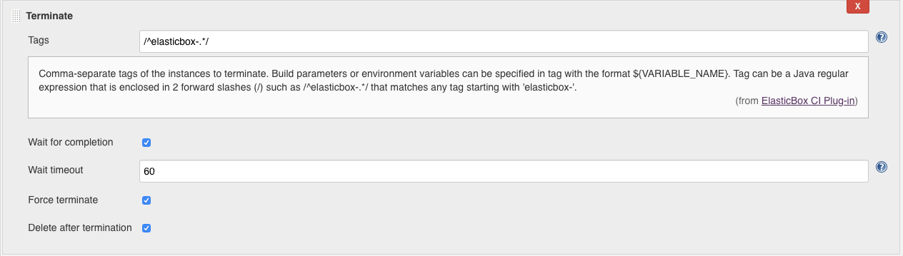
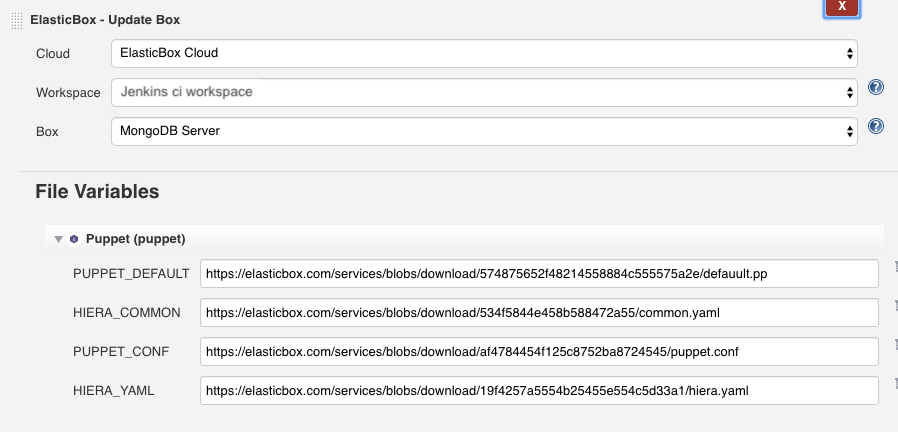

{{{
"title": "Setting Up CI/CD with Cloud Application Manager, Jenkins and GitHub",
"date": "05-16-2019",
"author": "Julio Castanar",
"keywords": ["cam","cloud application manager", "Jenkins", "plugin" ],
"attachments": [],
"contentIsHTML": false
}}}

**In this article:**

* [Overview](#overview)
* [Audience](#audience)
* [Prerequisites](#prerequisites)
* [Manage GitHub Pull Requests](#manage-github-pull-requests)
* [Deploy Box configurations from Cloud Application Manager](#deploy-box-configurations-from-cloud-application-manager)
* [Manage Instance Lifecycle through Cloud Application Manager](#manage-instance-lifecycle-through-cloud-application-manager)
* [Update Box File Variables](#update-box-file-variables)
* [See CI/CD in Action](#see-cicd-in-action)
* [Contacting Cloud Application Manager Support](#contacting-cloud-application-manager-support)

### Overview

The [Cloud Application Manager Jenkins plugin](https://wiki.jenkins-ci.org/display/JENKINS/ElasticBox+CI) automates CI/CD on any cloud and SCM.  
In this article, we use Git as the SCM.  
For CI, the plugin launches code updates on to build environments in any cloud through Cloud Application Manager.  
For CD, it runs automation and lifecycle operations for workloads defined in Cloud Application Manager boxes in the Jenkins job build steps.

To add Cloud Application Manager build steps in Jenkins jobs, go to the job page. Under Build, click **Add build step** and select an Cloud Application Manager deploy, manage, or update step.

### Audience

If you use Cloud Application Manager and you also use Jenkins to continuously test and integrate code changes in development, staging, or production, you’d want to use the [Jenkins Cloud Application Manager plugin](https://wiki.jenkins-ci.org/display/JENKINS/ElasticBox+CI) to fully automate touchless deployments.

### Prerequisites

* You must have an active Cloud Application Manager Account
* A [Jenkins server with the GitHub and Cloud Application Manager plugins](jenkins-cloud-application-manager-setup.md).

### Manage GitHub Pull Requests
The plugin simplifies the GitHub pull request lifecycle for workloads run through Cloud Application Manager. While you need the GitHub plugin to provide the repository, project URL, and access credentials, you don’t need the GitHub pull request builder plugin, which is a lot of work to setup.

When you check the **Manage GitHub pull request lifecycle with Cloud Application Manager** option in the Jenkins job, the plugin performs the following things:
* Automatically detects commits to the GitHub repository specified in the Jenkins job.
* Triggers the Jenkins job when you create or update a pull request.  
The plugin detects a change when any of these cases occur:  
    - You submit a new pull request, 
    - reopen an existing one, 
    - push a new commit to an existing one, or 
    - post the specified trigger phrase from the Jenkins job in the comment of the pull request.
* Manages multiple updates to a pull request cost effectively. Typically, a pull request has an instance.  
When multiple commits happen simultaneously, Jenkins can run into conflicts and build issues. Additionally, simultaneous commits to the same pull request waste compute and slave resources. But with the lifecycle option, the plugin cancels older builds when it encounters a new update to the pull request.  
Thus, it saves both on slave and compute resources.
* When you merge pull requests to the master branch, the plugin terminates and deletes the pull request instance. This is useful for multi-tier applications. Usually, you have to use tags and delete build steps in downstream build jobs to clean up instances. But you save all that extra work with the plugin lifecycle option.

Cloud Application Manager provides parameters that contain information about GitHub pull requests. You can call them from box scripts, box text expression variables, and in Jenkins build job shell scripts.

| Name | Description |
|------|-------------|
| PR_NUMBER | Pull request number |
| PR_URL | Pull request URL (Ex: **https://github.com/jenkinsci/elasticbox-plugin/pull/1**) |
| PR_OWNER | GitHub login of the pull request owner |
| PR_OWNER_EMAIL | Pull request owner’s email address |
| PR_MERGE_BRANCH | Branch to which the pull request merges (Ex: master) |
| PR_BRANCH | Git branch of the pull request (Ex: fix-unit-tests) |
| PR_COMMIT | Git commit for the triggered build (Ex: fe982b7082035025bef4e851b5bd250a21aae18e) |
| BUILD_REQUESTER | GitHub login of the person requesting the build via a trigger phrase like “Jenkins test this please” |
| BUILD_REQUESTER_EMAIL | Email address of the person requesting the build |

### Deploy Box configurations from Cloud Application Manager
Add the Cloud Application Manager **Deploy Box** build step in Jenkins jobs to launch automated configuration defined in boxes from an Cloud Application Manager account.

#### Add a build step
Select a box to deploy for instance.

* **Cloud** - Select the [Cloud Application Manager account](../../jenkins-cloud-application-manager-slaves.md) you registered on the Jenkins server system configuration.
* **Workspace** - Choose the Cloud Application Manager workspace from where you want to deploy the box.
* **Box** - Choose the box in your workspace you want to deploy.
* **Version** - Choose **Cloud Application Manager automatic version** to deploy a default box. For any other box, select Latest or a version from the drop-down.
* **Instance Name** - Choose a name for every instance created for this box. Note the variable used to relate it with the pull request number and give a different name at the same time. See next field.
* **Tags** Enter one or more keywords separated by comma. These keywords can include Jenkins build parameters or environment variables in the ${variable_name} format. The instance deployed from this build step is tagged with these keywords. Make sure the tags are unique if you want to bind to this build step from a subsequent one.
* **Automatic Updates** - Specify if box must be updated when a new version is available.
* **Expiration** - When deploying boxes through Jenkins build jobs, you can plan to expire the instance at future hour or custom time and date to save money and resources in the process.  
In the deploy build step, under Expiration, schedule an instance as follows:
  * If you don’t want to schedule, keep **Always On**, which is the default. This option lets you kill the instance when you will.
  * To shut it down, select **Shutdown** from the drop-down. Then specify whether to shut down in a number of hours from now or at a specific date and time.

    

  * To terminate it, select **Terminate** from the drop-down. Then specify when in the same manner as before.

     

#### Setup the variables

Under **Variables**, pass deployment values for variables defined in the box and bind to instances. Depending on the box you have chosen, different variables will be shown to fill.  

If you have a variable here that binds to a box from a previous build step, then you can use tags to refer to the box. For example, in a previous deploy build step a MySQL database box is tagged mysql-db. When binding to this box from a later build step we refer to the tag as shown.

#### Set a deployment policy

Select a specific deployment policy or search for policies whose claims match requirements that appear here.

#### Configure Advanced settings

Under **Advanced**, you can optionally configure more deployment settings.

* **If instance already exists** - Tell Jenkins what to do choosing whether should still deploy, skip deploying, reinstall, reconfigure, or delete the existing instance and deploy a new one.
  
* **Wait for completion** - Check this option if you want subsequent build steps to wait for this one to complete before starting the next. To run build steps in parallel, uncheck it.

* **Wait timeout** - In any of the Cloud Application Manager build steps, you can timeout any operation in minutes if it fails to run in that specified time. By default, the Cloud Application Manager Jenkins plugin waits 60 minutes before timing out an operation. But you can specify a custom wait time.

* **Inject environment variables** - Allows you generate instance information. Depending on the box you have chosen, different variable names are available. Enter an variable name and Cloud Application Manager uses it to generate instance information.   
  You can pass them as environment variables in following build steps or build jobs.  

  

  For example, if you enter MYSQL, you retrieve the following environment variables for the instance:
  * MYSQL: Instance ID
  * MYSQL_URL: Instance URL
  * MYSQL_SERVICE_ID: Instance service ID
  * MYSQL_TAGS: Comma separated tags of the instance

  Depending on whether you deployed one or more instances, you also get these variables:

    Single instance
    * MYSQL_MACHINE_NAME: Machine name of the instance
    * MYSQL_PUBLIC_ADDRESS: Public IP address of the instance
    * MYSQL_PRIVATE_ADDRESS: Private IP address of the instance

    Multiple instances
    * MYSQL_MACHINE_NAMES: List of machine names for the instances
    * MYSQL_PUBLIC_ADDRESS: List of public IP addresses for the instances
    * MYSQL_PRIVATE_ADDRESS: List of private IP addresses for the instances

### Manage Instance Lifecycle through Cloud Application Manager
Add the Cloud Application Manager **Manage Instance** build step in Jenkins jobs to manage the lifecycle of instances in a workspace with [specific operations](../Deploying Anywhere/deploying-managing-instances.md).

#### Select an instance operation

To run an operation, select the Cloud Application Manager account registered in Jenkins, the workspace where the instance is located, and the operation under **Add operation** menu. Select **Reconfigure**, **Reinstall**, **Start**, **Stop**, **Terminate**, or **Update**.

#### Configure operations

* Any of the operations **Reconfigure, reinstall, start, stop, or terminate an instance** can configure some of the next features:

    

  * **Tags** - enter tags for instances. Separate tags by comma. Any operation you select runs on all tagged instances.  
  Tags can come from a deploy build step or can be tags applied to instances deployed through Cloud Application Manager. Tags can include Jenkins build parameters and environment variables in the ${variable_name} format. 

  * **Wait for completion** - Check this option if you want subsequent build steps to wait for this one to complete before starting the next. To run build steps in parallel, uncheck it.

  * **Wait timeout** - In any of the Cloud Application Manager build steps, you can timeout an operation in minutes if it fails to run in that specified time. By default, the Cloud Application Manager Jenkins plugin waits 60 minutes before timing out an operation. But you can specify a custom wait time.

  * **Force terminate** - Instead of terminating an instance, you can force it to terminate by selecting this option in a *terminate operation*.

  * **Delete after termination** - In a *terminate operation*, check this option to delete instances after terminating.

* In the **Update** operation, enter the box, the prefered version and the tags to identify a deployed instance you want to update. 

    

    Update its runtime by providing deployment values to the variables of the box you pick.  
    To apply these changes to the instance, run reinstall or reconfigure in subsequent operations.

### Update Box File Variables
In a Jenkins project, Cloud Application Manager **Update Box** build step lets you upload the file variables to a box in a specific workspace.  
Add this build step to upload files from a working folder where the Jenkins job runs to a box in Cloud Application Manager.

### See CI/CD in Action
To see Jenkins CI/CD in action, try the [tutorial](../Tutorials/jenkins-ci-cd-tutorial.md). It takes you through a typical deployment workflow automated entirely with the help of the Cloud Application Manager plugin.

### Contacting Cloud Application Manager Support

We’re sorry you’re having an issue in [Cloud Application Manager](https://www.ctl.io/cloud-application-manager/). Please review the [troubleshooting tips](../Troubleshooting/troubleshooting-tips.md), or contact [Cloud Application Manager support](mailto:incident@CenturyLink.com) with details and screenshots where possible.

For issues related to API calls, send the request body along with details related to the issue.

In the case of a box error, share the box in the workspace that your organization and Cloud Application Manager can access and attach the logs.
* Linux: SSH and locate the log at /var/log/elasticbox/elasticbox-agent.log
* Windows: RDP into the instance to locate the log at ProgramDataElasticBoxLogselasticbox-agent.log
