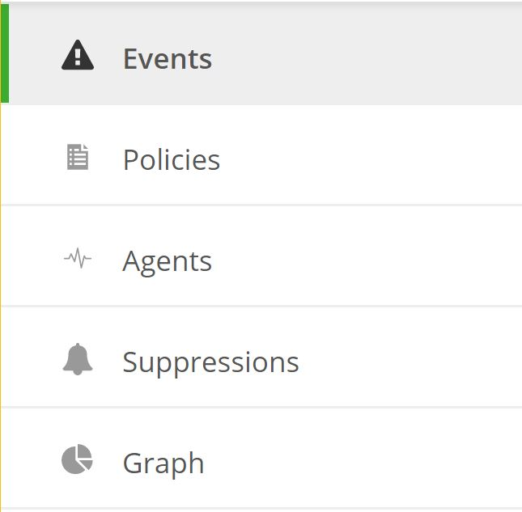

{{{
   "title": "Cloud Application Management Monitoring for Managed OS Introduction",
   "date": "12-13-2017",
   "author": "Jason Oldham",
   "attachments": [],
   "contentIsHTML": false
 }}}
 @@ -11,24 +11,24 @@ The Cloud Application Manager [Monitoring UI](https://monitoring.cam.ctl.io) is
 
 
### Overview
This document describes how to access the Monitoring UI, and provides a breakdown of the different views that are available in each of the main components of the UI which consists of Events, Policies, Agents, Suppression, and Graphing.
 

  
##### Events
On the Events tab there is a list of all active events (i.e. check that are out of their configured bound) for that workspace.  This includes statuses warning and critical, the check-type, its output, count and last occurrence.
 
##### Policies
Monitoring policies are groupings of one or more server checks available to be applied to a server within the selected workspace. Within the policy itself you can view the server checks and their associated configuration parameters along with the servers currently applied under that policy. 

##### Agents
This section lists all of the server being monitored for the selected workspace. Clicking on an individual agent will provide details specific to that server and also the current status of all checks being reported back from the server.  

##### Suppressions
In this area, you can view the server(s) of which traps have been suppressed, the period of time and reasoning for which the suppression is valid. Any server(s) listed here will not have its monitored events send to our operations center for investigation and resolution.  
 
##### Graphs
For servers that have 'metric' server checks applied to them, for which all Managed OS server do for CPU, Memory and Disk by default, you can display the data in area, line or multi-bar formats over the selected period of time via specific timeframes or generalized (i.e. now, last hour).
 
