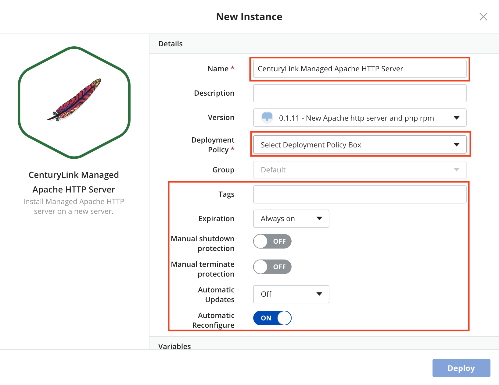

{{{
  "title": "Deploying CenturyLink Managed Apache via Cloud Application Manager",
  "date": "03-30-2018",
  "author": "Thomas Broadwell",
  "attachments": [],
  "contentIsHTML": false
}}}

### Table of Contents

* [Introduction](#introduction)
* [Overview](#overview)
* [Supported Apache HTTP Server](#supported-apache-http-server)
* [Supported PHP](#supported-php)
* [Supported Operating Systems](#supported-operating-systems)
* [License](#license)
* [Installation Features](#installation-features)
* [Configuration](#configuration)
* [Administration](#administration)
* [Deploying Managed Apache](#deploying-managed-apache)

### Introduction
Apache HTTP has been the most popular web server for nearly two decades — and it gets even better with CenturyLink Cloud and our Managed Apache service.

### Overview
Cloud Application Manager’s Managed Services Anywhere (MSA) allows customers to depend on CenturyLink to manage cloud deployed workloads, relieving themselves of the burdens of day to day monitoring, patching and Operational activities.  Through Cloud Application Manager's Managed Service Anywhere (MSA), a customer can provision a VM instance running Apache within any MSA enabled provider and because Managed Services has been enabled on the provider, CenturyLink will manage both the Operating System and Apache.

### Supported Apache HTTP Server
*  HTTP Server version 2.4

### Supported PHP
*  Version 7.0
*  Version 7.1

### Supported Operating Systems
*	Managed Redhat version 6
*	Managed Redhat version 7

### License
* Licensing for deployments are provided by the Cloud Provider.  The cost for the RHEL license and the VM it is deployed upon will be reflected within the customer's cloud provider bill, or under the cloud provider's section in the CenturyLink consolidated bill (for customers that have elected to utilize CenturyLink's consolidated billing feature).

### Installation Features
* Prepare Server for Application Service (OS Specific Parameters)
* Install Apache Http Server
* Install PHP, Ruby on Rails, Express, AngularJS and Node.JS
* Install OpenSSL
* Install CenturyLink Monitoring
* Perform Quality Assurance against Apache Http Server Installation/Hardening

### Configuration
* Configure Site Connectivity (Virtual Hosts, TCP Port, IP Address and SSL Certificate allocation)
* Implementation of Customer specified Apache configuration
* Implementation of Customer specified PHP configuration
* Configure CenturyLink Monitoring

### Administration
* Application Log Monitoring
* Restart/Stop/Start Services
* Install Patched Apache, PHP and OpenSSL packages
* Log Management (Rotation & Removal)
* Coordinate patching with Customer during maintenance hours
* Customer initiated Redundancy & High Availability Test/Audit (Excludes Disaster Recovery testing)
* Patching, minor/major releases, change management

### Deploying Managed Apache

Deploying Managed Apache to your provider with CenturyLink Cloud Application Manager:

1. In Catalog, select the Managed Services Anywhere subcategory and then select the “CenturyLink Managed Apache Http Server".  Deploy CenturyLink Managed Apache instance.

  

2. Update the Details of the instance that is to be deployed, selecting the appropriate RHEL 6 or 7 Deployment Policy for your desired environment and the Features you would like enabled.

  
  

3. Select Deploy

### Help

Please review the [troubleshooting tips](../Troubleshooting/troubleshooting-tips.md) for help. Or you may contact [support](http://managedservices.ctl.io) to request help.
