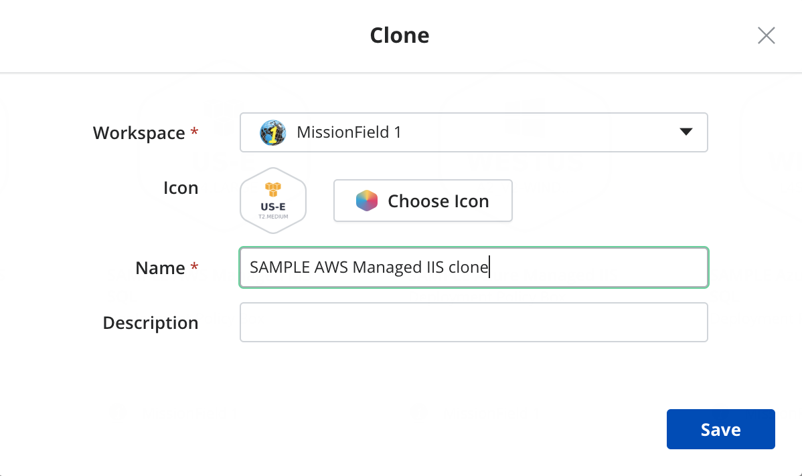
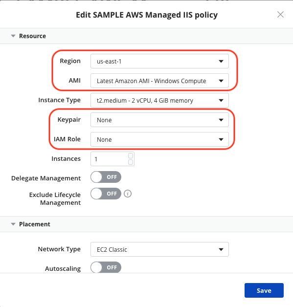
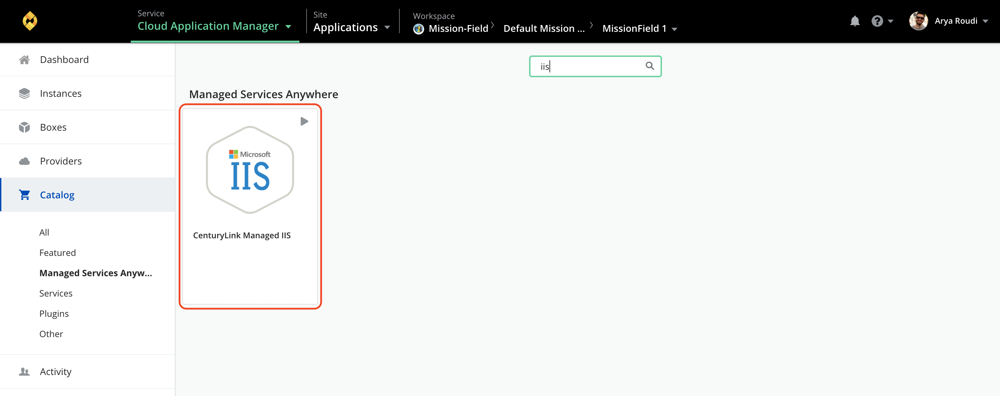
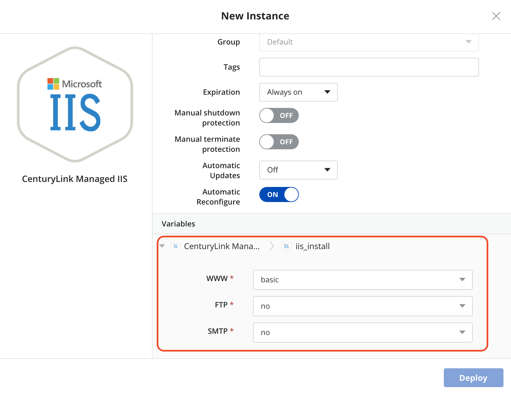

{{{
  "title": "Deploying CenturyLink Managed IIS via Cloud Application Manager",
  "date": "03-30-2018",
  "author": "Thomas Broadwell",
  "attachments": [],
  "contentIsHTML": false
}}}

### Table of Contents

* [Introduction](#introduction)
* [Overview](#overview)
* [Supported Versions](#supported-versions)
* [Supported Editions](#supported-editions)
* [Supported Operating Systems](#supported-operating-systems)
* [License](#license)
* [Installation Features](#installation-features)
* [Configuration](#configuration)
* [Administration](#administration)
* [Deploying Managed MS IIS](#deploying-managed-ms-iis)

### Introduction
Internet Information Services (IIS, formerly Internet Information Server) is an extensible web server created by Microsoft for use with the Windows NT family.[2] IIS supports HTTP, HTTPS, FTP, FTPS, SMTP and NNTP. It has been an integral part of the Windows NT family since Windows NT 4.0 – and it gets even better with CenturyLink Cloud Application Manager and our Managed Microsoft IIS service.

### Overview
Cloud Application Manager’s Managed Services Anywhere (MSA) allows customers to depend on CenturyLink to manage cloud deployed workloads, relieving themselves of the burdens of day to day monitoring, patching and Operational activities.  Through Cloud Application Manager's Managed Service Anywhere (MSA), a customer can provision a VM instance running Apache within any MSA enabled provider and because Managed Services has been enabled on the provider, CenturyLink will manage both the Operating System and IIS.

### Supported Installation types
*  Basic
*  Full
*  ASP.NET

### Supported Options
*  Enabling of FTP
*  Enabling of SMTP
*  Enabling of DTC Network

### Supported Operating Systems
*	Managed Microsoft Windows Server 2012
*	Managed Microsoft Windows Server 2012 R2

### License
* Licensing for deployments are provided by the Cloud Provider.  The cost for the Windows server license and the VM it is deployed upon will be reflected within the customer's cloud provider bill, or under the cloud provider's section in the CenturyLink consolidated bill (for customers that have elected to utilize CenturyLink's consolidated billing feature).

### Installation Features
* Prepare Server for Application Service (OS Specific Parameters)
* Install ASP.Net versions (not native to OS)
* Install Microsoft IIS (including available sub components)
* Install SSL Certificates
* Install CenturyLink Monitoring
* Perform Quality Assurance against Microsoft IIS Installation/Hardening

### Configuration
* Configure Site Connectivity (Host Headers, TCP Port, IP Address and SSL Certificate allocation)
* Configure CenturyLink Monitoring

### Administration
* Application Log Monitoring
* Recycle Application Pool(s)
* Restart/Stop/Start Services
* Update managed servers with all recommended security patches, service packs and hot-fixes upon customer request
* Log Management (Rotation & Removal)
* Coordinate patching with Customer during maintenance hours
* Customer initiated Redundancy & High Availability Test/Audit (Excludes Disaster Recovery testing)

### Deploying Managed MS IIS

Deploying Managed MS IIS to your provider with CenturyLink Cloud Application Manager:
1. In Boxes, Deployment Policies, search for “SAMPLE Managed IIS”
2. Select SAMPLE Managed IIS Deployment Policy

  
The Sample Deployment policy is generated when the provider is made managed.  This policy's default configuration may be changed to suit the environment in which it is being installed.

3. Select the Configure (Gear) dropdown
4. Select “Clone”:
5. Modify the Cloned Deployment Policy with your details (Icon, Name, Description)
6. Select Save

  

7. Edit your new Deployment Policy with your environment specific details (Resource, Placement and Network) and Save.
**NOTE:  The CenturyLink recommended Instance type is selected in the SAMPLE Managed IIS deployment policy.  Modification of this Instance type may result in significant performance issues.**
**Disk configuration settings should remain as configured in SAMPLE Managed IIS deployment policy.**

   

8. In Catalog, select the Managed Services Anywhere subcategory and then select the “CenturyLink Managed IIS”.  Deploy CenturyLink Managed IIS instance.

  

9. Update the Details of the instance that is to be deployed, selecting the appropriate Deployment Policy for your desired environment and the Features you would like enabled.

  
  

10. Select Deploy

### Help

Please review the [troubleshooting tips](../Troubleshooting/troubleshooting-tips.md) for help. Or you may contact [support](http://managedservices.ctl.io) to request help.
