<<<<<<< HEAD:Cloud Application Manager/Managed Services/Deploying_Managed_MS_SQL_to_AWS.md
{{{
  "title": "Deploying CenturyLink Managed MS SQL via Cloud Application Manager",
  "date": "05-17-2018",
  "author": "Thomas Broadwell",
  "attachments": [],
  "contentIsHTML": false
}}}

### Table of Contents

* [Introduction](#introduction)
* [Overview](#overview)
* [Supported Versions](#supported-versions)
* [Supported Editions](#supported-editions)
* [Supported Operating Systems](#supported-operating-systems)
* [License](#license)
* [Installation Features](#installation-features)
* [Configuration](#configuration)
* [Administration](#administration)
* [Deploying Managed MS SQL](#deploying-managed-ms-sql)

### Introduction
The foundation of Microsoft’s comprehensive data platform, SQL Server delivers breakthrough performance for mission-critical applications – and it gets even better with CenturyLink Cloud Application Manager and our Managed Microsoft SQL service.

### Overview
Cloud Application Manager’s Managed Services Anywhere allows customers to deploy workloads and delegate the management of the workload to CenturyLink, relieving themselves of the burdens of day to day monitoring, patching and Operational activities.  Through Cloud Application Manager, a customer can provision a new VM instance with MS SQL within their AWS provider and chose to have CenturyLink manage both the Operating System and MS SQL.

### Supported Versions
*  Microsoft SQL Server 2008 R2
*  Microsoft SQL Server 2012
*  Microsoft SQL Server 2014

### Supported Editions
*  Standard Edition
*  Enterprise Edition

### Supported Operating Systems
*	Managed Microsoft Windows Server 2008 R2
*	Managed Microsoft Windows Server 2012

### License
* Licensing for AWS and Azure deployments are provided by the Cloud Provider.  The cost for MS SQL server and the VM it is deployed upon will be reflected within the customer's cloud provider bill, or under the cloud provider's section in the CenturyLink consolidated bill for customers that have elected to utilize CenturyLink's consolidated billing feature.
* CenturyLink Private Cloud on VMware Cloud Foundation supports a bring your own license (BYOL) model.  Customers can enter an activation key at deployment for a Managed MS SQL instance deployed on CenturyLink Private Cloud on VMware Cloud Foundation.

### Installation Features
* Prepare Server for Application Service (OS Specific Parameters)
* Install Microsoft SQL Server (including available options and features)
* Install applicable Microsoft SQL Server Service Packs
* Harden Microsoft SQL Server to CenturyLink Standards
* Install CenturyLink Monitoring
* Perform Quality Assurance against Microsoft SQL Server Installation/Hardening

### Configuration
* Create/Configure Microsoft SQL Server service accounts and SPNs
* Configure Login Auditing
* Configure Database Encryption using TDE
* Configure CenturyLink Monitoring
* Configure CenturyLink approved and provided Database Backups and Maintenance Jobs

### Administration
* SQL Server Log Monitoring
* Restart/Stop/Start Services
* Update managed servers with all recommended security patches, service packs and hot-fixes upon customer request
* Coordinate patching with Customer during maintenance hours
*	Support for Microsoft SQL Server Analysis Services (SSAS)

### Deploying Managed MS SQL

Deploying Managed MS SQL to your AWS provider with CenturyLink Cloud Application Manager:
1.	In Boxes, Deployment Policies, search for “SAMPLE”
2.	Select SAMPLE Managed MS SQL Deployment Policy

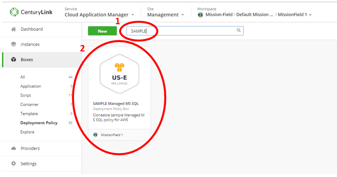

3.	Select the Configure (Gear) dropdown
4.	Select “Clone”:

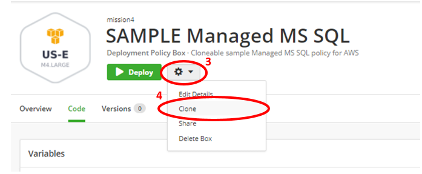

5.	Modify the Cloned Deployment Policy with your details (Icon, Name, Description)
6.	Select Save

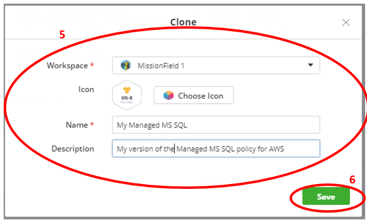

7.	Edit your new Deployment Policy with your environment specific details (Resource, Placement and Network) and Save.
**NOTE:  The CenturyLink recommended Instance type is selected in the SAMPLE Managed MS SQL deployment.  Modification of this Instance type may result in significant performance issues.**
**Disk configuration settings should remain as configured in SAMPLE Managed MS SQL deployment policy.**

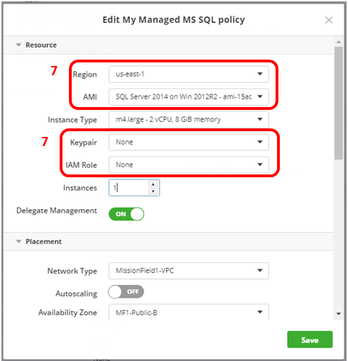
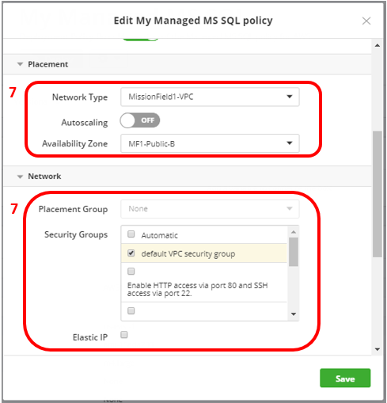

8.	In Boxes, Deployment Policies, search for “CenturyLink Managed SQL Server”
9.	Select CenturyLink Managed SQL Server Script Box

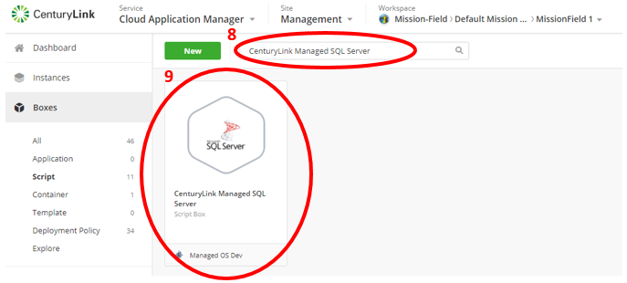

10.	Select Deploy

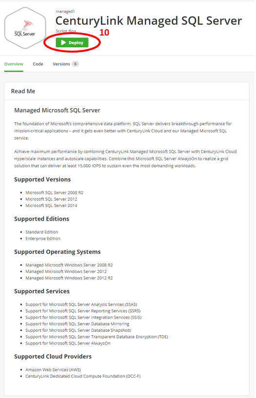

11.	Update the Details of the instance that is to be deployed, selecting the appropriate Deployment Policy for your desired environment.
12.	Select Deploy

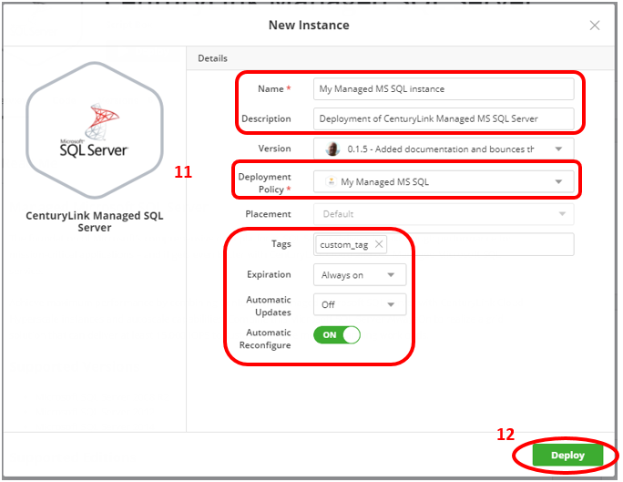

### Help

Please review the [troubleshooting tips](../Troubleshooting/troubleshooting-tips.md) for help. Or you may contact [support](http://managedservices.ctl.io) to request help.
=======
{{{
  "title": "Deploying CenturyLink Managed MS SQL via Cloud Application Manager",
  "date": "09-20-2017",
  "author": "Thomas Broadwell",
  "attachments": [],
  "contentIsHTML": false
}}}

### Table of Contents

* [Introduction](#introduction)
* [Overview](#overview)
* [Supported Versions](#supported-versions)
* [Supported Editions](#supported-editions)
* [Supported Operating Systems](#supported-operating-systems)
* [License](#license)
* [Installation Features](#installation-features)
* [Configuration](#configuration)
* [Administration](#administration)
* [Deploying Managed MS SQL](#deploying-managed-ms-sql)

### Introduction
The foundation of Microsoft’s comprehensive data platform, SQL Server delivers breakthrough performance for mission-critical applications – and it gets even better with CenturyLink Cloud Application Manager and our Managed Microsoft SQL service.

### Overview
Cloud Application Manager’s Managed Services Anywhere (MSA) allows customers to deploy workloads and delegate the management of the workload to CenturyLink, relieving themselves of the burdens of day to day monitoring, patching and Operational activities.  Through Cloud Application Manager, a customer can provision a VM instance running Apache within any MSA enabled provider and because Managed Services has been enabled on the provider, CenturyLink will manage both the Operating System and MS SQL.

### Supported Versions
*  Microsoft SQL Server 2008 R2
*  Microsoft SQL Server 2012
*  Microsoft SQL Server 2014

### Supported Editions
*  Standard Edition
*  Enterprise Edition

### Supported Operating Systems
*	Managed Microsoft Windows Server 2008 R2
*	Managed Microsoft Windows Server 2012

### License
* Licensing for AWS and Azure deployments are provided by the Cloud Provider.  The cost for MS SQL server and the VM it is deployed upon will be reflected within the customer's cloud provider bill, or under the cloud provider's section in the CenturyLink consolidated bill for customers that have elected to utilize CenturyLink's consolidated billing feature.

### Installation Features
* Prepare Server for Application Service (OS Specific Parameters)
* Install Microsoft SQL Server (including available options and features)
* Install applicable Microsoft SQL Server Service Packs
* Harden Microsoft SQL Server to CenturyLink Standards
* Install CenturyLink Monitoring
* Perform Quality Assurance against Microsoft SQL Server Installation/Hardening

### Configuration
* Create/Configure Microsoft SQL Server service accounts and SPNs
* Configure Login Auditing
* Configure Database Encryption using TDE
* Configure CenturyLink Monitoring
* Configure CenturyLink approved and provided Database Backups and Maintenance Jobs

### Administration
* SQL Server Log Monitoring
* Restart/Stop/Start Services
* Update managed servers with all recommended security patches, service packs and hot-fixes upon customer request
* Coordinate patching with Customer during maintenance hours
*	Support for Microsoft SQL Server Analysis Services (SSAS)

### Deploying Managed MS SQL

Deploying Managed MS SQL to your provider with CenturyLink Cloud Application Manager:
1. In Boxes, Deployment Policies, search for “SAMPLE Managed MS SQL”
2. Select SAMPLE Managed MS SQL Deployment Policy

  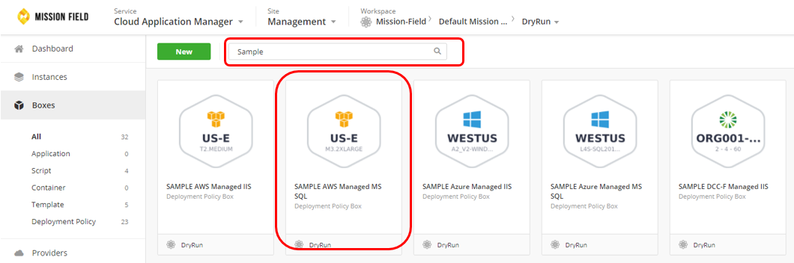
The Sample Deployment policy is generated when the provider is made managed.  This policy's default configuration may be changed to suit the environment in which it is being installed.

3. Select the Configure (Gear) dropdown
4. Select “Clone”:
5. Modify the Cloned Deployment Policy with your details (Icon, Name, Description)
6. Select Save

  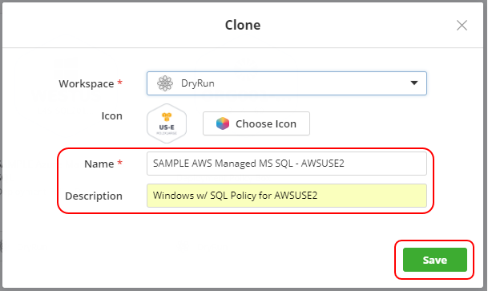

7. Edit your new Deployment Policy with your environment specific details (Resource, Placement and Network) and Save.
**NOTE:  The CenturyLink recommended Instance type is selected in the SAMPLE Managed MS SQL deployment.  Modification of this Instance type may result in significant performance issues.**
**Disk configuration settings should remain as configured in SAMPLE Managed MS SQL deployment policy.**

  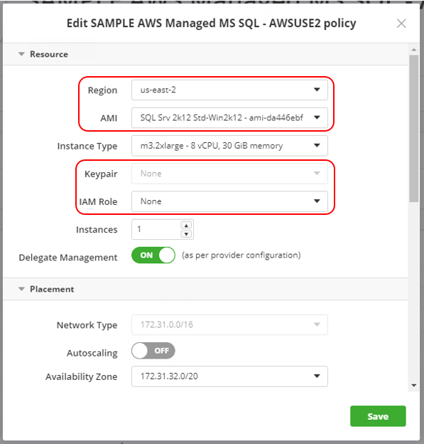 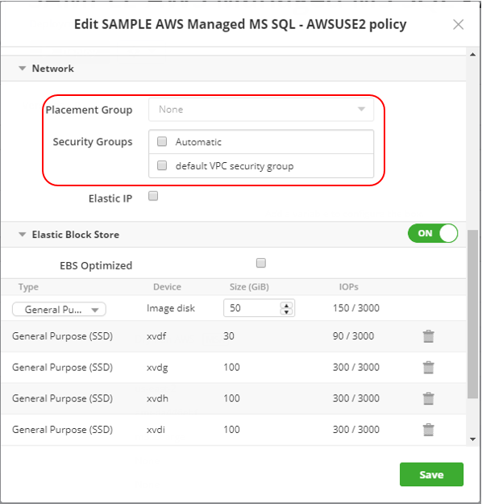

8. In Catalog, select the Managed Services Anywhere subcategory and then select the “CenturyLink Managed SQL Server”.  Deploy CenturyLink Managed SQL Server.

  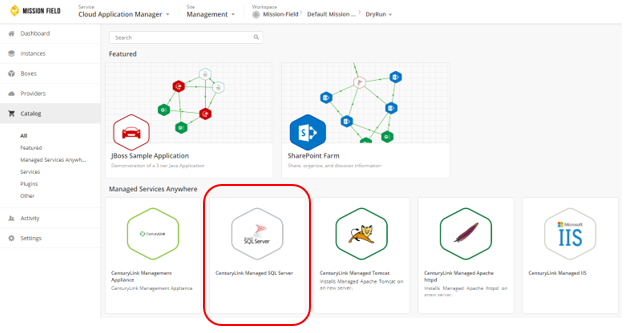

9. Update the Details of the instance that is to be deployed, selecting the appropriate Deployment Policy for your desired environment.
  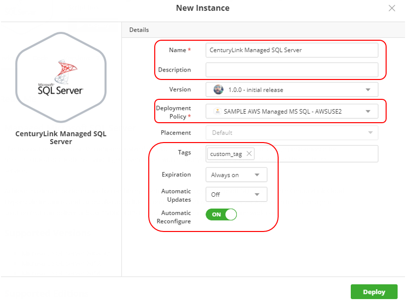

10. Select Deploy

### Help

Please review the [troubleshooting tips](../Troubleshooting/troubleshooting-tips.md) for help. Or you may contact [support](http://managedservices.ctl.io) to request help.
>>>>>>> upstream/master:Cloud Application Manager/Managed Services/Deploying-Managed-MS-SQL.md
