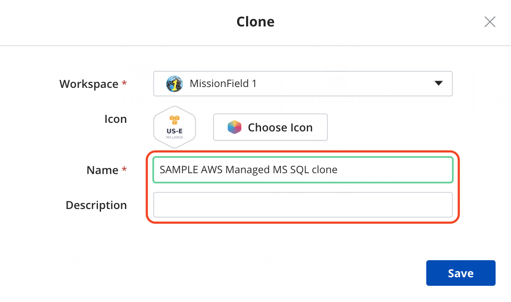
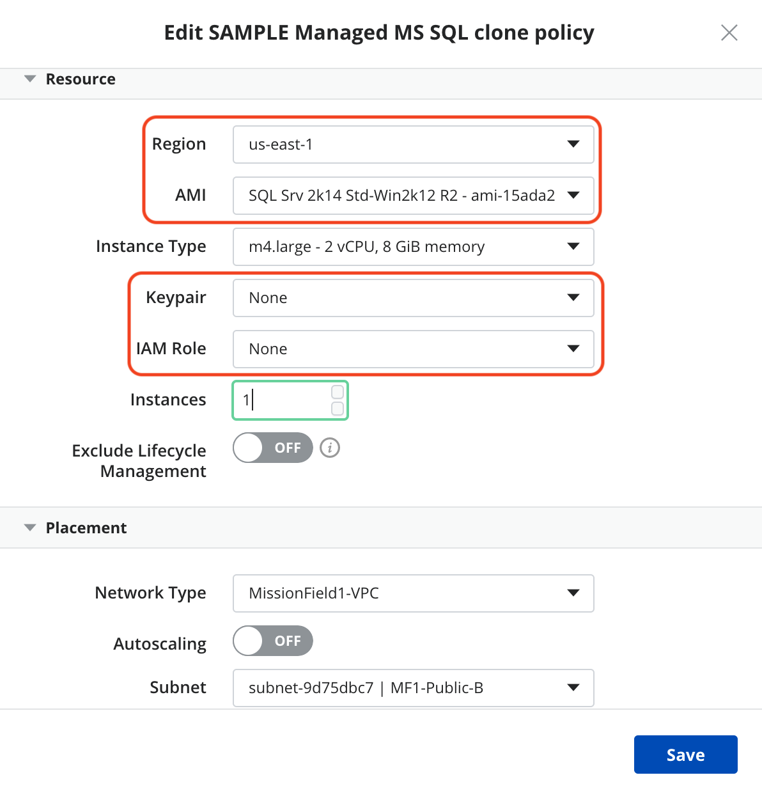

{{{
  "title": "Deploying CenturyLink Managed MS SQL via Cloud Application Manager",
  "date": "06-20-2018",
  "author": "Managed Applications Team",
  "attachments": [],
  "contentIsHTML": false
}}}

### Table of Contents

* [Introduction](#introduction)
* [Overview](#overview)
* [Supported Versions](#supported-versions)
* [Supported Editions](#supported-editions)
* [Supported Operating Systems](#supported-operating-systems)
* [Licensing](#licensing)
* [Deployment Overview](#deployment-overview)
* [Deploying Managed MSSQL via CAM](#deploying-managed-mssql-via-cam)

### Introduction
The foundation of Microsoft’s comprehensive data platform, SQL Server delivers breakthrough performance for mission-critical applications – and it gets even better with CenturyLink Cloud Application Manager (CAM) and our Managed Microsoft SQL service.

### Overview
Cloud Application Manager’s Managed Services Anywhere (MSA) allows customers to deploy workloads and delegate the management of the workload to CenturyLink, relieving themselves of the burdens of day to day monitoring, patching and Operational activities.  Through Cloud Application Manager, a customer can provision a VM instance running SQL Server within any MSA-enabled provider.  With Managed Services enabled on the provider, CenturyLink will manage both the Windows OS & MSSQL.

### Supported Versions
* Microsoft SQL Server 2012
* Microsoft SQL Server 2014
* Microsoft SQL Server 2016
* Microsoft SQL Server 2017

### Supported Editions
* Web
* Standard
* Enterprise

### Supported Operating Systems
* Managed Microsoft Windows Server 2012
* Managed Microsoft Windows Server 2012 R2
* Managed Microsoft Windows Server 2016

### Licensing
* Provider: CenturyLink Private Cloud on VMware Cloud Foundation (DCC-F): Licensing is provided by CenturyLink.
* Provider: AWS or Azure: Licensing is provided by the Cloud Provider.  The cost for MSSQL and the VM it is deployed upon will be reflected within the customer's cloud provider bill, or under the cloud provider's section in the CenturyLink consolidated bill for customers that have elected to utilize CenturyLink's consolidated billing feature.

### Deployment Overview
* Prepare Server for Application Service (OS-specific parameters)
* Install Microsoft SQL Server (including available options and features)
* Install the latest Microsoft SQL Server Service Pack available for the specified version (unless specified)
* Harden Microsoft SQL Server to CenturyLink standards (includes backup & maintenance jobs)
* Install CenturyLink Monitoring

### Deploying Managed MSSQL via CAM
1. **Create Deployment Policy**
    - This portion of the procedure is provider-dependent.  Refer to the applicable provider section below:
    - **Provider: CenturyLink Private Cloud on VMware Cloud Foundation (DCC-F)**
        1. Create a deployment policy using your MSA-enabled provider
            - **vApp Template**: Windows Server 2012 or greater
            - **Virtual CPUs**: At least 4 is optimal from a licensing cost perspective for Standard or Enterprise Edition, considering the minimum number of per-core/vCPU licenses is 4.
            - **Memory**: Minimum recommended value is 4GB.  At least 16 GB is recommended for production workloads.
            - **Disks**: At least 2 disk are required; one for system/boot, another for MSSQL data/backups (minimum recommended value is 10 GB).
    - **Provider: AWS or Microsoft Azure**
        1. Create a deployment policy by cloning a "SAMPLE" MSSQL deployment policy
            1. In Boxes, Deployment Policies, search for "SAMPLE Managed MS SQL"
            2. Select the provider-specific SAMPLE Managed MS SQL deployment policy
                - 
                - The Sample Deployment policy is generated when the provider is made managed.  This policy's default configuration may be changed to suit the environment in which it is being installed.
            3. Select the Configure (gear) dropdown
            4. Select "Clone"
            5. Modify the cloned deployment policy with your details (Icon, Name, Description)
            6. Select Save
                - 
            7. Edit your new deployment policy with your environment specific details (Resource, Placement and Network) and Save.
                -  
                - **NOTE**: The CenturyLink recommended Instance type is selected in the SAMPLE Managed MS SQL deployment.  Modification of this Instance type may result in significant performance issues.
                - 
                - **NOTE**: Disk configuration within the SAMPLE policy should remain as configured, however the quantity & size can be adjusted as needed.  At least 2 disk are required; one for system/boot, another for MSSQL data/backups.
2. Deploy "CenturyLink Managed SQL Server" script box from the Catalog using the created Deployment Policy                
    1. In Catalog, "Managed Services Anywhere" subcategory, select "CenturyLink Managed SQL Server".  Within this script box, select Deploy (top center, green).
        - 
        - **Details**: Select the appropriate Deployment Policy for your desired environment.
        - **Variables**: Select the target Version & Edition.  Other variables/options are available by clicking "Show More".
            - Refer to the "CenturyLink Managed SQL Server" Overview/ReadMe for details of each variable
        
    2. Select Deploy

### Help
Please review the [troubleshooting tips](../Troubleshooting/troubleshooting-tips.md) for help. Or you may contact [support](http://managedservices.ctl.io) to request help.
