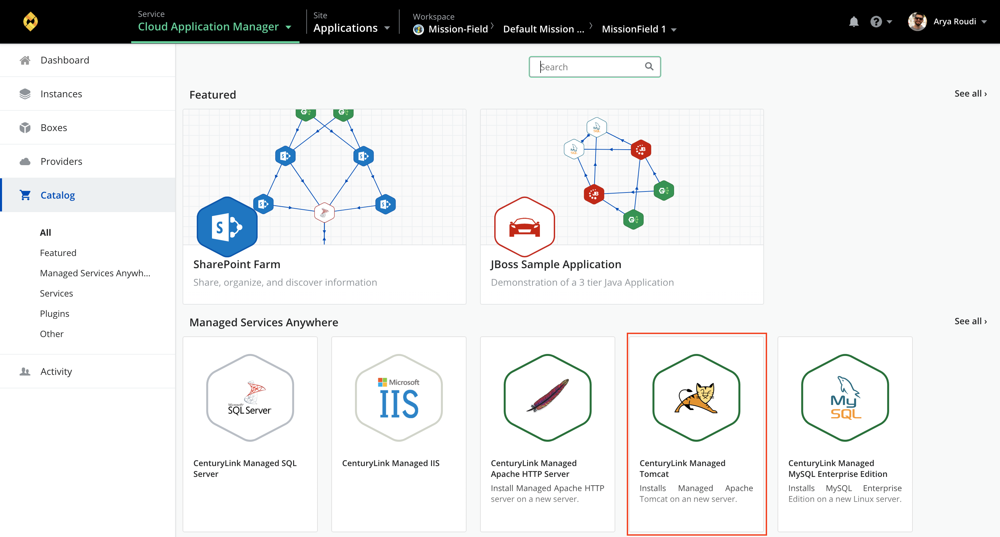

{{{
  "title": "Deploying Lumen Managed Tomcat via Cloud Application Manager",
  "date": "03-30-2018",
  "author": "Thomas Broadwell",
  "attachments": [],
  "contentIsHTML": false
}}}

### Table of Contents

* [Introduction](#introduction)
* [Overview](#overview)
* [Supported Tomcat Server](#supported-tomcat-server)
* [Supported Operating Systems](#supported-operating-systems)
* [License](#license)
* [Installation Features](#installation-features)
* [Configuration](#configuration)
* [Administration](#administration)
* [Deploying Managed Tomcat](#deploying-managed-tomcat)

### Introduction
Apache Tomcat is an open source software implementation of the Java Servlet and JavaServer Pages Java Expression Language and Java WebSocket technologies. As a collaboration of best-of-breed developers from around the world, Tomcat has rapidly become one of the leading Web servers.

### Overview
Cloud Application Manager’s Managed Services Anywhere (MSA) allows customers to depend on Lumen to manage cloud deployed workloads, relieving themselves of the burdens of day to day monitoring, patching and Operational activities.  Through Cloud Application Manager's Managed Service Anywhere (MSA), a customer can provision a VM instance running Apache within any MSA enabled provider and because Managed Services has been enabled on the provider, Lumen will manage both the Operating System and Tomcat.

### Supported Tomcat Server
*  Apache Tomcat version 7.0
*  Apache Tomcat version 8.0
*  Apache Tomcat version 8.5

### Supported Operating Systems
*	Managed Redhat version 6
*	Managed Redhat version 7

### License
* Licensing for deployments are provided by the Cloud Provider.  The cost for the RHEL license and the VM it is deployed upon will be reflected within the customer's cloud provider bill, or under the cloud provider's section in the Lumen consolidated bill (for customers that have elected to utilize Lumen's consolidated billing feature).

### Installation Features
* Prepare Server for Application Service (OS Specific Parameters)
* Install Oracle JDK
* Install Apache Tomcat Server
* Harden Apache Tomcat to CIS Level 1 and Lumen Standards
* Install SSL Certificate (if purchased)
* Install Lumen Monitoring
* Perform Quality Assurance against Apache Tomcat Installation/Hardening

### Configuration
* Configure application server clusters
* Configure Communication Between Lumen Managed Apache HTTPd Web Server and Apache Tomcat Server
* Configure Lumen Monitoring

### Administration
* Application Log Monitoring
* Restart/Stop/Start Tomcat Services (JVM)
* Update managed servers with all recommended security patches, service packs and hot-fixes upon customer request
* Coordinate minor version upgrades and patching with Customer during maintenance hours
* Log Management (Rotation & Removal)

### Deploying Managed Tomcat

Deploying Managed Tomcat to your provider with Lumen Cloud Application Manager:

1. In Catalog, select the Managed Services Anywhere subcategory and then select the “Lumen Managed Tomcat".  Deploy Lumen Managed Tomcat instance.

  

2. Update the Details of the instance that is to be deployed, selecting the appropriate RHEL 6 or 7 Deployment Policy for your desired environment and the Features you would like enabled.

  
  

3. Select Deploy

### Help

Please review the [troubleshooting tips](../Troubleshooting/troubleshooting-tips.md) for help. Or you may contact [support](http://managedservices.ctl.io) to request help.
