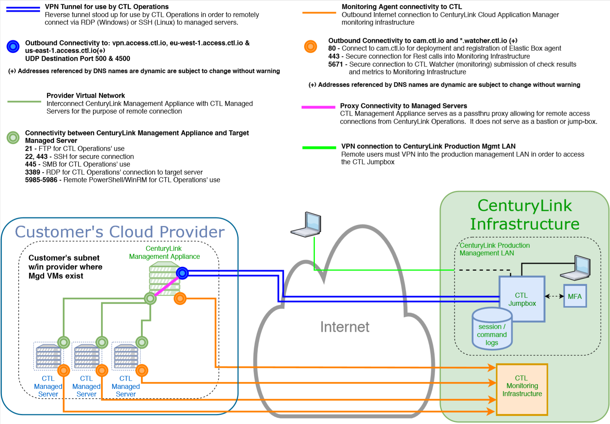

{{{
"title": "MSA Network Architecture",
"date": "09-26-2019",
"author": "Thomas Broadwell",
"attachments": [],
"contentIsHTML": false,
"keywords": ["cam", "cloud application manager", "architecture", "msa", "watcher", "monitoring", "anywhere", "remote administration", "ra"]
}}}

**In this article:**

* [Overview](#overview)
* [Audience](#audience)
* [MSA Netword Architecture](#network-architecture)
* [Connectivity and Required Firewall Rules](#connectivity-and-required-firewall-rules)
* [Contacting Cloud Application Manager Support](#contacting-cloud-application-manager-support)

### Overview

This article is meant to assist users of Managed Services Anywhere (MSA) in the network architecture and requirements of the MSA solution.  This document explains the network requirements of the MSA customer's environment for the purposes of preparation for MSA enablement and post enablement support.

### Audience

All Managed Services Anywhere (MSA) customers or those interested in enabling MSA within their Cloud Application Manager Providers.

