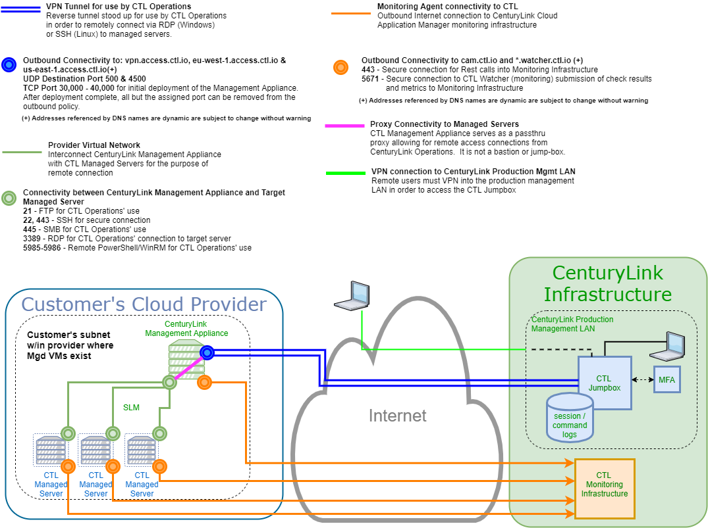

{{{
"title": "MSA Network Architecture",
"date": "09-26-2019",
"author": "Thomas Broadwell",
"attachments": [],
"contentIsHTML": false,
"keywords": ["cam", "cloud application manager", "architecture", "msa", "watcher", "monitoring", "anywhere", "remote administration", "ra"]
}}}

**In this article:**

* [Overview](#overview)
* [Audience](#audience)
* [MSA Network Diagram](#msa-network-diagram)
* [Connectivity and Required Firewall Rules](#connectivity-and-required-firewall-rules)
* [Contacting Cloud Application Manager Support](#contacting-cloud-application-manager-support)

### Overview

This article is meant to assist users of Managed Services Anywhere (MSA) in the network architecture and requirements of the MSA solution.  This document explains the network requirements of the MSA customer's environment for the purposes of preparation for MSA enablement and post enablement support.

### Audience

All Managed Services Anywhere (MSA) customers or those interested in enabling MSA within their Cloud Application Manager Providers.

### MSA Network Diagram

Network connections between customer servers, MSA management appliance, and Lumen.

*Does not include traffic between other sources, such as for DNS resolution or OS updates.*

### Connectivity and Required Firewall Rules

Because of the dynamic nature of our endpoints and management appliances, we recommend applying the following stateful rules to subnets hosting MSA management appliances

#### External Connections from MSA Management Appliance

| Description | Purpose          | Protocol | Port | Destination |
|-------------|------------------|----------|------|-------------|
| HTTPS       | CAM Management   | TCP      | 443  | 0.0.0.0/0   |
| RabbitMQ    | Monitoring       | TCP      | 5671 | 0.0.0.0/0   |
| ISAKMP      | Remote Admin     | UDP      | 500  | 0.0.0.0/0   |
| IPSEC       | Remote Admin     | UDP      | 4500 | 0.0.0.0/0   |

#### Internal Connections from MSA Management Appliance

| Description | Purpose      | Protocol | Port | Destination                                           |
|-------------|--------------|----------|------|-------------------------------------------------------|
| SSH         | Remote Admin | TCP      | 22   | Internal Networks Managed by MSA Management Appliance |
| HTTPS       | Monitoring   | TCP      | 443  | Internal Networks Managed by MSA Management Appliance |
| SMB         | Remote Admin | TCP      | 445  | Internal Networks Managed by MSA Management Appliance |
| RDP         | Remote Admin | TCP      | 3389 | Internal Networks Managed by MSA Management Appliance |
| WinRM       | Remote Admin | TCP      | 5985 | Internal Networks Managed by MSA Management Appliance |
| WinRM       | Remote Admin | TCP      | 5986 | Internal Networks Managed by MSA Management Appliance |

#### Internal Connections *to* MSA Management Appliance

| Description | Purpose          | Protocol | Port | *Source*                                              |
|-------------|------------------|----------|------|-------------------------------------------------------|
| PING        | MSA Registration | ICMP     | ALL  | Internal Networks Managed by MSA Management Appliance |

### Contacting Cloud Application Manager Support

We’re sorry you’re having an issue in [Cloud Application Manager](https://www.ctl.io/cloud-application-manager/). Please review the [troubleshooting tips](../Troubleshooting/troubleshooting-tips.md), or contact [Cloud Application Manager support](mailto:incident@CenturyLink.com) with details and screenshots where possible.
