{{{
  "title": "Getting Started with Managed Services Anywhere in CAM",
  "date": "3-31-2018",
  "author": "Thomas Broadwell",
  "attachments": [],
  "contentIsHTML": false
}}}

### Introduction

Managed Services Anywhere (MSA) provides comprehensive managed services including monitoring, patching and remote administration by way of automation and hands-on access by certified IT professionals. Services are offered on Amazon Web Services (AWS), Microsoft Azure (Azure) and Dedicated Cloud Compute Foundation (DCCF) per Provider (An account in one of the previously mentioned cloud platforms where customer is either directly responsible for the billing or buying the services through CenturyLink).

### CAM MSA Technical Dependencies

For CenturyLink teams to be able to offer Managed Services on customer workloads, there is a technical dependency to have a Management Appliance in the VPC (AWS), Virtual Network (Azure) or Org Network (DCCF) where the workloads reside. CenturyLink Management Appliance enables CenturyLink Support Engineers the ability to access customer's workloads in a secure mechanism and provide Managed Services.  Additionally, outbound internet access must be available for the Management Appliance and the managed workloads.

### Enable Managed Services on a cloud provider in Cloud Application Manager (CAM)

After configuring your AWS, Azure or DCC-Foundation provider within CAM (see [Providers](https://www.ctl.io/knowledge-base/cloud-application-manager/core-concepts/providers/) KB article) an initial synchronization of the provider will occur (a sync can be done at any time by clicking the Sync button on the provider's Logs tab).  During the synchronization process, CenturyLink automation will collect information about the provider such as running workloads (VMs), security policies, IAM roles, images/AMIs, Networks, VPCs, and other configuration details.  Upon completion of the synchronization the provider will be Online and available to be affected through CAM Application Lifecycle Management (ALM), Managed Services Anywhere (MSA) and Analytics.

  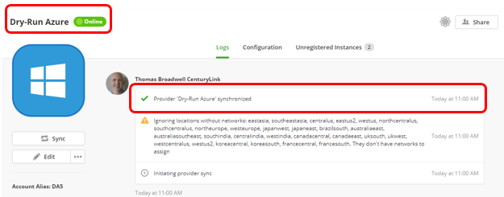

You can choose to Enable Managed Services on the provider at this time and by doing so, CenturyLink will enable our comprehensive managed services including monitoring, patching and remote administration by way of automation and hands-on access by certified IT professionals.  MSA includes all the ALM features along with Analytics and a Technical Account Manager will be assigned to your account.

* Select the Edit button on the provider's Logs tab:

  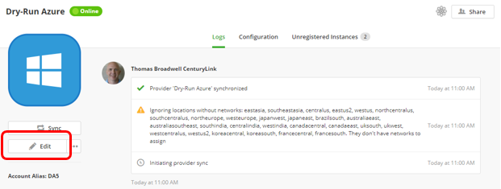

* Within the Edit Provider windows, toggle the "Enable Managed Services" to ON.

  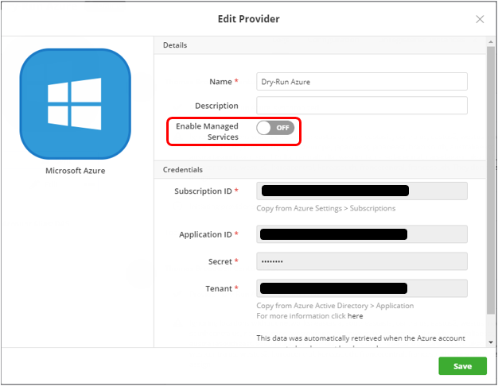

* Review and Accept the Enable Managed Services Terms and then click enable

  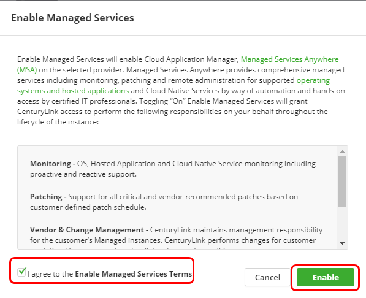

After agreeing to Enable Managed Services Terms, you will be prompted to select the VPC(s) or Network(s) where your managed workloads are deployed and/or where you wish to deploy managed workloads.  The make managed process will deploy a VM within the region(s) or VPC(s)/Networks(s) selected for the management appliance to be deployed on.  The VM will be deployed to the customer's environment and the cost will be reflected on the customer's cloud provider bill.  For this reason, CenturyLink provides this mechanism to allow customer's to select only those Regions, VPCs/Networks where they have, or will have, workloads deployed.

**Azure:** For regions where a network and security group does not already exist, an Azure Resource Manager (ARM) template will be deployed creating the necessary network and security group prior to deploying the management appliance (VM).

  *Azure Example:*

  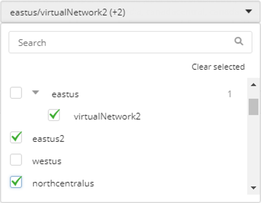

**AWS:** By default AWS creates a default VPC and Default network in each region.  To avoid the cost of unnecessary VMs in regions where no workloads are deployed, CenturyLink enables the ability to select those regions where workloads exist for the AWS account configured in the provider.  Selecting a VPC and Network within a region will result in the automated deployment of the Management appliance.  Selecting a region without selecting a VPC or Network within that region will result in an AWS CloudFormation template being executed, creating a new VPC and Network within the selected region prior to deploying the management appliance (VM).

  *AWS Example:*

  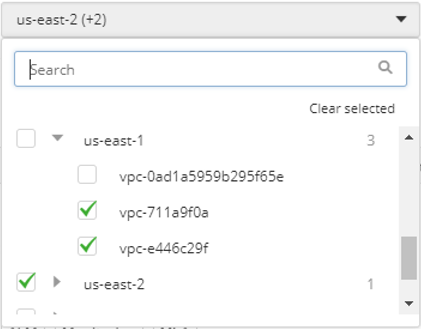

* Select the Region(s) and VPC(s)/Network(s) where managed workloads exist or will be deployed and select Save:

  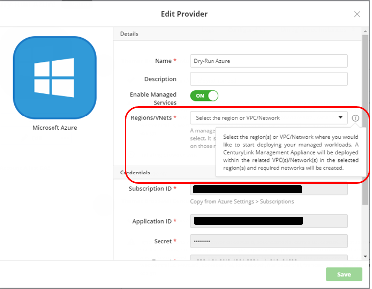
  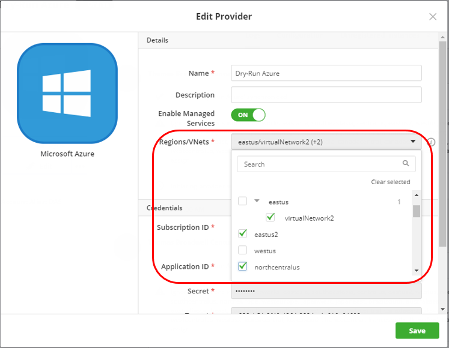

  Management Appliances deployed to the three selected regions:

  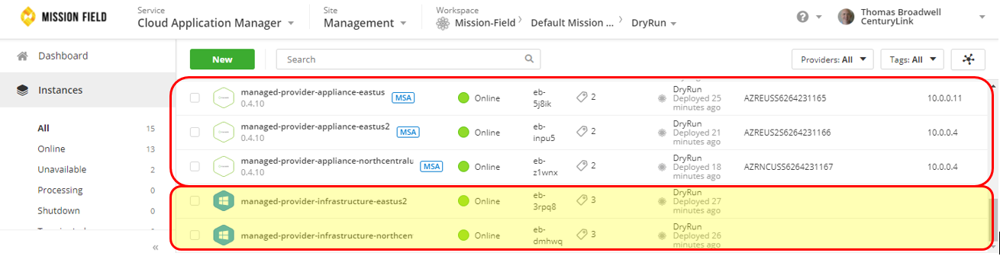  

  (**Note:** Where no Virtual Networks existed - eastus2 & northcentralus - ARM templates were deployed, creating new Virtual Networks and security groups prior to the deployment of the Management Appliance within each Virtual Network)

  

### Managed Provider Deployment Policies

Upon completion of the Enable Managed Services process, you will observe new deployment policies within your Boxes tab.  These SAMPLE deployment policies are deployable immediately for the region specified within the deployment policies' configuration.  These policies are also intended to be used as templates that may be cloned and modified to fit the region, VPC/Network desired.  See [Cloud Application Manager](https://www.ctl.io/knowledge-base/cloud-application-manager/managed-services/) for KBs about the different Managed Hosted Applications supported under MSA.

  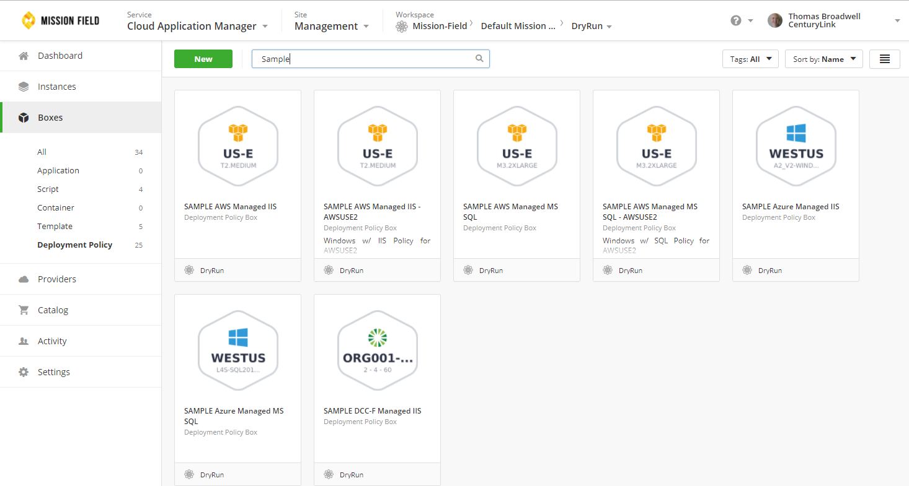

**Note:** Once the provider has been managed, all deployment policies configured on the provider will be toggled to Delegate Management On (as per provider configuration).

  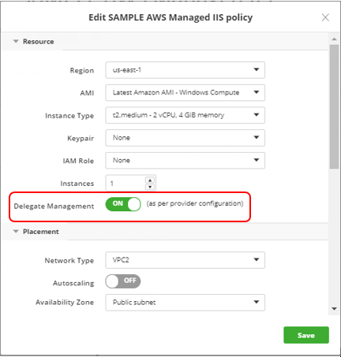

### Help

Please review the [troubleshooting tips](../Troubleshooting/troubleshooting-tips.md) for help. Or you may contact [support](http://managedservices.ctl.io) to request help.
