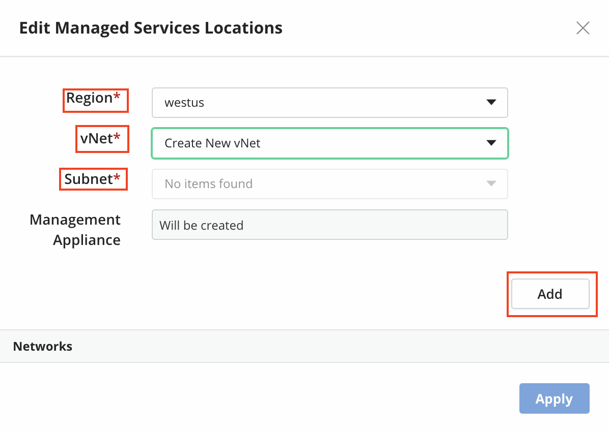
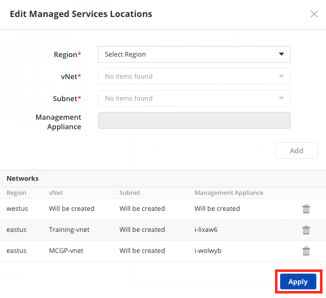
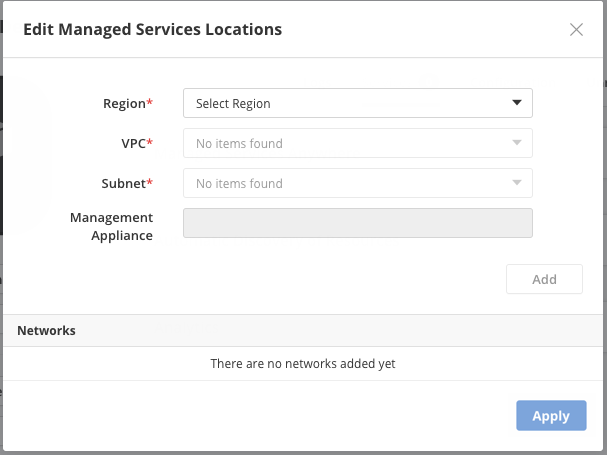
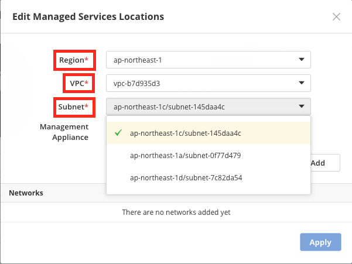
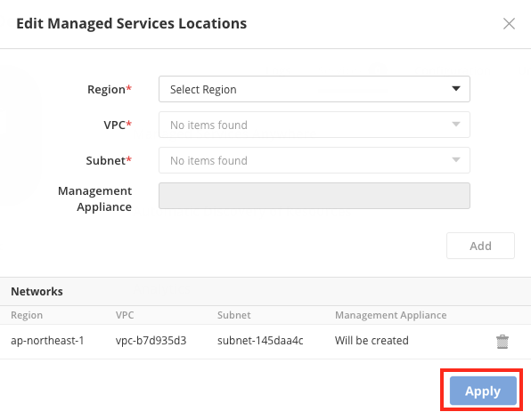
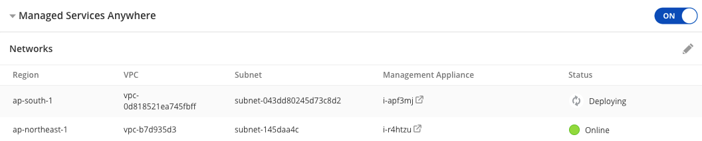
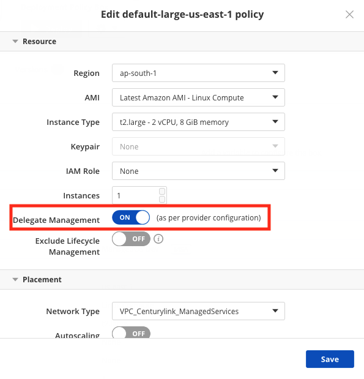

{{{
  "title": "Getting Started with Managed Services Anywhere in CAM",
  "date": "5-30-2019",
  "author": "Mindy Daugherty",
  "attachments": [],
  "contentIsHTML": false
}}}

### Introduction

Managed Services Anywhere (MSA) provides comprehensive managed services including monitoring, patching and remote administration by way of automation and hands-on access by certified IT professionals.

Services are offered on Amazon Web Services (AWS), Microsoft Azure (Azure) and CenturyLink Private Cloud on VMware Cloud Foundation per Provider (An account in one of the previously mentioned cloud platforms where customer is either directly responsible for the billing or buying the services through CenturyLink)

### CAM MSA Technical Dependencies

For CenturyLink teams to be able to offer Managed Services on customer workloads, there is a technical dependency to have a Management Appliance in the VPC (AWS), Virtual Network (Azure) or Org Network (CenturyLink Private Cloud on VMware Cloud Foundation) where the workloads reside.

CenturyLink Management Appliance enables CenturyLink Support Engineers the ability to access customer's workloads in a secure mechanism and provide Managed Services. Additionally, outbound internet access must be available for the Management Appliance and the managed workloads.

The management appliance must be installed on a Centos 7 server.

#### Supported OS

* RHEL 6, 7, and 8
* CentOS 6, 7, and 8 
* Ubuntu 14, 16 and 18
* Windows 2k08R2, 2k12, 2k16, and 2k19

Note for windows servers, .NET 4.6 and powershell 3.0 must be installed, and TLS 1.2 must be supported.

For all other operating systems, please consult with a sales representative.  

### Enable Managed Services on a cloud provider in Cloud Application Manager (CAM)

After configuring your AWS, Azure or CenturyLink Private Cloud on VMware Cloud Foundation provider within CAM (see Providers KB article) an initial synchronization of the provider will occur (a sync can be done at any time by clicking the Sync button on the provider's Logs tab).

During the synchronization process, CenturyLink automation will collect information about the provider such as running workloads (VMs), security policies, IAM roles, images/AMIs, Networks, VPCs, and other configuration details.

Upon completion of the synchronization the provider will be Online and available to be affected through CAM Application Lifecycle Management (ALM), Managed Services Anywhere (MSA) and Analytics.

You can choose to Enable Managed Services on the provider at this time and by doing so, CenturyLink will enable our comprehensive managed services including monitoring, patching and remote administration by way of automation and hands-on access by certified IT professionals. MSA includes all the ALM features along with Analytics and a Technical Account Manager will be assigned to your account.

* Select the Provider on which MSA is to be enabled from the **Providers** tab.

  

* Next click on **Services** to open and configure available services. To enable Managed Services Anywhere, toggle the “Enable Services Anywhere’ button from **OFF** to **ON**.

  

* Review and Accept the Enable Managed Services Terms by checking the checkbox and then click **Enable**.

  

After agreeing to Enable Managed Services Terms, you will be prompted to select the VPC(s) or Network(s) where your managed workloads are deployed and/or where you wish to deploy managed workloads.

The make managed process will deploy a VM within the region(s) or VPC(s)/Networks(s) selected for the management appliance to be deployed on.

The VM will be deployed to the customer's environment and the cost will be reflected on the customer's cloud provider bill.
For this reason, CenturyLink provides this mechanism to allow customers to select only those Regions, VPCs/Networks where they have, or will have, workloads deployed.

**Azure:** For regions where a network and security group does not already exist, an Azure Resource Manager (ARM) template will be deployed creating the necessary network and security group prior to deploying the management appliance (VM).

*Azure Example:*

  
Select the Region from the dropdown where managed workloads exist or will be deployed. If a vNet is available, you can select it from the dropdown or select “Create New vNet.” The Subnet field will allow you to choose available Subnets or auto populate if only one is available.

Next click **Add**. Note that the Management Appliance field will show “Will Be Created.”

  
When selecting “Create new vNet”, the Subnet field will show “No items found” but will create a public and private Subnet once created. Click **Add** to continue.

Continue to add additional Regions or select **Apply** and confirm changes.

**AWS:** By default AWS creates a default VPC and Default network in each region.  To avoid the cost of unnecessary VMs in regions where no workloads are deployed, CenturyLink enables the ability to select those regions where workloads exist for the AWS account configured in the provider.  

Selecting a VPC and Network within a region will result in the automated deployment of the Management appliance.  

Selecting a region without selecting a VPC or Network within that region will result in an AWS CloudFormation template being executed, creating a new VPC and Network within the selected region prior to deploying the management appliance (VM).

  *AWS Example:*

Select the Region from the dropdown where managed workloads exist or will be deployed. Next, choose an existing VPC or select “Create New VPC.” When selecting an existing VPC, the Subnet field will auto populate with available Subnets.

Select the Subnet and click **Add**. Note that the **Management Appliance** field will show “Will Be Created.”

Continue to add additional Regions or select **Apply** and confirm changes.

When selecting “Create New VPC,” the Subnet field will show “No items found” but will create a public and private Subnet once created. Click **Add** to continue.

From here Management Appliances will begin deployment for the selected Regions.

In this example we enabled Management Appliances for two Regions: *ap-south-1* and *ap-northeast-1*.

(**Note:** Where no Virtual Networks existed (ap-south 1,) ARM templates were deployed, creating new Virtual Networks and security groups prior to the deployment of the Management Appliance within each Virtual Network.)

### Managed Provider Deployment Policies

Upon completion of the Enable Managed Services process, you will observe new deployment policies within your Boxes tab.  These SAMPLE deployment policies are deployable immediately for the region specified within the deployment policies' configuration.  These policies are also intended to be used as templates that may be cloned and modified to fit the region, VPC/Network desired.  See [Cloud Application Manager](https://www.ctl.io/knowledge-base/cloud-application-manager/managed-services/) for KBs about the different Managed Hosted Applications supported under MSA.

To view the applicable policies for the selected Provider, click on the **Boxes** tab then select **Deployment Policy**.

Next, click **Providers** on the top right then select the Provider from the dropdown.

**Note:** Once the provider has been managed, all deployment policies configured on the provider will be toggled to Delegate Management On (as per provider configuration).

### Help

Please review the [troubleshooting tips](../Troubleshooting/troubleshooting-tips.md) for help. Or you may contact [support](http://managedservices.ctl.io) to request help.
