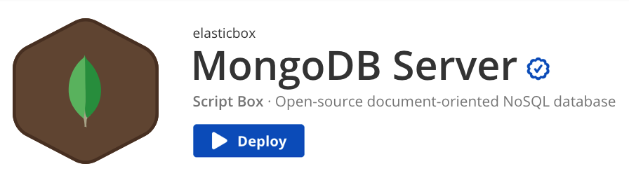
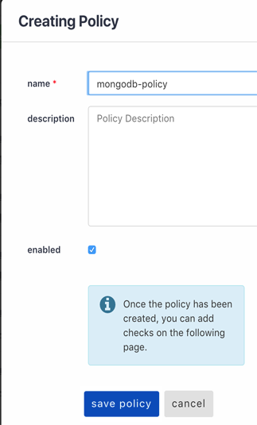
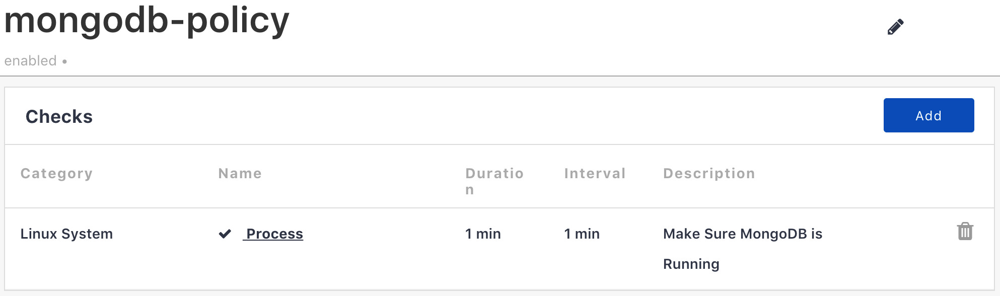
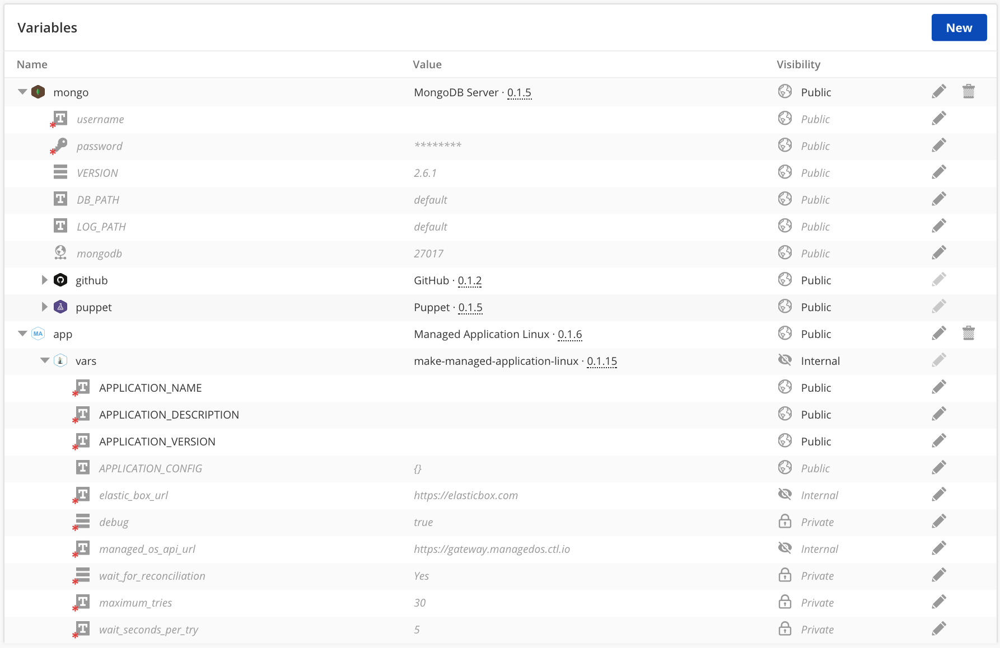

{{{
  "title": "Getting Started with CAM Integration Guide",
  "date": "12-18-2017",
  "author": "Keith Homco",
  "attachments": [],
  "contentIsHTML": false
}}}

### Create Managed Application in Cloud Application Manager (CAM)

Learn how to create a Managed Application within CAM; one that would be supported and managed by CenturyLink.  At the time of writing this article, this is intended for internal users of CenturyLink and most specifically those familiar with Managed Services Anywhere.  As the process is refined, the creation of Managed Applications will be expanded to a wider audience. This includes customers wanting their custom applications managed by CenturyLink.

Before you start, sign up for a Cloud Application Manager account (account currently expected to be within the CenturyLink organization).

Then, follow these simple steps.

1. Configure a script box for your application
2. Create Monitoring policy
3. Request Managed Application script box (Linux or Windows) be shared to your workspace
4. Create script box to be Managed version of your application
5. Add Managed Application script box as variable
6. Pass necessary values to Managed Application script box
7. Publish your script box


### Configure Script Box for Your Application

We suggest, from experience, to develop the installation and configuration of your application in a script box that could be deployed independently of being managed. Following this practice allows for taking existing applications developed in script boxes and applying the following steps to make it a Managed Application.

So, that is what we will do for simplicity of this article; I will use an existing script box available in CAM.  I will use the MongoDB Server script box.



Now that my work here is done, let's move on to the next step.

### Create Monitoring Policy

Let's head over to the Monitoring page (https://monitoring.cam.ctl.io/) where we will create the appropriate policy for monitoring our application.  I will keep it simple for the sake of this article, but do be sure to create a thorough policy for monitoring your application.

**Note: Create your policy in the same workspace as you created your managed application script box**

Clicking on the **Policies** link on the left which will render something like the following.


Go ahead and click **New**, which will show a pop-up modal. Here, enter a name and description. Take note of the name as it will be used later.



Here's our new policy with no checks currently. I'll just be adding a simple check. Go ahead and create all of the necessary checks for your application. The Check Catalog is accessible from within the Policies tab of the Monitoring Site and provides a list of all the current check types that could be configured.


So, I added a process check. With your necessary checks in place, you can move on to the next step requesting use of the Managed Application script box.



### Request Managed Application script box (Linux or Windows) be shared to your workspace

Here you will need to request the Managed Services Anywhere's Managed Application script box to be shared to a designated workspace of your choosing. It will be with this script box you will be able to trigger the Make Managed process for applications.

**Note: Both a Windows and Linux version of the Managed Application script box will be shared with your workspace.**

For now, this has some back and forth via email until automation can be put in place.  We found it important to make this available to you sooner rather than later.

So, without further ado... let's send an email to the Managed Services Anywhere team.  [Click this very awesome sentence to send an email with a pre-populated subject and body](mailto:clcos.support@ctl.io?subject=Request%20for%20Managed%20Application&amp;body=Dear%20Managed%20Services%20Anywhere%2C%0D%0A%0D%0AI%20am%20requesting%20the%20creation%20of%20a%20new%20Managed%20Application%20for%20%22%5Bapplication%20name%5D%22%20with%20the%20monitoring%20policy%20named%20%22%5Bapplication%20policy%20name%5D%22%20under%20the%20%22%5Bworkspace%20name%20or%20id%5D%22%20workspace.%0D%0A%0D%0APlease%20review%20the%20policy%20which%20corresponds%20to%20a%20suggested%20application%20name%20of%20%22%5Bsimple%20application%20name%5D%22.%0D%0A%0D%0AThank%20you%2C%0D%0AApp%20Maker%20Man%20or%20Woman).

Here is example of the contents of the email:

**Note: Be sure to have already created the monitoring policy before sending this email**

```
Dear Managed Services Anywhere,

I am requesting the creation of a new Managed Application for "MongoDB Server" with the monitoring policy named "mongodb-policy" under the "Managed OS Dev" workspace.

Please review the policy which corresponds to a suggested application name of "mongodb".

Thank you,
App Maker Man or Woman
```

The Managed Services Anywhere team will use their special powers to transform the policy into a JSON document that can be consumed and stored with a mapping to the simple application name provided.  This way, whenever the application is deployed, this monitoring policy definition will be applied.


Expect to receive an email from Managed Services Anywhere, within 2 business days, informing you of this part of the process being complete. You will see the Managed Application script box in the workspace provided and with that you can complete the steps below. Additionally, the monitoring policy you created can then be deleted if you wish as the MSA team only uses it as a reference.

### Create Managed Script Box for Your Application

Here we will create another script box that will act as a container for our application installation/deployment as well as the efforts of make managed.  Below is our new Managed MongoDB Server script box.


I have gone ahead and added the Managed Application script box as well as the MongoDB Server script box as variables.

**Note: Select the appropriate platform (windows/linux) implementation of the Managed Application script box for your needs.**


### Pass Application Values to Managed Application Box

Learn how to pass values to the Managed Application script box for making your application available for support by CenturyLink.

First, I should point out the lifecycle events of a Managed Application. When a Managed Application is deployed, the Make Managed process will be triggered and executed on the compute prior to your application script box.  It is during your script box execution that the Managed Application script box will execute at both the **pre_start** and **start** lifecycle events.  The **pre_start** is simply detecting whether or not the Make Managed process for the compute was successful prior to moving forward.  If it had failed silently for some reason, the script box will be halted here.

Then, it is expected that the application being managed would be either started already or be started in the **start** lifecycle event.  This is where the order of the variables shown earlier is important; the application script box must come **before** the Managed Application script box. It should only be after the application has successfully started that a call to make it managed be made.

So, with all of that said, we will actually be using any lifecycle event prior to the **pre_start** to pass the appropriate values to the Managed Application script box. This is typically best suited to be done in the **configure** event of the parent script box: *Managed MongoDB Server* script box in this case.

Below is an expanded view of the boxes included in this script box and their respective variables for reference.



Since the **APPLICATION_NAME**, **APPLICATION_DESCRIPTION**, and **APPLICATION_VERSION** are required values in the Managed Application script box, you will need to override these values in this new managed script box.  Since the underlying make managed application script box is **internal**, these values won't be visible at deploy time.  So, they will require a default value as shown in the example below.  You are then welcome to expose your own variables and custom scripts to override these values during the execution of a deployment.


Here is a figure of the partially expanded events section. Note that **configure** is the only populated event for the parent script box, as it is acting as a kind of mapping between the application script box and the Managed Application script box.


And you can see that I have populated the **configure** event with some code.  Below are the contents of that lifecycle event:

> Bash Example:

```
username="{{ mongo.username }}"
password="{{ mongo.password }}"
log_path="{{ mongo.LOG_PATH }}"
port="{{ mongo.mongodb }}"
db_path="{{ mongo.DB_PATH }}"

config="{\"username\": \"$username\", \"password\": \"$password\", \"db_path\": \"$db_path\", \"logs\": \"$log_path\", \"db_port\": \"$port\"}"

elasticbox set app.vars.APPLICATION_DESCRIPTION "My managed cross-platform document-oriented database"
elasticbox set app.vars.APPLICATION_VERSION "{{ mongo.VERSION }}"
elasticbox set app.vars.APPLICATION_CONFIG "$config"
```

> Powershell Example (if this were windows):

```
$username = "{{ mongo.username }}"
$password = "{{ mongo.password }}"
$log_path = "{{ mongo.LOG_PATH }}"
$port = "{{ mongo.mongodb }}"
$db_path = "{{ mongo.DB_PATH }}"

$config = "{'username': '$username', 'password': '$password', 'db_path': '$db_path', 'logs': '$log_path', 'db_port': '$port'}"

elasticbox set app.vars.APPLICATION_DESCRIPTION "My managed cross-platform document-oriented database"
elasticbox set app.vars.APPLICATION_VERSION "{{ mongo.VERSION }}"
elasticbox set app.vars.APPLICATION_CONFIG $config
```

The above scripts are essentially mapping values from the MongoDB Server script box installation over to the Managed Application script box.  This is also where you might use your custom variables for overriding the default values.

The **APPLICATION_CONFIG** is intended for any additional metadata you wish to provide about the application that would be valuable for its ongoing support.

Also note the **APPLICATION_NAME**; this value is important as it will be used to map this application with its corresponding monitoring policy in the next step.

### Publish your Managed Application

Learn to publish your new Managed Application script box to the public catalog.

This step can be done in parallel to the previous step of creating the monitoring policy.  There is no need to wait for a response from MSA before publishing your script box.

Publishing your script box is explained well [here](../Tutorials/publish-script-box.md).
