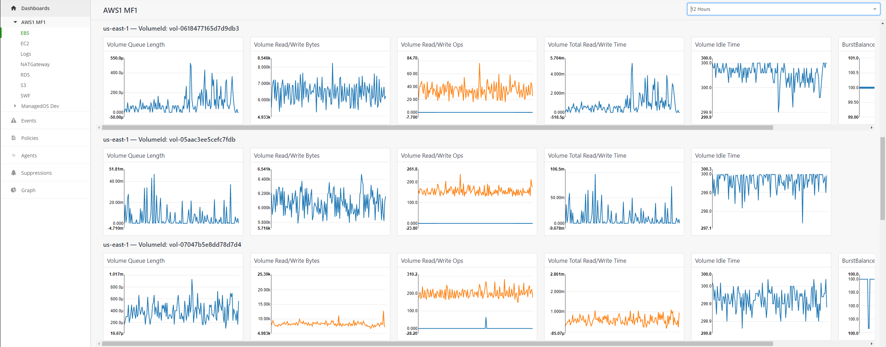
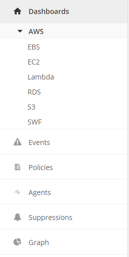
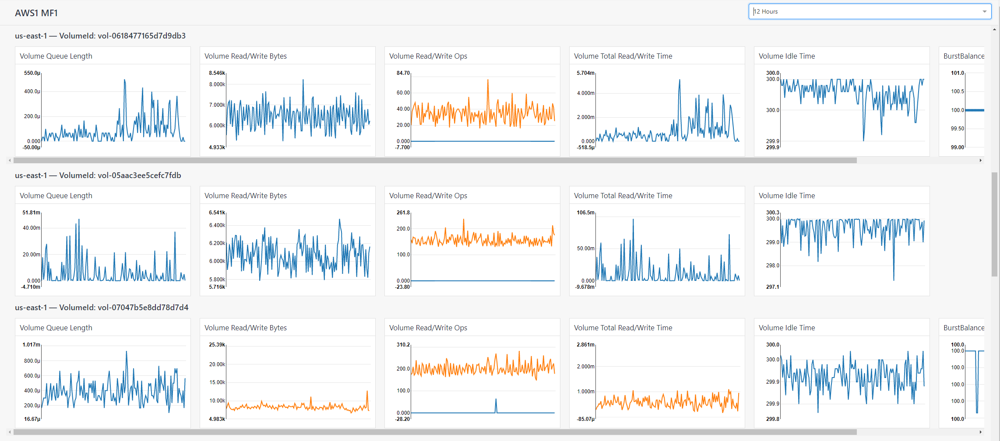

{{{
  "title": "AWS Dashboards",
  "date": "01-24-2018",
  "author": "Jason Oldham",
  "attachments": [],
  "related-products" : [],
  "contentIsHTML": false,
  "sticky": true
}}}


### Overview:

Our Cloud Application Manager Monitoring dashboard is specific to Amazon Web Services (AWS) providers.  Our goal is to provide users of the Cloud Application Manager Monitoring site with CloudWatch metrics and graphs about their infrastructure and services residing with AWS.  

 

#### Features:

•	User will be able to list & switch between AWS providers within a Workspace 

•	All CloudWatch resource types/namespaces are available to be viewed as individual dashboards

•	Works for any Cloud Application Manager provider with the appropriate permissions

•	Dashboard rows are organized by unique dimension in that namespace

•	All regions are aggregated into each dashboard

•	Upon selecting a Provider, the user will be able to see a subset of AWS services that can be selected to get a deeper level of metrics

•	The left navigation is dynamic and will only show the services the customer has set up for that specific provider

•	Each individual dashboard will be likable and take the user to the appropriate graph page for deeper dives

•	Graphs can be changed to a 1 hour, 4 hours, 12 hours, 1 day, 1 week, and 1 month time interval

#### Assumptions:

•	User is setup as an admin in the workspace.  
•	User has created required policies and roles within AWS and provided the required ARN information while registering AWS Provider or Update an existing AWS Provider. Separate specification will be provided to update the user experience of Provider creation to accommodate monitoring requirement.

#### Required permissions in AWS:

User should have the following actions (below) as well as ReadOnlyAccess in the IAM Policy for Monitoring site to display Cloud Watch metrics  
```
{
  "Version": "2012-10-17",
  "Statement": [
    {
      "Effect": "Allow",
      "Action": [
        "cloudwatch:GetMetricStatistics",
        "cloudwatch:ListMetrics"
     ],
      "Resource": "*"
    }
  ]
}
```
#### Navigation 

Left Navigation:  
When a user navigates to the Cloud Application Manager Monitoring site they will see a Dashboard tab on the left-hand side.  All configured AWS providers will be listed under the Dashboards tab.  You can only open one provider at a time.  Only the metrics related to that provider are listed (dynamically loaded).  An example would be that AWS may have 200 metrics available but the configured provider set up 22 CloudWatch metric checks.  Only the 22 will be shown and not every metric available.

 

Lazy Loading:  
When a user selects a service listed under their provider, all metrics associated with that service will be loaded.  On the screen, just the graphs that are visible are loaded.  As you scroll left/right or up/down the graphs will start loading.  This is called lazy loading and improves performance by only loading the graphs that are visible.  Minimal charges may apply after AWS CloudWatch free tier limit is exceeded.  Please [click here](https://aws.amazon.com/cloudwatch/pricing) to view the AWS free tier details and pricing.
 

