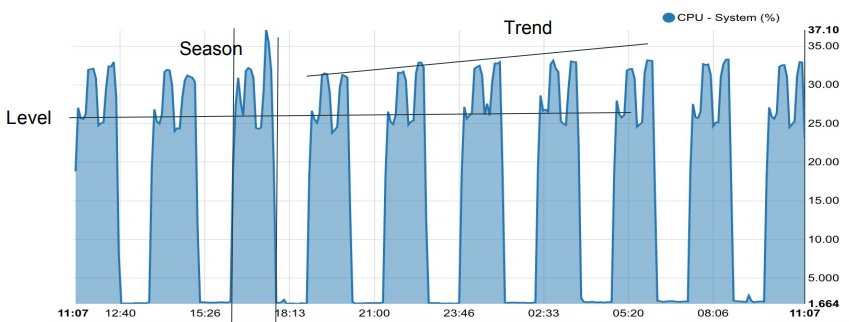
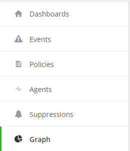
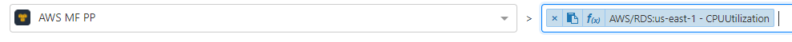
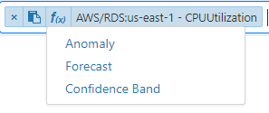
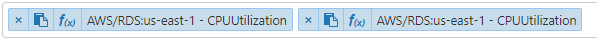
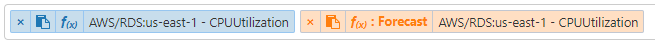
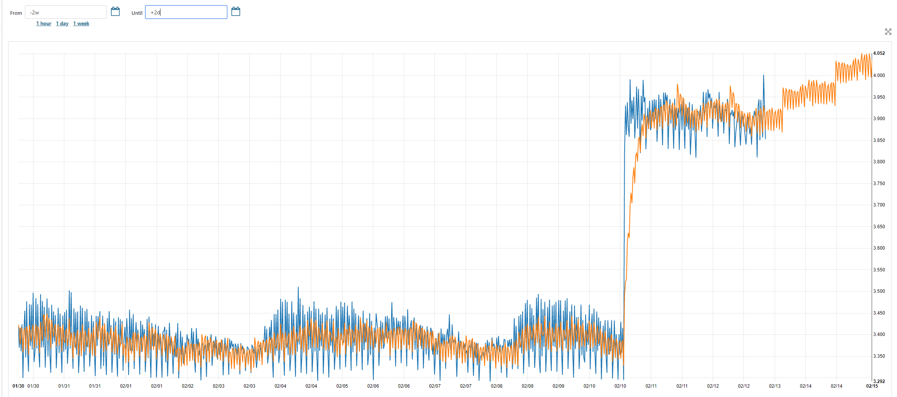
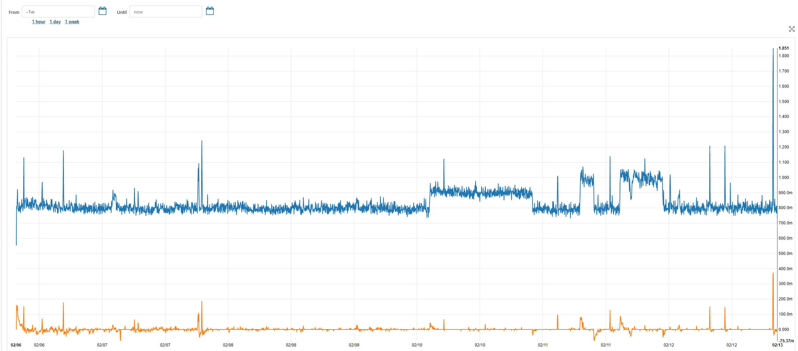

{{{
  "title": "Anomaly Detection & Forecasting",
  "date": "02-13-2018",
  "author": "Jason Oldham",
  "attachments": [],
  "related-products" : [],
  "contentIsHTML": false,
  "sticky": true
}}}

### Overview:

This document will cover anomaly detection, confidence bands, and forecasting functionality accessed via the Graphs tab in the Cloud Application Manager Monitoring site.  Our anomaly detection and forecasting is based on the Holt Winters forecasting model.

Holt Winters (Triple Exponential Smoothing)

•	Well known forecasting model
•	Considers three components of dataset
     o	 Level: Behavior of the y-axis value over time
     o	Trend: Behavior of the incline/slope of the dataset over time
     o	Season: Repeating patterns in a dataset over a fixed time period

 

#### Features:

•	Can be applied to CloudWatch datasets and Watcher telemetry data
•	You do not need to be a managed account to access graphs
•	Customer must grant Cloud Application Manager access to see their CloudWatch data
     o	Provider’s ARN contains ReadOnlyAccess permission
•	The forecasting function can be projected arbitrarily in the future
•	Ability to copy the metric ID to clipboard
•	Intuitive legend to allow users to apply functions to the corresponding datasets on the graph

**Forecast** – Graphs based on projected future states of metric data.  Future time periods can be specified for any metric (including those originating from AWS CloudWatch).

**Confidence** – A tool to calibrate the uncertainty in a forecasted dataset.  This allows for the visualization of anomalies as a signal crosses over a confidence interval.

**Anomaly Detection** – Visual representation of the degree of aberration within a signal.

#### Navigation 

**Forecast:**
To access the anomaly detection and forecasting function you first need to go to the Graphs tab.

 

From there you will select your Source and then the metrics you want to view.

You will see that there is an f(X) button as well as a clipboard icon.  The clipboard icon allows you to copy the metric id to the clipboard.  The _f(X)_ allows you to add the anomaly detection, forecasting, and confidence band functionality.
 

To view your original data (CPUUtilization) as well as the functional data you want to apply; you need to add the same dataset to the graph.

Once you have added the second metric you can add your functionality.  The legend will change to show your applied functionality in a new color. 

_As a rule of thumb, requesting 2 weeks of data generates more meaningful results.  The more data that is available the more accurate you can expect the forecast to be._

**Anomaly Detection:**

To access anomaly detection, you would follow the same path as Forecast but would select Anomaly from the f(X) function instead.  

_As a rule of thumb, you need to request at least 72 hours of data to generate more meaningful results.  The more data that is available (up to 2 weeks) the more accurate you can expect the forecast to be._

