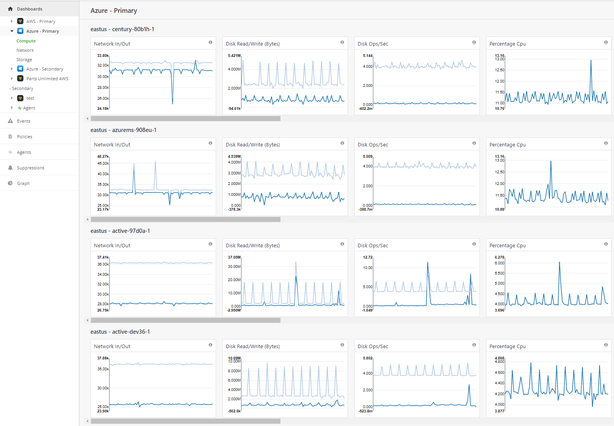

{{{
  "title": "Azure Dashboards",
  "date": "11-01-2018",
  "author": "Thomas Broadwell",
  "attachments": [],
  "related-products" : [],
  "contentIsHTML": false,
  "sticky": true
}}}

### Overview:

The Cloud Application Manager Monitoring dashboard allows customers to view cloud native monitoring data for Microsoft Azure & Amazon Web Services (AWS) providers.  Our goal is to provide users of the Cloud Application Manager Monitoring site with Cloud Provider metrics and graphs about their infrastructure and services residing within AWS and Azure.  

 

#### Features:

•	User will be able to list & switch between Azure providers within a Workspace 

•	All Application Insights resource types/namespaces are available to be viewed as individual dashboards

•	Works for Azure providers where appropriate permissions are granted (within the provider) & configured in Cloud Application Manager

•	Dashboard rows are organized by unique dimension in that namespace

•	All regions are aggregated into each dashboard

•	Upon selecting a Provider, the user will be able to see a subset of Azure services that can be selected to get a deeper level of metrics

•	The left navigation is dynamic and will only show the services the customer has set up for that specific provider

•	Each individual dashboard will be likable and take the user to the appropriate graph page for deeper dives

•	Graphs can be changed to a 1 hour, 4 hours, 12 hours, 1 day, 1 week, and 1 month time interval

#### Assumptions:

•	User is setup as an admin in the workspace.  
•	Auzre provider is configured in Cloud Application Manager Provider console [Using Microsoft Azure](https://www.ctl.io/knowledge-base/cloud-application-manager/deploying-anywhere/using-microsoft-azure/ "Using Microsoft Azure")

#### Navigation 

Left Navigation:  
When a user navigates to the Cloud Application Manager Monitoring site they will see a Dashboard tab on the left-hand side.  All configured AWS and Azure providers will be listed under the Dashboards tab.  Only one provider may be opened at a time and only the metrics related to that provider are listed (dynamically loaded).  An example would be that Azure may have 200 metrics available but the configured provider set up 22 CloudWatch metric checks.  Only the 22 will be shown and not every metric available.

 

**Lazy Loading:**  
When a user selects a service listed under their provider, all metrics associated with that service will be loaded.  On the screen, just the graphs that are visible are loaded.  As you scroll left/right or up/down the graphs will start loading.  This is called lazy loading and improves performance by only loading the graphs that are visible.  
 

