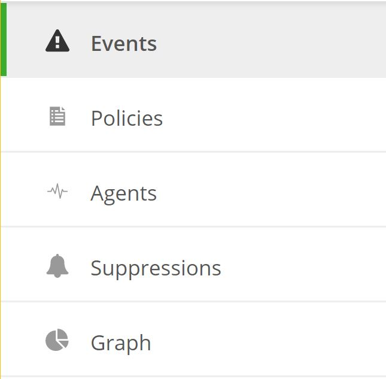
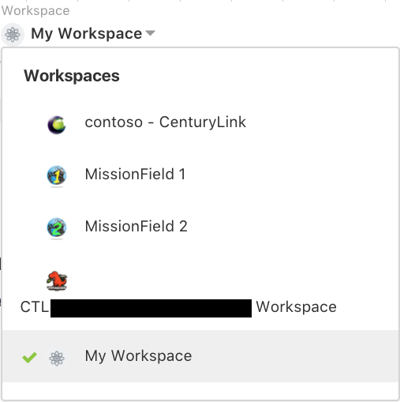
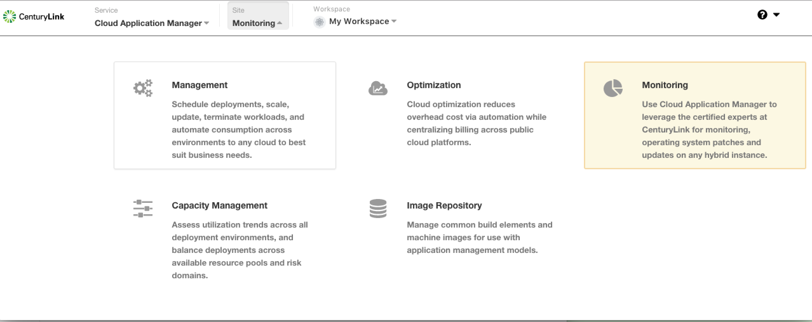

{{{
  "title": "Cloud Application Management Monitoring Introduction",
  "date": "02-12-2018",
  "author": "Jason Oldham",
  "attachments": [],
  "contentIsHTML": false
}}}

### Overview
This document describes how to access the Monitoring UI, and provides a breakdown of the different views that are available in each of the main components of the UI which consists of Events, Policies, Agents, Suppression, and Graphing.

##### [Events](Events.md)
On the Events tab there is a list of all active events (i.e. check that are out of their configured bound) for that workspace.  This includes statuses warning and critical, the check-type, its output, count and last occurrence.

##### [Policies](Policies.md)
Monitoring policies are groupings of one or more server checks available to be applied to a server within the selected workspace. Within the policy itself you can view the server checks and their associated configuration parameters along with the servers currently applied under that policy.  

##### Agents
This section lists all of the servers being monitored for the selected workspace. Clicking on an individual agent will provide details specific to that server and also the current status of all checks being reported back from the server.  

##### [Suppressions](Suppressions.md)
In this area, you can view the server(s) of which traps have been suppressed, the period of time and reasoning for which the suppression is valid. Any server(s) listed here will not have its monitored events send to our operations center for investigation and resolution.  

##### Graphs
For servers that have 'metric' server checks applied to them, for which all Managed OS server do for CPU, Memory and Disk by default, you can display the data in area, line or multi-bar formats over the selected period of time via specific timeframes or generalized (i.e. now, last hour).

##### Workspaces

After logging in the user will be in their personal workspace. Click on the workspace switcher to choose the workspace of which agent(s) you wish to view.  

#### [AWS Dashboards](AWSDashboards.md)
Our Cloud Application Manager Monitoring dashboard is specific to Amazon Web Services (AWS) providers. Our goal is to provide users of the Cloud Application Manager Monitoring site with CloudWatch metrics and graphs about their infrastructure and services residing with AWS.

#### [Anomaly Detection and Forecasting]
This document will cover anomaly detection, confidence bands, and forecasting functionality accessed via the Graphs tab in the Cloud Application Manager Monitoring site.  Our anomaly detection and forecasting is based on the Holt Winters forecasting model.

### Logging into the Monitoring UI.

After logging into Cloud Application Manager you can navigate to the Monitoring UI by clicking on the monitoring link as shown below.

### Monitoring Portal Functionality

The Monitoring Portal is intended to offer our customers visibility into the status of their environment. If you have any questions about what is being displayed or you would like to request modification the setup please open a ticket with our operations teams [here](http://managedservices.ctl.io).  

### Managed OS Default Policies

* The default monitoring policy for supported linux images can be found [here](CAMMonitoringDefaultPolicy-Linux.md)
* The default monitoring policy for supported Windows images can be found [here](CAMMonitoringDefaultPolicy-Windows.md)
