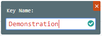

{{{
  "title": "Configure Vars with Monitoring UI",
  "date": "6-10-2019",
  "author": "Thomas Broadwell",
  "attachments": [],
  "contentIsHTML": false
}}}

### Configuring vars via the Monitoring site UI

Vars are metadata about workloads which are maintained within the Watcher infrastructure.  Vars and Facts, along with Application Lifecycle Manager metadata, are used to make decisions about workloads including the Monitoring Policies to be applied to the workload.

Vars and Facts can be viewed within the Agent details screen of the Monitoring site.  By selecting an agent from the list of all agents, the Agents detail screen is displayed.  

Vars and Facts are collapsed when first viewed.  By selecting the arrow to the left of the Vars or Facts, the element will expand.  Configured Vars can be seen in an organized structure starting with the top level “vars” and having nested sub-elements.  

Vars may be added at any level of the structure.  In order to add a var, select the “+”  to the right of the element under which the var is to be created.  

A new modal will be displayed where the new var’s Key Name may be configured.  Once the key is entered, select the check mark to save the Key to the vars structure.

When the new Key is added, it will be presented in the Vars structure with a NULL value by default.

The value of the key may be manipulated by hovering over the new Key and selecting the Edit icon to the right of the current value.

Enter the desired value for this new key and select the check mark to the right of the value input bar.

The new Var (name : value pair) will be updated with the input vale and visible within the vars structure.

With the new Var added, the agent’s metadata must be refreshed.  By selecting the Gear icon within the Agent Details page, a dropdown is presented.  Select the “Refresh Facts” option.  This will reset the agent and in doing so the agent will pick up the new var. 

