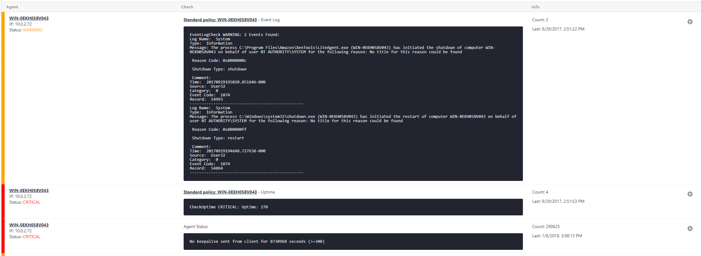
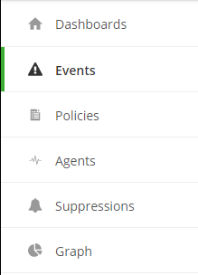
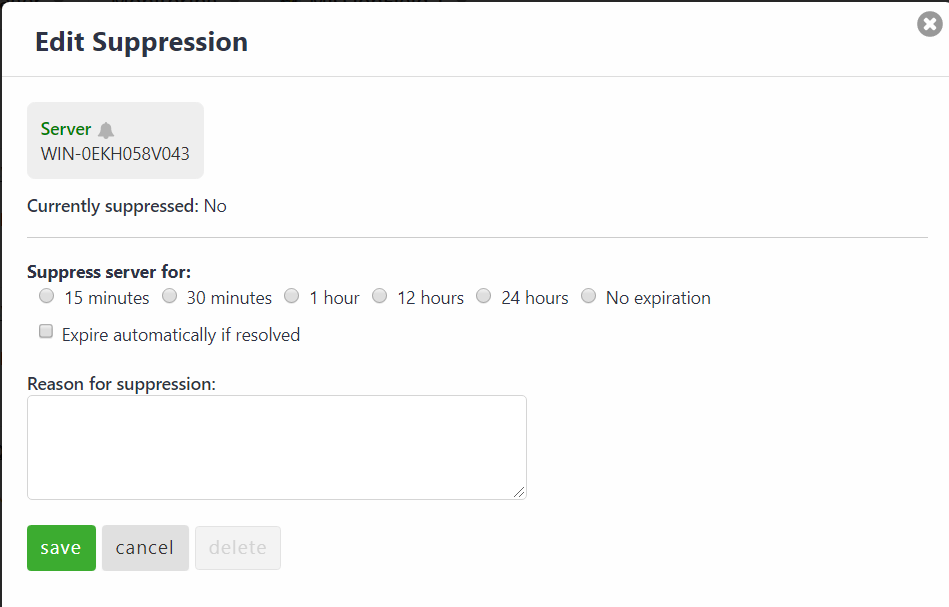

{{{
  "title": "Cloud Application Management Monitoring - Events",
  "date": "01-24-2018",
  "author": "Jason Oldham",
  "attachments": [],
  "related-products" : [],
  "contentIsHTML": false,
  "sticky": true
}}}

### Overview
The events tab provides a view of events that may be a warning/critical to your infrastructure based policy checks.  Each event shows the Agent, statuses warning and critical, the check-type, its output, count and last occurrence.

##### Features
•	Ability to look deeper into an event by agent or check
•	Ability to suppress an event by agent or check type
•	Ability to delete an event
•	Easy to view color coded warnings and alerts

##### Assumptions
•	User has created required policies and roles previously.

##### Navigation
Left Navigation:                                       
When a user navigates to the Cloud Application Manager Monitoring site they will see an Events tab on the left-hand side.

Suppressing an event:                                
You can suppress an agent as well as a check 

Once you click Suppress Agent or Check you will be taken to a new pop up.  You can set expirations from 15 minutes to 24 hours as well as no expiration at all.

