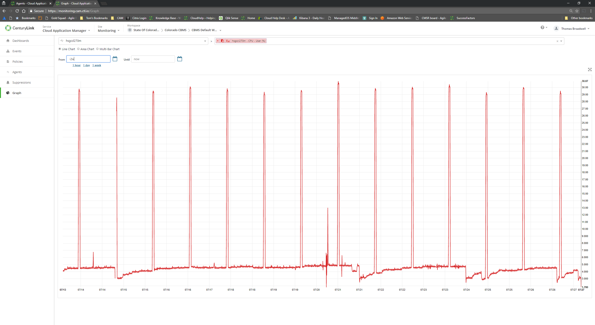
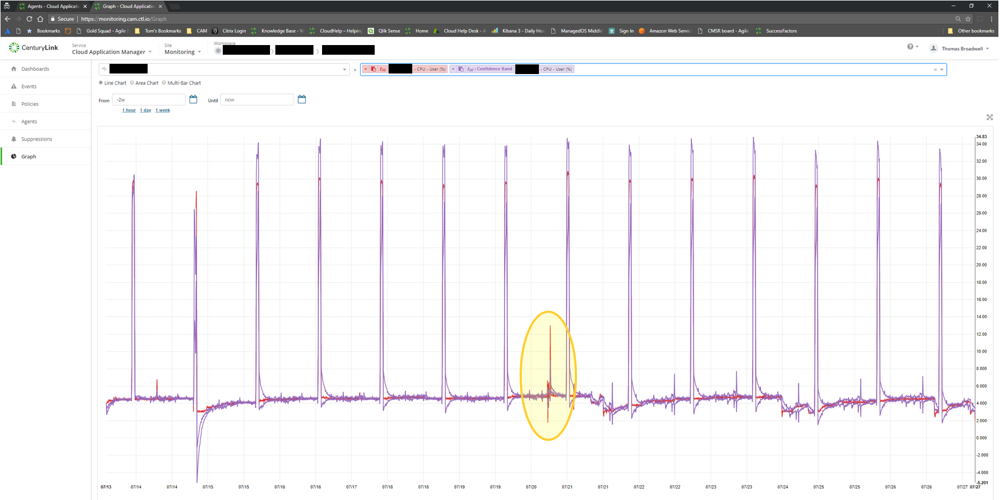

{{{
  "title": "Practical use of Anomaly Detection",
  "date": "06-10-2019",
  "author": "Thomas Broadwell",
  "attachments": [],
  "related-products" : [],
  "contentIsHTML": false,
  "sticky": true
}}}

### What is Anomaly Detection?

CenturyLink’s Cloud Application Manager – Managed Services Anywhere (CAM MSA) monitoring component, Watcher collects and stores metrics from applications, services and infrastructure.  While these metrics are useful for event triage and historical trending, they may also be used for statistical analysis.  

Leveraging statistical analysis known as triple exponential smoothing, ie: the Holt-Winters method, Watcher first derives a forecast for the metric signal.  Using this data model, it compares actual observed values against the forecasted expected values to identify anomalous events.  Multiple parameters are also available to fine tune the sensitivity of the anomaly detection algorithm.  Upon the identification of an anomaly, as with any other event, alerts are generated and sent to CenturyLink incident management system.

### Example Practical Use Case

Backups and other scheduled activities for the environment run on a predetermined schedule.  Because traditional monitoring utilizes a threshold, the systems will produce monitoring events due to increased activity which overcomes the configured threshold.  Tickets and monitoring events will be created, but these events are fundamentally unactionable as they are indicative of normal operations.

Leverage CAM MSA Anomaly Detection to set a baseline for normal operations.  This baseline includes those scheduled activities that cause unactionable monitoring events.  The CAM MSA anomaly detection algorithm anticipates those recurring times of high activity and ensures the metric stream exhibits a consistent profile.  This has two advantages, tickets would not be created during the normal activities and if the activities did not occur, then a ticket may be generated.

By enabling Anomaly Detection we achieved an increase in the signal to noise ratio for actionable problems in the customer’s environment.  Because alerts are not generated for those things that do not need to be actioned and operators are alerted for those things that are more indicative of real problems, resources are freed to focus on other business objectives. 
