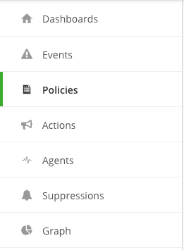
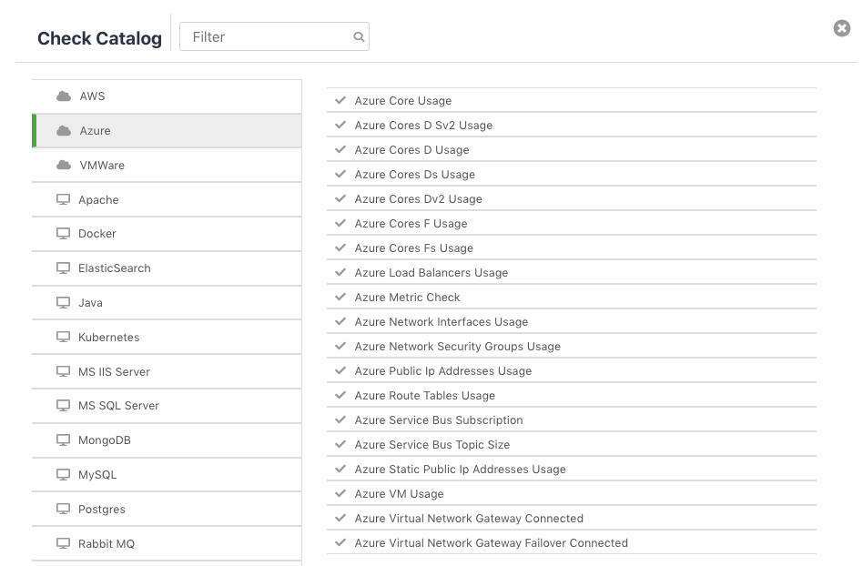
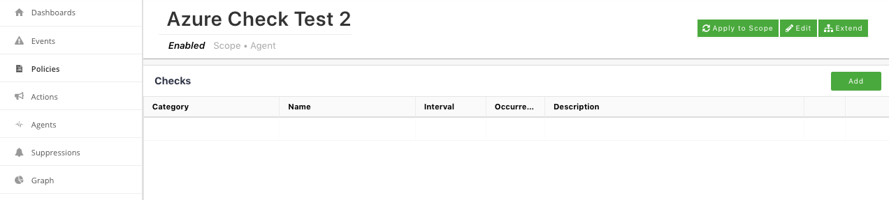
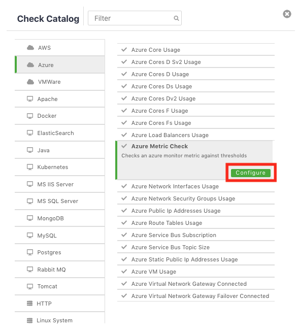
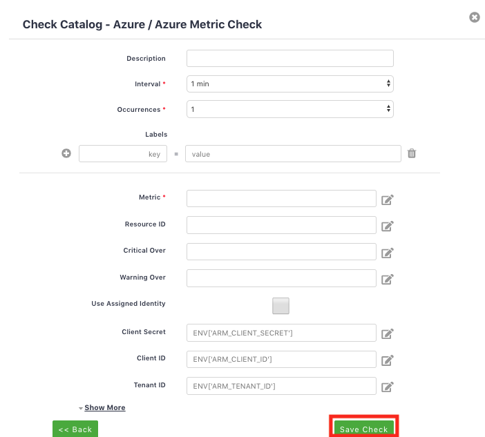
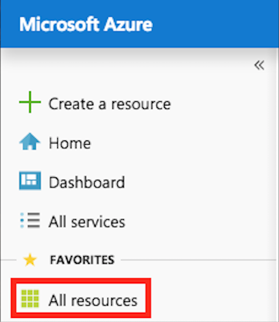
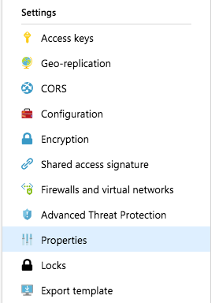
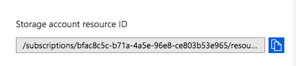
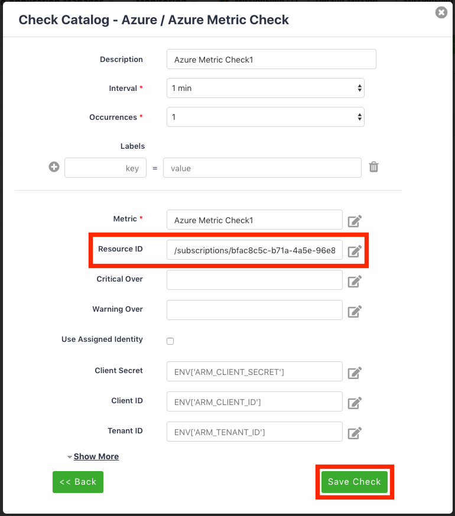
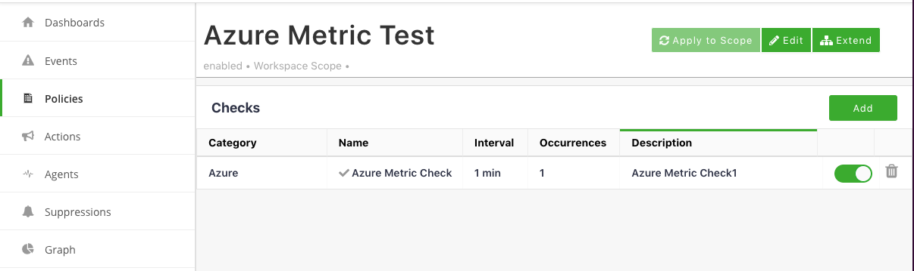

{{{
  "title": "Microsoft Azure Checks",
  "date": "06-04-2019",
  "author": "Mindy Daugherty",
  "attachments": [],
  "related-products" : [],
  "contentIsHTML": false
}}}

**In this article:**
* [Overview](#overview)
* [Prerequisites](#prerequisites)
* [Navigation](#navigation)
* [Check Catalog](#checkcatalog)
* [Configuration](#configuration)

### Overview
The Check Catalog is library that contains the available Checks (metric or status) that can be added to Policies within the Cloud Application Manager. The following document covers the available configurable Microsoft Azure checks.

### Prerequisites 
User must have access to Cloud Application Manager Monitoring Site, the workspace where the monitoring assets are configured, and should be at the organization level scope to access Settings.

User must also have access to the organization’s Azure account in order to obtain necessary information for the setup of an Azure check. 

### Navigation 

Left Navigation:  

The Policies tab provides a list of available policies as well as checks currently setup for your organization.

#### Check Catalog

**Azure Core Usage**
This plugin checks the number of CPU Cores allocated and available in a Region in Azure

**Azure Cores D Sv2 Usage**
This plugin checks the number of DS Family CPU Cores allocated and available in a Region in Azure

**Azure Cores D Usage**
This plugin checks the number of D Family CPU Cores allocated and available in a Region in Azure

**Azure Cores Dv2 Usage**
This plugin checks the number of Dv2 Family CPU Cores allocated and available in a Region in Azure

**Azure Cores F Usage**
This plugin checks the number of F Family CPU Cores allocated and available in a Region in Azure

**Azure Cores Fs Usage**
This plugin checks the number of FS Family CPU Cores allocated and available in a Region in Azure

**Azure Load Balancers Usage**
This plugin checks the number of Load Balancers allocated and available in a Region in Azure

**Azure Metric Check**
Checks an azure monitor metric against thresholds

**Azure Network Interfaces Usage**
This plugin checks the number of Network Interfaces allocated and available in a Region in Azure

**Azure Network Security Groups Usage**
This plugin checks the number of Network Security Groups allocated and available in a Region in Azure

**Azure Public Ip Addresses Usage**
This plugin checks the number of Public IP Addresses allocated and available in a Region in Azure

**Azure Route Tables Usage**
This plugin checks the number of Route Tables allocated and available in a Region in Azure

**Azure Service Bus Subscription**
This plugin asserts that a given Service Bus Subscription exists

**Azure Service Bus Topic Size**
This plugin checks a given Service Bus Topic percentage used with warning/critical thresholds

**Azure Static Public Ip Addresses Usage**
This plugin checks the number of Static Public IP Addresses allocated and available in a Region in Azure

**Azure VM Usage**
This plugin checks the number of Virtual Machines allocated and available in a Region in Azure

**Azure Virtual Network Gateway Connected**
This plugin checks the specified Virtual Network Gateway is connected

**Azure Virtual Network Gateway Failover Connected**
This plugin checks the specified Virtual Network Gateways are connected. This will fail if ether get disconnected.

### Configuration

You can select a current policy or add a new policy in order to configure the setup.

**Adding a New Policy:**
To create a new policy, click the **New** button on the top left side of the screen and follow the prompts to complete the **Creating Policy** screen.

You will be required to enter a name for the policy as well as entering a description, define the Scope and Workspace, include any filters, and add any additional labels. You will also have the option to enable the policy now or unselect and enable at a later time. Click **Save Policy**.

Once you have saved the policy, you will now be able to edit the policy and add a check. Click **Add** on the top right corner to continue on to select the check from the Check Catalog.

On the Check Catalog screen, select the catalog from left-hand side menu then select the check or metric from the associated list and click **Configure**.

To add a specific metric check for Azure, select **Azure Metric Check** and follow the prompts to configure the check.

Click **Show More** to view additional fields. For additional information about each field, click into the box for a descriptive tool tip.  

Once complete, click **Save Check** then follow the instructions below for the Azure piece of the setup.

Log into the Azure portal (portal.azure.com) and navigate to ** All resources**.

Next, select the resource from the list of All resources. After selecting the resource, click on **Properties** under Settings.

Next, locate the resource ID and click the blue icon on the right to copy the resource ID.

Lastly, return to the Cloud Application Manager Monitoring site to edit the Azure Policy and paste the resource ID into the **Resource ID** field. Review the page for any additional fields that need to be completed such as Critical over and/or Warning over.

Click **Save Check** to complete the process.

After the check has been saved, it will then appear in the list of available Policies.

