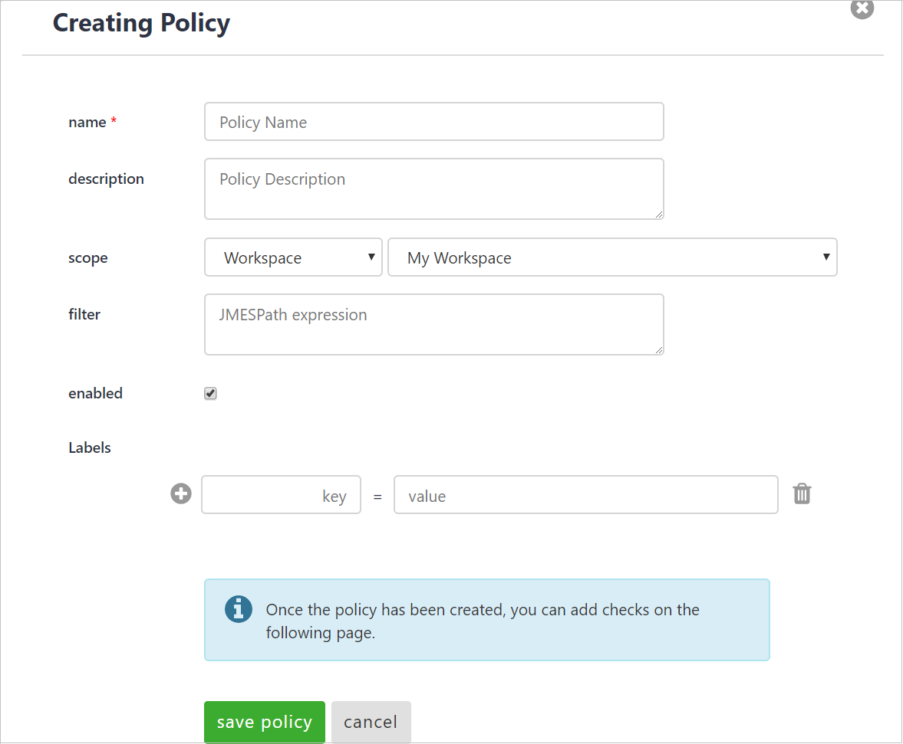
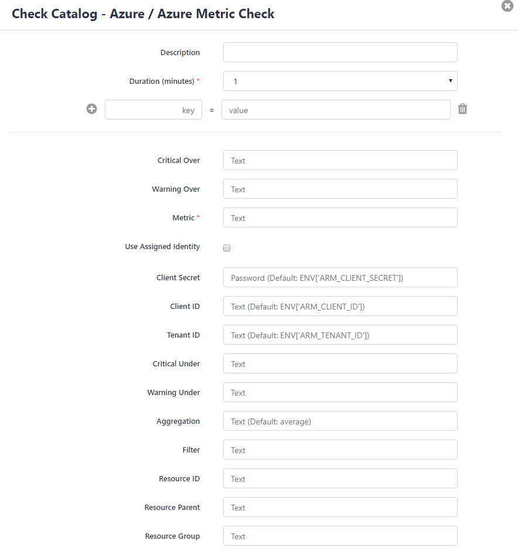

{{{
  "title": "Microsoft Azure Checks",
  "date": "03-20-2019",
  "author": "Mindy Daugherty",
  "attachments": [],
  "related-products" : [],
  "contentIsHTML": false,
  "sticky": true
}}}

### Overview
Cloud Application Manager Monitoring features Microsoft Azure checks.  These checks will provide base-level infrastructure metrics and logs for Azure services.

#### Navigation 

Left Navigation:  

The Policies tab provides a list of available policies as well as checks currently setup for your organization.

Adding a New Policy:
To create a new policy, click the **New** button on the top left side of the screen and follow the prompts to complete the **Creating Policy** screen. You will be required to enter a name for the policy as well as entering a description, define the Scope and Workspace, include any filters, and add any additional labels. You will also have the option to enable the policy now or unselect and enable at a later time. Click **Save Policy**.

Once you have saved the policy, you will now be able to edit the policy and add a check. Click **Add** on the top right corner to continue on to select the check from the Check Catalog.

SCREENSHOT - AzureMetricCheckConfig

On the Check Catalog screen, select the catalog from left-hand side menu then select the check or metric from the associated list to be added to the new policy. 

 To add a specific metric check for Azure, select **Azure Metric Check** and follow the prompts to configure the check. You will be required to create a name for the Metric and select the interval and occurences for the check as well a description, labels, Resource ID, Critical Over, Warning Over

Log into the Azure portal (portal.azure.com) and go to All Resources.

Then select the type you want to work in.

Then you will need to go to Properties in the Azure portal and copy the resource ID.

Copy the resource ID and paste it in Resource ID in the check catalog.  Post your critical over and warning over as well as your critical and warning under.
