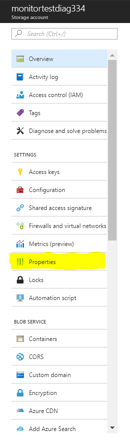

{{{
  "title": "Microsoft Azure Checks",
  "date": "03-07-2018",
  "author": "Jason Oldham",
  "attachments": [],
  "related-products" : [],
  "contentIsHTML": false,
  "sticky": true
}}}

### Overview
Cloud Application Manager Monitoring now allows for Microsoft Azure checks.  These checks will provide base-level infrastructure metrics and logs for Azure services.

#### Navigation 

Left Navigation:  
The checks live on the Policies tab (Check Catalog) in the Cloud Application Management Monitoring site.

Adding a New Policy:
To create a new policy, you need to click the “New” button in the upper left-hand side.  After clicking the new button, a new pop-up appears where you can name and describe your policy.

From there you will be able to set up the metric or status checks you want to see.  You can also set up the servers you want to associate the checks with as well.

To add a metric check you will access the check catalog and select the category you want.  Once a category is selected a list of check types will be shown on the right-hand side. 

 To add a spcific check for Azure, you need to click on Azure Metric Check and configure it

Log into the Azure portal (portal.azure.com) and go to All Resources.

Then select the type you want to work in.

Then you will need to go to Properties in the Azure portal and copy the resource ID.

Copy the resource ID and paste it in Resource ID in the check catalog.  Post your critical over and warning over as well as your critical and warning under.
