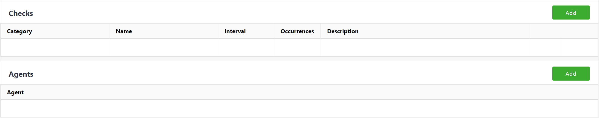

{{{
  "title": "Cloud Application Management Monitoring - Policies",
  "date": "01-31-2018",
  "author": "Jason Oldham",
  "attachments": [],
  "related-products" : [],
  "contentIsHTML": false,
  "sticky": true
}}}

### Overview
Policies are a collection of checks that can be configured and applied to one or more agents.  This tab will show a list of all policies that the customer has set up.  Each policy will show the name, the description the customer gave, as well as how many checks are configured for the policy.

#### Navigation 

Left Navigation:  
When a user navigates to the Cloud Application Manager Monitoring site they will see an Policies tab on the left-hand side.

Adding a New Policy:
To create a new policy, you need to click the “New” button in the upper left-hand side.  After clicking the new button, a new pop-up appears where you can name and describe your policy.

From there you will be able to set up the metric or status checks you want to see.  You can also set up the servers (**Agents**) you want to associate the checks with as well.

To add a metric check you will access the check catalog and select the category you want.

Once a category is selected a list of check types will be shown on the right-hand side.  

