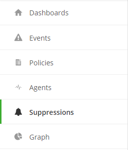
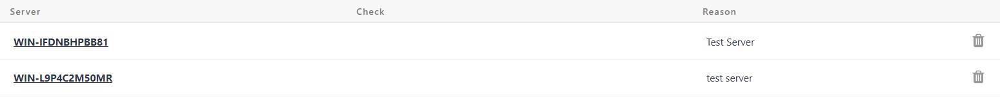
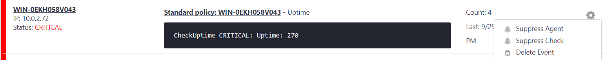
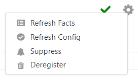
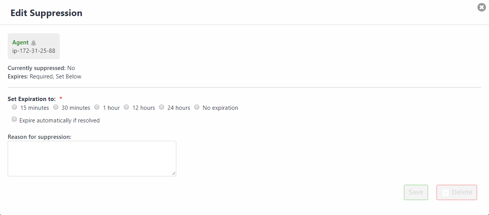

{{{
  "title": "Cloud Application Management Monitoring - Suppressions",
  "date": "01-31-2018",
  "author": "Jason Oldham",
  "attachments": [],
  "related-products" : [],
  "contentIsHTML": false,
  "sticky": true
}}}

### Overview
A suppression silences events by not forwarding alerts to the alert aggregation tool for a specified amount of time.

#### Features
* View configured suppressions for specific checks or agents
* Ability to edit or delete suppressions for specific checks or agents

##### View configured suppressesions:                                     
When a user navigates to the Cloud Application Manager Monitoring site they will see a Suppressions tab on the left-hand side.

Selecting Suppressions from the left side nave will update the page with configured Suppressions.  The server, the check type, and the reason for suppression will be presented.  Selecting a suppression from this view will open the agent details page for the agent that has the suppression configured.

##### Suppressing an event:                           
For a given check alert (event), a suppression can be configured.  Select the gear icon on the right side of the event detail and select **"Suppress Check"** to suppress future occurences of alerts for this check.  If desired, the entire agent may be suppressed by selecting **"Suppress Agent"**.  Suppressing the agent will suppress all future checks' alerts for the agent.

##### Suppressing an Agent:
Agents are displayed within the Agents modal by selecting **Agents** from the left side navigation bar.  Selecting an agent from the list will display the agent's details.  Select the gear icon on the right side of the agent detail and select **"Suppress"** to suppress future occurences of all alerts for this agent.  

Selecting Suppress Agent or Suppress Check will cause a configuration modal to be opened.  The suppression can be configured with the length of time to suppress and will offer a "Reason for suppression" as well.

