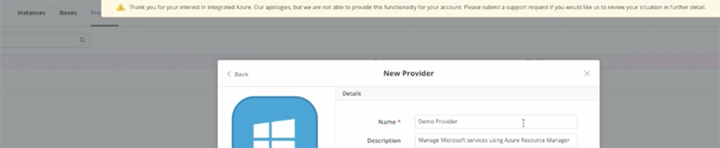
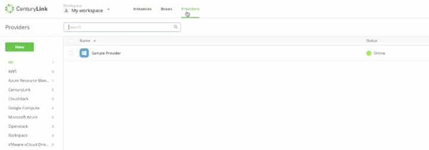
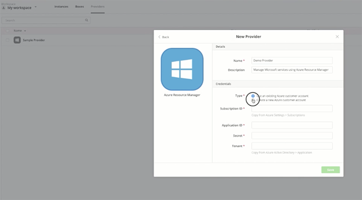

{{{
"title": "Error When Creating a Provider Outside Territory",
"date": "02-20-2017",
"author": "Ben Swoboda",
"attachments": [],
"contentIsHTML": false
}}}

<iframe width="560" height="315" src="https://player.vimeo.com/video/204243434" frameborder="0" allowfullscreen></iframe>

### Introduction

CenturyLink Cloud is limited by contract with Microsoft to sell Azure only to specific countries. This tutorial demonstrates the alert message that will display if the CenturyLink Cloud billing address linked to an admin account is outside the territory permitted by Microsoft.

### Billing Address Must Match Territory

The following error will appear if the CenturyLink Cloud billing address associated with the user and account alias is outside the territory allowed by our contract with Microsoft.

Here's how you might arrive at this error message. After you log into [Cloud Application Manager](https://www.ctl.io/cloud-application-manager), click the **Provider** tab on the top toolbar.

Then click **New Provider** on the left navigation bar.

Select **Microsoft Azure** to build a customer account in the current Microsoft Azure. Note: this is the new Azure, not the classic Azure. The dialog box that appears will enable you to create a new Azure customer account. Add a name for the account and select the **Create a new Azure Subscription** option.

### The Exception Message

If the CenturyLink Cloud billing address associated with the user and alias is outside the territory given to us by Microsoft, you will see this error message letting you know we are not permitted to offer the product to you.

"Thank you for your interest in Integrated Azure. Our apologies, but we are not able to provide that functionality for your account. Please submit a support request if you would like us to review your situation in further detail."

If you send us a ticket we will review your case.

### Contacting Cloud Application Manager Support

We’re sorry you’re having an issue in [Cloud Application Manager](https://www.ctl.io/cloud-application-manager/). Please review the [troubleshooting tips](troubleshooting-tips.md), or contact [Cloud Application Manager support](mailto:incident@CenturyLink.com) with details and screenshots where possible.

For issues related to API calls, send the request body along with details related to the issue.

In the case of a box error, share the box in the workspace that your organization and Cloud Application Manager can access and attach the logs.
* Linux: SSH and locate the log at /var/log/elasticbox/elasticbox-agent.log
* Windows: RDP into the instance to locate the log at ProgramDataElasticBoxLogselasticbox-agent.log
