{{{ "title": "Binding Examples",
"date": "05-16-2019",
"author": "Guillermo Sánchez",
"attachments": [],
"keywords": ["cloud application manager", "cam", "alm", "bindings", "binding type", "example", "catalog"],
"contentIsHTML": false
}}}

**In this article:**

* [Overview](#overview)
* [Audience](#audience)
* [Prerequisites](#prerequisites)
* [Brief recap on Bindings](#brief-recap-on-bindings)
* [A Simple Example](#a-simple-example)
* [Three Tiers application from Catalog](#three-tiers-application-from-catalog)
* [Contacting Cloud Application Manager Support](#contacting-cloud-application-manager-support)

### Overview

Bindings glue together different parts of a multi-tier application over the network. These components can be parts of an application stack, a load balancing pool, cluster, and more. Bindings enable services to auto-discover and connect dynamically at scale. They also reconfigure the instances that need it to keep their configuration up to date.

### Audience

Cloud Application Manager Users using Application Lifecycle Management (ALM) features.

### Prerequisites

* Access to [Applications site](https://cam.ctl.io/#/dashboard) (Application Lifecycle Management module) of Cloud Application Manager as an authorized user of an active Cloud Application Manager account.

* A provider already configured in Cloud Application Manager. See [providers](../Core Concepts/providers.md).

### Brief recap on Bindings

Bindings are [variables](../../Cloud Application Manager/Automating Deployments/parameterizing-boxes-with-variables.md) that you can add to boxes. They represent a connection from the deployed box to other instances. The detail explanation of Bindings can be found at this [knowledge article](../../Cloud Application Manager/Automating Deployments/managing-multi-tier-applications-with-bindings.md).

### A Simple Example

The easiest way to understanding the function of Bindings is to put them to use.  This portion of the article will use Binding to establish a simple client server relation between to instances.  This article walks through setting up a pair NFS server and client boxes with Bindings.

#### Creating the NFS Server script box

  Create the NFS server box in your workspace
  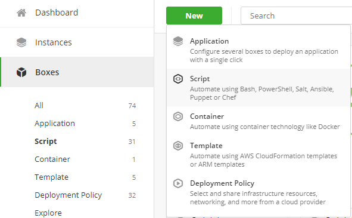

  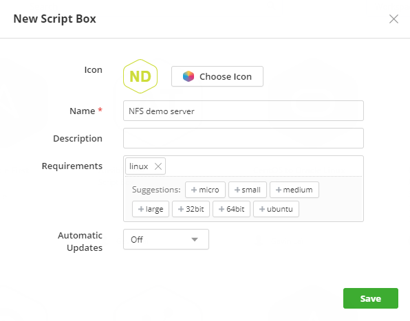

  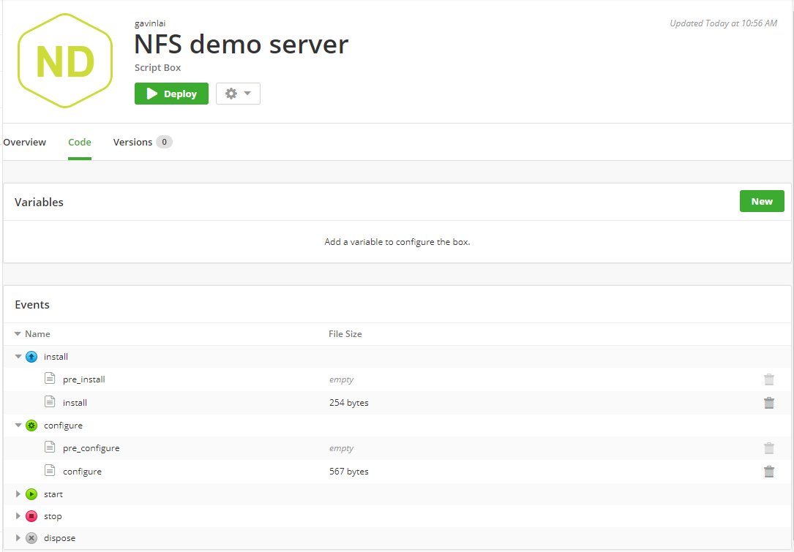

  ##### Install script

  ```
  #!/bin/bash -e
  if [[ -e /etc/redhat-release || -e /etc/system-release ]]; then
    yum -y install nfs-utils nfs-utils-lib
    else
    export DEBIAN_FRONTEND=noninteractive
    apt-get update
    apt-get -y install nfs-kernel-server
  fi
  ```

  ##### Configure script

  ```
  #!/bin/bash -e
  mkdir -p {{ EXPORT_DIRECTORY }}
  echo {{ netmask.private }}
  # Configure etc/hosts
  sed  -i '/# BEGIN NFS CONFIGURATION/,/# END NFS CONFIGURATION/d' /etc/exports
  cat >> /etc/exports << \
  EXPORTS_CONFIG
  # BEGIN NFS CONFIGURATION
  {{ EXPORT_DIRECTORY }}  {{ EXPORT_HOST }}(rw,sync,no_root_squash,no_subtree_check)
  # END NFS CONFIGURATION
  EXPORTS_CONFIG
  if [[ -e /etc/redhat-release || -e /etc/system-release ]]
  then
    service rpcbind start
    service nfs start
  else
    service nfs-kernel-server restart
  fi
  echo "NFS Test OK" > /data/export2/NFS_test
  ```

  Add two varibales to the NFS server box (screenshots below). EXPORT_HOST for the network of the NFS clients and EXPORT_DIRECTORY is the directory of the file share.

  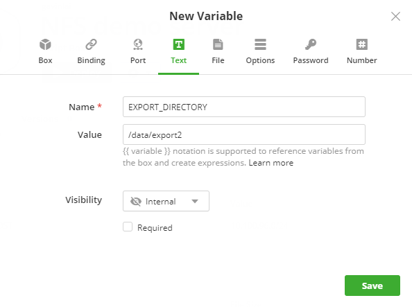

  

 #### NFS client box

  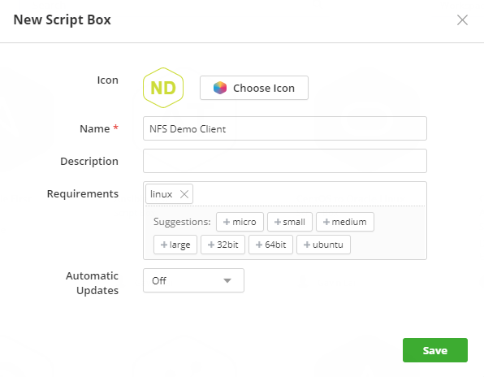
  Use the script below for install script:

  ```
  if [[ -e /etc/redhat-release || -e /etc/system-release ]]; then
    yum update -y
    yum -y install nfs-utils nfs-utils-lib
  else
    export DEBIAN_FRONTEND=noninteractive
    apt-get -y install nfs-kernel-server
  fi
  ```

  The configure script is as follow:

  ```
  #!/bin/bash
  
  if mount | grep {{ LOCAL_PATH }} > /dev/null; then
    echo "Folder already mounted"
  else
    mkdir -p {{ LOCAL_PATH }}
    mount {{ server.address.private }}:{{ server.EXPORT_DIRECTORY }} {{ LOCAL_PATH }}
  fi
  
  exit 0;
  ```

  Configure two new variables for this box, one is LOCAL_PATH for the mount point of the NFS client and the other one is the Binding variable.

  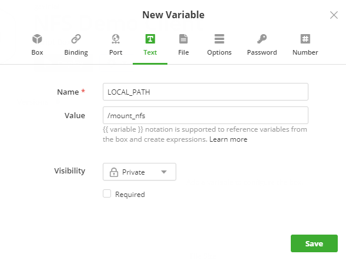

  

  #### Application Box with NFS server and client

  Once the two script boxes are created, creation of the an application box would be the next step.
  To create an application box, click on "New" -> "Application Box", Enter "NFS Demo"
  Edit the newly created Application Box in Code section of the portal, Click on "New" and type "NFS demo" in the search window

  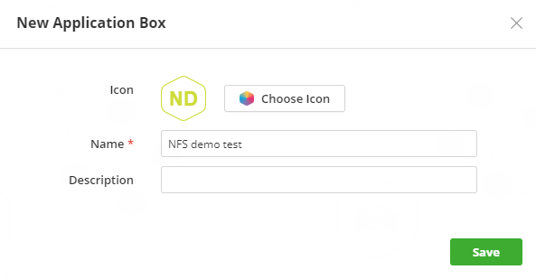
  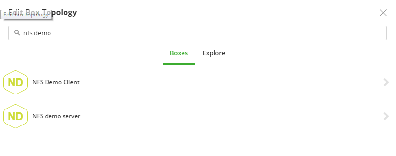

  Click on "NFS Demo Server" and add "nfsserver" tag to the box

  

  Tagging bindings allow services to discover each other automatically. At deploy time, for the bindings defined in the boxes, we need to apply tags of instances to which they can bind. In this example, we ask the NFS client to bind to instances tagged as nfsserver.
  Repeat the process to add the "NFS Demo Client", on the Edit Box Topology, there should be a suggestion to the nfsserver binding.  Select 'nfsserver' and "Save".
  On the Topology page of the Application Box, you should be able to see the connectivity between the two boxes.

  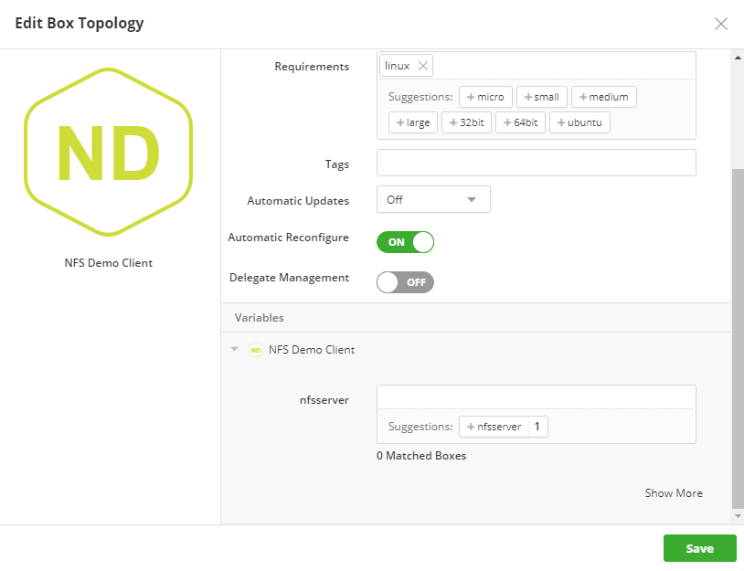

  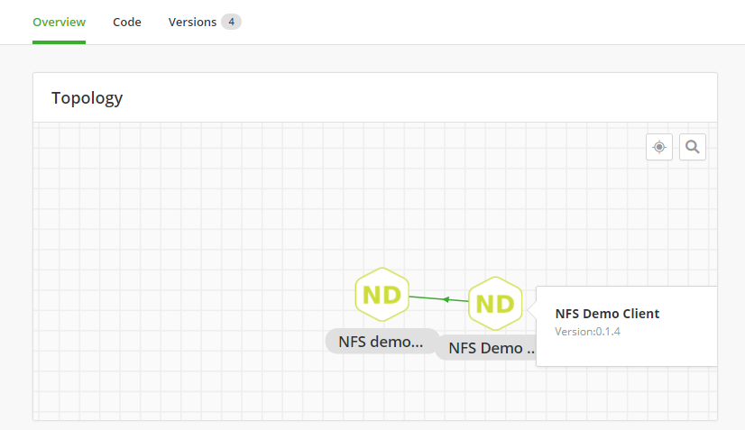

#### Use of Parameters in Binding

  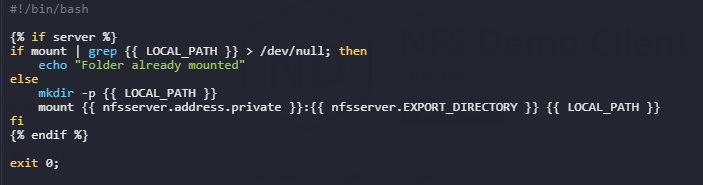

  From the configure script, the nfsserver.address.private and nfsserver.EXPORT_DIRECTORY are passed from the nfsserver box to nfsclient box.
  This is a simple example and this can be used in a more complex environment, like the JBoss example that will be covered in the next section.

### Three Tiers application from Catalog

  The next example is from [Cloud Application Manager Catalog](//cam.ctl.io/#/catalog), it is the JBoss Sample Application.  In this example, Binding tags are being used extensively.  To recap the concept of Binding Tags, there are couple of ways of utilizing them in a complex environment:
    - Dynamic bindings: Tagged bindings discover instance connectivity dynamically. They serve as an auto-discovery mechanism where instances with binding tags can automatically connect to other instances that match those tags.
    - One to many bindings: Bindings can connect one or many services together, again, using tags.

This example is consisted of 6 script boxes to create a redundant three tiers JBoss application environment.  The environment has a pair of MySQL servers in the backend, a pair of JBoss Application server and two load balancers in the DMZ.  

  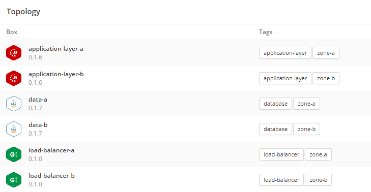

  In order to archieve redundancy, two tags are created for this environment, zone-a and zone-b.  The zones are labelled to utilize cloud providers’ multi-zones ability, like Availability Zones in AWS and Azure.  When the script box is tag with zone-a, only [deployment policy with zone-a](//www.ctl.io/knowledge-base/cloud-application-manager/automating-deployments/application-box/#creating-application-boxes) claim would be utilized to create an instance in zone a.  
  Services connect to each other using binding tags during deployment.  In this example, the Nginx load balancers are connected to the JBoss application servers as below:

  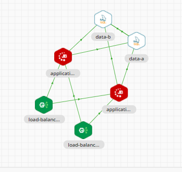

The application servers are tagged with application-layer tags, which the load balancers are connecting to regardless of the location of zones (see below):

  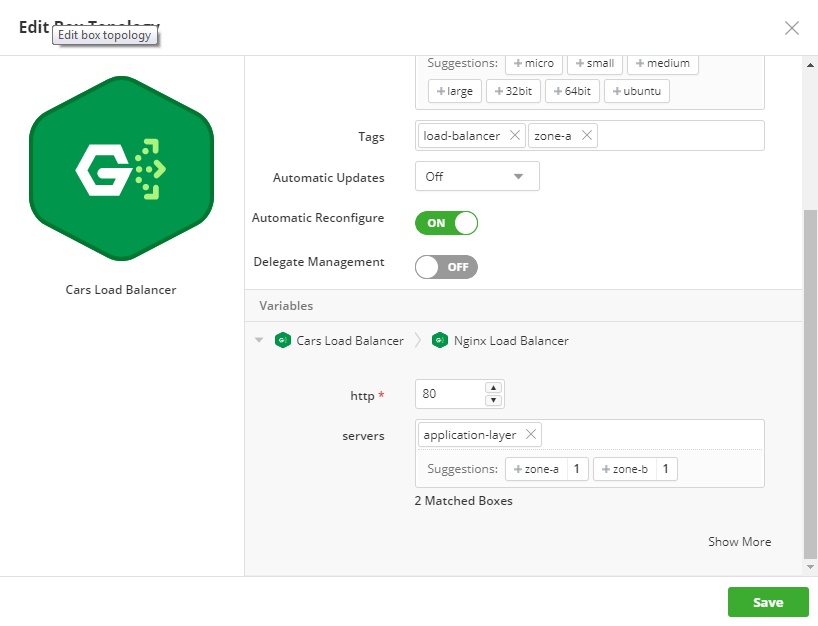

The similar steps are needed for the JBoss servers to bind to the database servers:

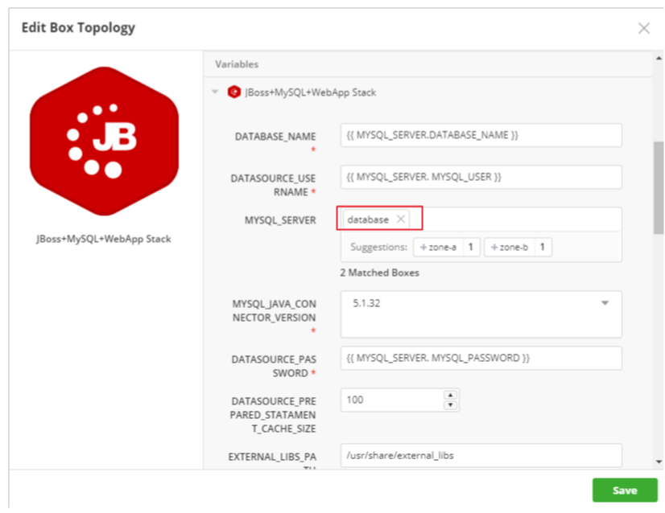

As the diagram above shows that the application servers are binding to the database to create the three tiers application.  Also this allows the application servers utilize the parameters within the binding environment, from load balancer box or database box.  To learn more on the details with application boxes, please refer to [this](../../Cloud Application Manager/Automating Deployments/managing-multi-tier-applications-with-bindings.md).  
The JBoss Application Boxes is available at [here](//cam.ctl.io/#/catalog), give it a try to experience the flexibility of Binding in Cloud Application Manger.  

### Contacting Cloud Application Manager Support

We’re sorry you’re having an issue in [Cloud Application Manager](//www.ctl.io/cloud-application-manager/). Please review the [troubleshooting tips](../Troubleshooting/troubleshooting-tips.md), or contact [Cloud Application Manager support](mailto:incident@CenturyLink.com) with details and screenshots where possible.

For issues related to API calls, send the request body along with details related to the issue.

In the case of a box error, share the box in the workspace that your organization and Cloud Application Manager can access and attach the logs.

* Linux: SSH and locate the log at /var/log/elasticbox/elasticbox-agent.log
* Windows: RDP into the instance to locate the log at ProgramDataElasticBoxLogselasticbox-agent.log
