{{{
"title": "Jenkins CI/CD Tutorial",
"date": "09-01-2016",
"author": "",
"attachments": [],
"contentIsHTML": false
}}}

### Jenkins CI/CD Tutorial

This tutorial is for you if you use Jenkins to automate software test and deployment workflows. It demonstrates how to use the [Cloud Application Manager Jenkins Plugin](https://wiki.jenkins-ci.org/display/JENKINS/ElasticBox+CI) to automate an entire end-to-end deployment. Here we use the plugin to automatically trigger Jenkins based on a code checkin in GitHub to deploy a LAMP Stack app in a test environment.

The LAMP Stack app is defined in Cloud Application Manager as a box that you can predictably deploy not just in testing, but also in staging and production environments the same way.

It takes 90 minutes to go through this tutorial. By the end, you’d know how to use the plugin to integrate with your own Jenkins setup and automate deployments painlessly.

**In this article:**
* Before you begin
* Create a Jenkins build job
* Trigger a CI/CD build

### Before You Begin

You need the following:
* Get an Cloud Application Manager account.
* Fork a repository of this [GitHub project](https://github.com/ElasticBox/Easy-PHP-MySQL). You’ll use this to make some code changes and trigger a Jenkins build.
* Build a [LAMP Stack box with a binding to a MySQL Database box](./lamp-stack-tutorial.md). Create and save a deployment profile for both boxes, but don’t deploy.
* Install Jenkins server and [set it up](../Integrating with Jenkins/jenkins-cloud-application-manager-setup.md).
* Define a slave box configuration in Cloud Application Manager and [configure Jenkins to build using the slave](../Integrating with Jenkins/jenkins-cloud-application-manager-slaves.md).

___

### Create a Jenkins Build Job
Now that you’ve installed Jenkins server and registered your Cloud Application Manager account there, you’re ready to create a job that automates a test build.

**Step 1. Create a new job based on an existing template.**

When you install Jenkins server you get a pull-request job template. Create a new project called test-pullrequest and copy the template.

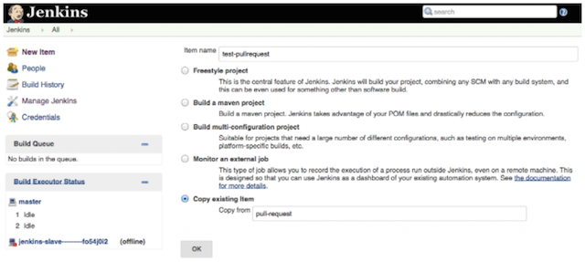

**Step 2. Select a slave from Cloud Application Manager to run the job.**

In the build job, select Restrict where this project can be run. Type the label for the slave box you added when [setting up Jenkins server](../Integrating with Jenkins/setting-up-ci-cd.md).


**Step 3. Automate pull request triggers.**

Since we’re using GitHub to submit code changes via pull requests, we’ll manage the lifecycle of pull requests through the Cloud Application Manager Jenkins plugin. Under Build Triggers, check **Cloud Application Manager GitHub Pull Request Lifecycle Management**.

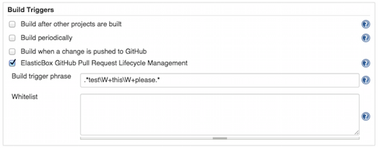

This setting triggers the job to build when you create a new pull request or update it. When you close the pull request, it triggers the job to delete the instances associated with the pull request saving compute resources in the process.

**Step 4 (optional). Add Shell commands to run unit tests.**

Under Build > Add build step, click **Execute shell**. Enter Bash Shell commands to run any unit tests on your pull request.


**Step 5. Deploy the MySQL Database Service box.**

Under Build > Add build step, click **Cloud Application Manager - Deploy Box**. Select the MySQL Database Service box from your workspace. To select the [deployment profile](../Deploying Anywhere/deploying-managing-instances.md) here, you have to create it for the box in your workspace first.

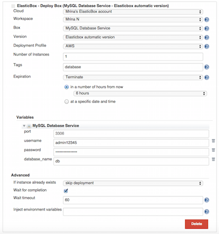

* Make sure you select **Cloud Application Manager Automatic Version** as this is a default box.
* Tag the instance with a unique label to identify it in the pull request.
* Set the instance to terminate 6 hours from when it launches.
* Under **Variables**, enter a username, password for the database. Without these values, the plugin can’t deploy the MySQL Database Service.
* Under Advanced, select **skip deployment** for **If instance already exists**. This avoids deploying a new MySQL Database Service if you’re only changing an existing pull request.

**Step 6. Deploy the LAMP Stack box.**

This step deploys the LAMP Stack application box and binds to the MySQL Database Service instance defined in the step above. This is how you deploy multi-tier applications from a single job.

Under Build > Add build step, click **Cloud Application Manager - Deploy Box**. As before, select your Cloud Application Manager account registered in Jenkins, your workspace where the LAMP Stack box is located, the LAMP Stack box, a version, and a deployment profile to launch it.

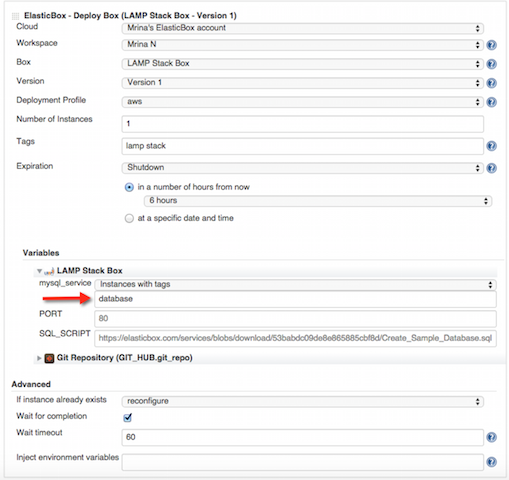

* Schedule a time to terminate the instance under Expiration.
* Under Variables, bind to the mysql\_service box by providing its tag as shown.
* Click **Advanced**. Under If instance already exists, choose reconfigure. This updates the LAMP Stack instance with the latest pull request changes without deploying again.

**Step 7 (optional). Add Shell commands to test the app.**

This step optionally runs any shell commands you give to test the LAMP Stack application.


**Step 8. Enter your own GitHub project URL in the job.**

Enter your own forked URL of the [GitHub project](https://github.com/ElasticBox/Easy-PHP-MySQL) in these fields: **GitHub project**, **Git Repositories**, and **CLONE\_URL**.

Here’s an example:

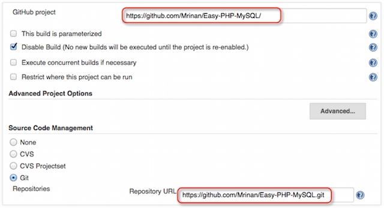

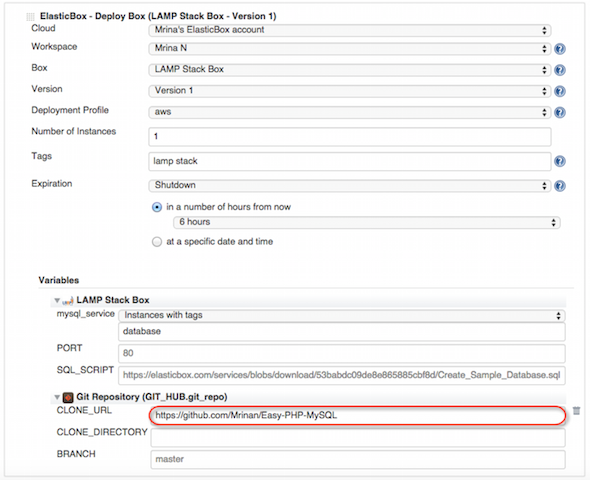

**Step 9. Enable build, save job, and verify.**

You’re almost done. Remember we copied this job from the template that’s disabled? To enable, deselect **Disable Build**.


Save the job. Verify that it’s configured properly by checking the logs. Under Manage Jenkins > System Log, Jenkins should show something like this:

```
Feb 04, 2015 1:58:03 AM INFO com.elasticbox.jenkins.triggers.github.PullRequestBuildHandler
Adding webhook http://107.178.218.51:8080/elasticbox/ to GitHub repository https://github.com/Mrinan/Easy-PHP-MySQL/
Feb 04, 2015 1:58:03 AM INFO com.elasticbox.jenkins.triggers.github.PullRequestBuildHandler createWebHook
Webhook http://107.178.218.51:8080/elasticbox/ is added to GitHub repository https://github.com/Mrinan/Easy-PHP-MySQL/
```

___

### Trigger a CI/CD Build

The test-pullrequest job is now all set to build, test, and deploy any pull request you submit to your forked [GitHub project](https://github.com/ElasticBox/Easy-PHP-MySQL).

**Step 1. Submit a pull request.**

To do this, install GitHub for your desktop. Create a new branch based on your forked repo master and commit a change to index.php in this line:

```
print "<HTML><BODY><H1>Showing the users of the sampledb that has been created in the RDS some seconds ago!</H1>\n";
```

Make sure you compare the pull request against your own master branch as seen here.


Go ahead, submit a pull request from your forked repo as shown.

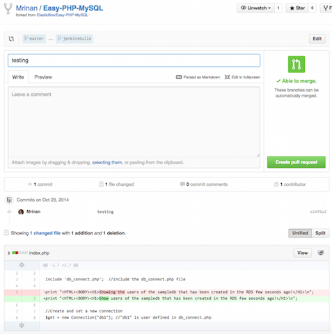

Soon as you create the request, you should see a build trigger automatically.


**Step 2. Check your workspace for deployed instances.**

Do you see the slave, LAMP Stack, and database instances online?

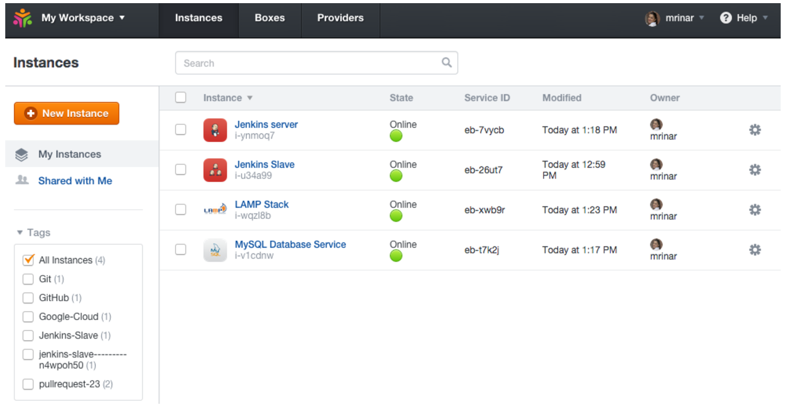

Click the LAMP Stack instance to verify that your pull request changes are there.

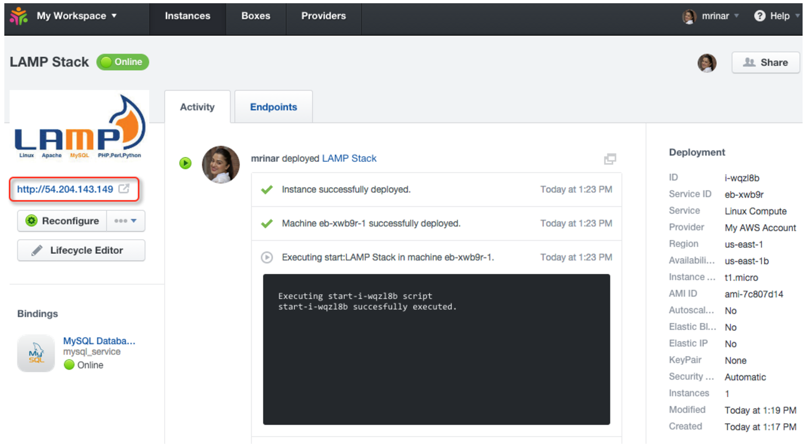

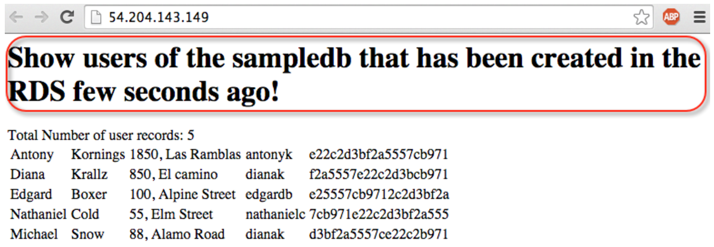

**Step 3. Check Jenkins build log.**

In Jenkins, look for the build job log at **http://<your Jenkins host>/job/test-pullrequest/lastBuild/console**. See that the build ran successfully for this specific job.

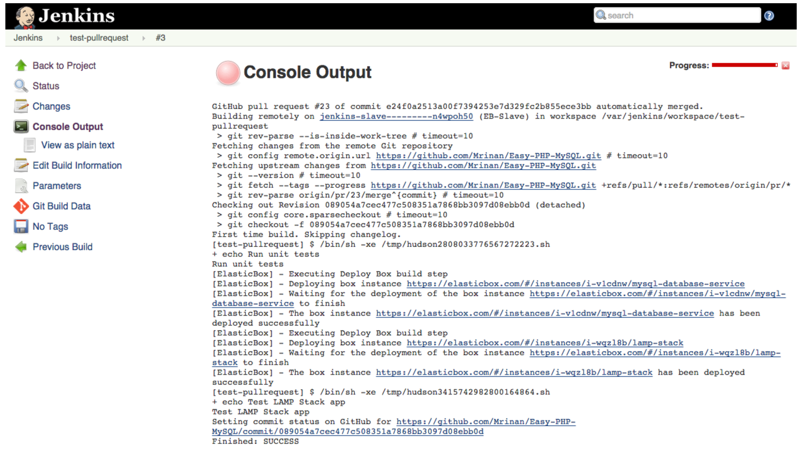

**Step 4. You’re ready to merge.**

When the build finishes, a message is automatically posted to your GitHub request. Since you’ve verified changes in the test instance, you can now merge them through another build job in Jenkins.

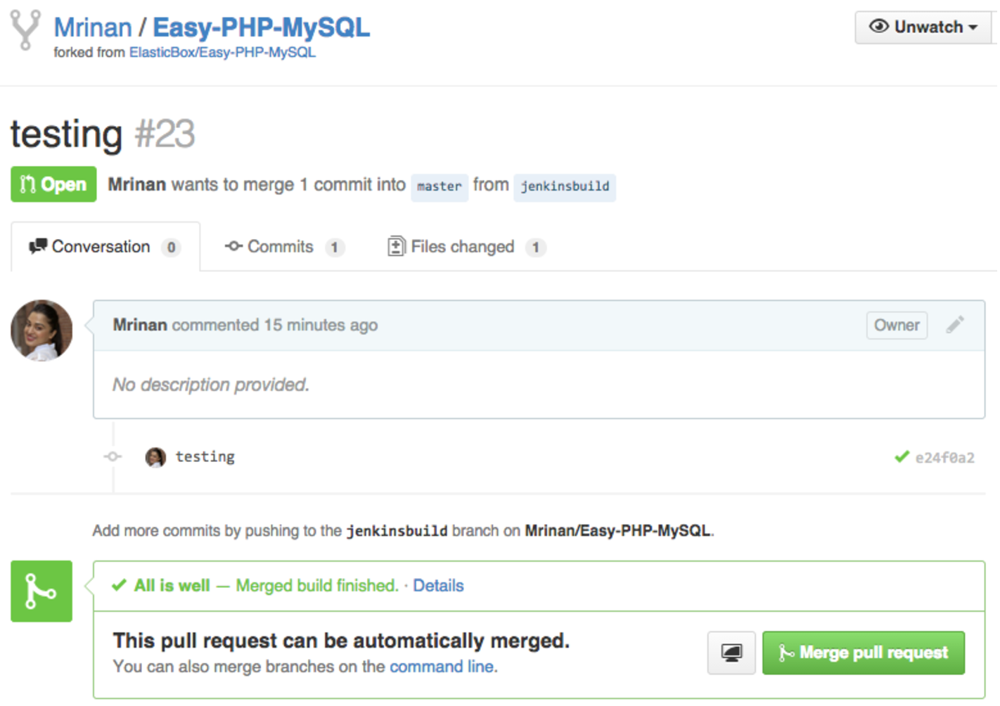

See how easy that was to automate a test build for code you checked in? If you want to take it a step further, set up a merge job using the merge job template to automatically deploy changes to staging, and then to production.

### Contacting Cloud Application Manager Support

We’re sorry you’re having an issue in [Cloud Application Manager](https://www.ctl.io/cloud-application-manager/). Please review the [troubleshooting tips](../Troubleshooting/troubleshooting-tips.md), or contact [Cloud Application Manager support](mailto:incident@CenturyLink.com) with details and screenshots where possible.

For issues related to API calls, send the request body along with details related to the issue.

In the case of a box error, share the box in the workspace that your organization and Cloud Application Manager can access and attach the logs.
* Linux: SSH and locate the log at /var/log/elasticbox/elasticbox-agent.log
* Windows: RDP into the instance to locate the log at ProgramDataElasticBoxLogselasticbox-agent.log
