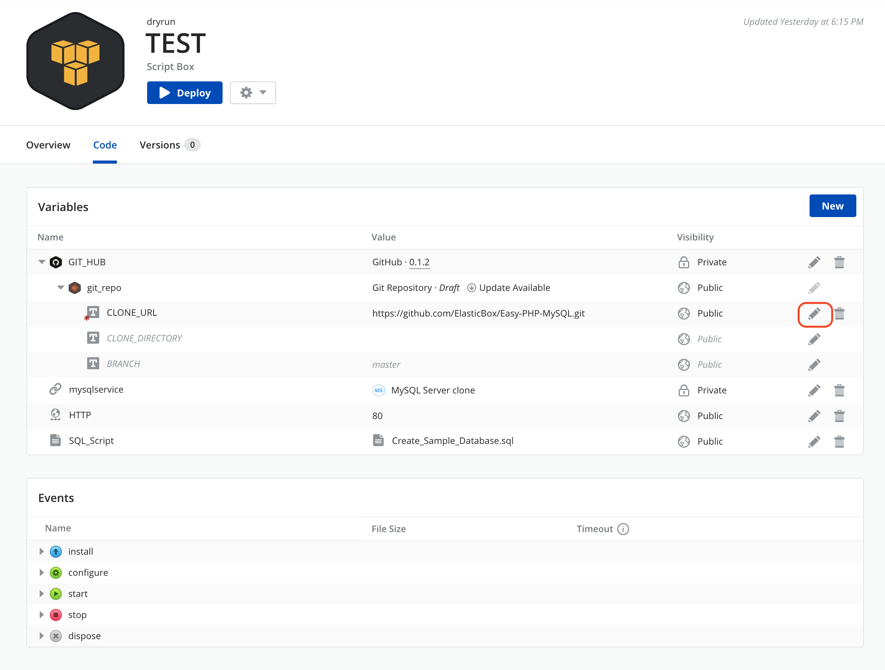

{{{
"title": "LAMP Stack Tutorial",
"date": "09-09-2019",
"author": "Modified by Arya Roudi, Gavin Lai",
"keywords": ["cam", "cloud application manager", "LAMP deploy", "Tutorial", "MySQL deploy", "PHP Deploy", "AWS", "clouds"],
"attachments": [],
"sticky": true,
"contentIsHTML": false
}}}

**In this article:**

* [Overview](#overview)
* [Prerequisites](#prerequisites)
* [Define the LAMP Stack Database Tier](#define-the-lamp-stack-database-tier)
* [Define the Deployment Policy for the LAMP Script Box](#define-the-deployment-policy-for-the-lamp-script-box)
* [Define the LAMP Stack App Tier](#define-the-lamp-stack-app-tier)
* [Deploy the LAMP Stack App](#deploy-the-lamp-stack-app)
* [Define the database configuration](#define-the-database-configuration)
* [Launch the App Tier](#launch-the-app-tier)
* [Contacting Cloud Application Manager Support](#contacting-cloud-application-manager-support)

### Overview

In this tutorial, you configure and deploy a simple Apache, PHP, MySQL two-tier LAMP Stack app. You configure the app and database tiers separately and connect them with a binding.
The entire quick start takes 30 minutes or less to complete. By the end, you’ll be well on your way to define and deploy multi-tier applications in Cloud Application Manager.

### Prerequisites

* Sign in to Cloud Application Manager.
* Optionally, get a feel for building a basic [Hello World box](../Getting Started/getting-started-with-hello-world.md).
* [Register an AWS cloud account](../Deploying Anywhere/using-your-aws-account.md) as a provider in Cloud Application Manager.

___

### Define the LAMP Stack Database Tier

#### Define Policy for MySQL

In order to make the database available on the apache server we will need to setup the policy configuration. In this tutorial we would put all the instances on the same VPC.

Go to the **Boxes** page, you can find it in the left menu. Now click on the **New** to create a new box, choose the **Deployment Policy** from the menu then **CloudFormation** then choose the **Provider** from the provider menu and save it.


After saving, it will take you to the created deployment policy page. Click on code tab, then on the pencil icon of the details section to edit it and choose the region as: *eu-west-1*. Click **Save** when finished


### Define the Deployment Policy for the LAMP Script Box

If you have already [registered an AWS account](../Deploying Anywhere/using-your-aws-account.md) you should have three policy boxes on **Boxes** menu: default-large-us-east-1, default-medium-us-east-1 and default-small-us-east-1.

Click on the _default-small-us-east-1_ tools dropdown menu (gear icon)  and click on **Clone Box**.


On the pop-up define the new Box name as 'default-vpc-eu-west-1' and save.

Select the new Box. On **code** tab, edit the policy menu. Define **Region** on Resource, **Network Type** on Placement, and **Security Groups** on Network to have the same values as the mySql box. In this tutorial 'eu-west-1', 'vpc-88082cee' and 'Automatic' security group.


### Define the LAMP Stack App Tier

#### Step 1. Create a LAMP Stack box

On the Boxes page, click **New** > **Script**. Name it LAMP Stack. Since LAMP needs Linux, tag it under Requirements. Save. Optionally, upload a matching icon to easily identify the box in the catalog.


#### Step 2. Indicate a relationship to the database tier with a binding

 In the Code tab, on Variables, click **New**. Select **Binding**. Call it mysqlservice and bind to the MySQL DB box you created earlier.

**Note:** Variable names are case-sensitive, so name exactly as given.

At this stage, you're selecting a box not a real instance for the binding. You'll select the actual instance at deploy time.

Save when done to create the variable.


#### Step 3. Allow traffic to and from the app tier with a port variable

In the Code tab, on Variables, click **New**. Select **Port**. Call it HTTP and give 80 as the value.

Save when done to create the variable.


#### Step 4: Add data for the database using a file variable

Copy, paste the following code in a plain text file. Save it as Create_Sample_Database.sql. Note the .sql extension.

```
CREATE DATABASE sampledb;
USE sampledb;
CREATE TABLE users (first_name VARCHAR(20),  last_name VARCHAR(20), address VARCHAR(20), login VARCHAR(20), password_hash VARCHAR(20));
INSERT INTO users VALUES ('Antony','Kornings','1850, Las Ramblas','antonyk', 'e22c2d3bf2a5557cb971');
INSERT INTO users VALUES ('Diana','Krallz','850, El camino','dianak', 'f2a5557e22c2d3bcb971');
INSERT INTO users VALUES ('Edgard','Boxer','100, Alpine Street','edgardb', 'e25557cb9712c2d3bf2a');
INSERT INTO users VALUES ('Nathaniel','Cold','55, Elm Street','nathanielc', '7cb971e22c2d3bf2a555');
INSERT INTO users VALUES ('Michael','Snow','88, Alamo Road','dianak', 'd3bf2a5557ce22c2b971');
```

In the LAMP box Code tab, on Variables, click **New**. Select **File**. Call it SQL_SCRIPT and upload the file you saved. This file will be pushed to the database at deploy time.


#### Step 5. Nest the default GitHub box to install PHP from GitHub

In the Code tab, under Variables, click **New**. Select **Box**. Call it GIT_HUB and pick the default GitHub box as the value.

Save when done to create the variable.


Now configure the GitHub default box to pull down PHP scripts at deploy time. Expand the GitHub box and the box variable inside called git_repo. In the context of the LAMP Stack box, edit the clone URL variable and set its value as follows:



CLONE_URL: **https://github.com/ElasticBox/Easy-PHP-MySQL.git**


**Step 6. Add events to install the LAMP stack app tier.**

Under Events > install, click **install**.


Copy, paste the following code in the install event dialog, then save.

```
#!/bin/bash
# To ensure that all of your software packages are up to date, perform a quick software update on your instance.
# This process may take a few minutes, but it is important to make sure you have the latest security updates and bug fixes.
# We use the -y option that installs the updates without asking for confirmation.
yum update -y
# Install the Apache web server, MySQL, and PHP software packages.
# We use the yum groupinstall command to install multiple software packages and all related dependencies at the same time.
yum groupinstall -y "Web Server" "MySQL Database" "PHP Support"
# Install the php-mysql package
yum install -y php-mysql
yum install -y mysql-utilities.noarch
yum install -y mysql
# Start the Apache web server
service httpd start
# Configure the Apache web server to start at each system boot
chkconfig httpd on
# This is only to show the configuration for this sample.
# Verify that httpd is on by running:
chkconfig --list httpd
# This should output something similar to the next line, showing httpd is on in runlevels 2, 3, 4, and 5:
# httpd           0:off   1:off   2:on    3:on    4:on    5:on    6:off
# To test your LAMP web server
# Create a simple PHP file in the Apache document root.
echo "" > /var/www/html/phpinfo.php
curl http://127.0.0.1/phpinfo.php
# You should see the PHP information page in the output of the install script
# Delete the phpinfo.php file. Although this can be useful information to you, it should not be broadcast to the Internet for security reasons.
rm /var/www/html/phpinfo.php
```

#### Step 7. Add events that connect the tiers using the binding

Under Events > configure, click **configure**. Copy, paste the following code and save. This puts PHP in the Apache web server’s root directory and triggers the Cloud Application Manager config command within a concatenate command to run the PHP script. This also gets credentials (public IP address, port, username, and password) of the MySQL Database Service through the binding.

```
 #!/bin/bash
# In configuration Script there is available ip, and variables of the bindings we will show them for this sample (public or private address can be used depending on the configuration).
echo {{ mysqlservice.address.private }}
echo {{ mysqlservice.port }}
echo {{ mysqlservice.username }}
echo {{ mysqlservice.password }}
cp Easy-PHP-MySQL/index.php /var/www/html
elasticbox config -i Easy-PHP-MySQL/db_connect.php -o /var/www/html/db_connect.php
```

Under Events > start, click **start**. Copy, paste the following code and save. Here the cURL command connects to the database server using the database credentials from the binding and downloads the file you uploaded in step 4. The script in the file creates a database with sample data.

```
 #!/bin/bash

    # In start script the bindings are ready for use

    curl -ks $SQL_SCRIPT | mysql --host={{ mysqlservice.address.public }} --port={{ mysqlservice.port }} --user={{ mysqlservice.username }} --password={{ mysqlservice.password }}
```

Yay! You just defined a simple LAMP stack application and connected its tiers with a binding.

___

### Deploy the LAMP Stack App

To deploy the app, you need AWS as a provider because we’re using the AWS CloudFormation RDS database service. Here you’ll deploy each tier in the same region on EC2.

**Note:** AWS may charge for the instances you deploy. So after deploying, be sure to shut down the instances from Cloud Application Manager to avoid unnecessary charges.

#### Configure the MySQL catalog box

For this tutorial we will use an Amazon RDS (any MySQL server can be used), as the box is already pre-configured.

On the Catalog page, at the top of the page you can find a search bar, search for MySQL amazon and click on it.


### Define the database configuration

In order to make the database instance available on the apache server we will need to tune the policy configuration. In this tutorial we would put all the instances on the same VPC.

In the **MySQL Catalog** page click on **Deploy** and it opens a modal with a form in it that you need to fill it with the necessary information.

In the **Deployment Policy** field, choose the deployment box related to your AWS provider then go to the variable section at the bottom of the form, specify the **MySqlVpcId** (in this tutorial: 'vpc-88082cee'), then choose **Show More** and now we should fill those fields with the requested information. In this tutorial we will use **sampledb** as database name.


You can also modify the variables later by clicking on the pencil icon on the right side and change the information.


#### Launch the Database Tier

 To define the binding add a **tag**, it will be use later on Lamp instance. Click **Deploy** after entering the data, Click **Deploy** to deploy the instance.


### Launch the App Tier

From the Instances page, click **New** and select the LAMP Stack box. For the deployment policy, select the AWS Policy you created. For the _mysqlservice_ binding, select the tag you define in the instance you previously launched. Also, schedule the instance to terminate an hour after deploying. Click **Deploy** to create an instance of the app tier.


Once deployed, you will have your LAMP stack up and running with two instances in your AWS provider.

### Contacting Cloud Application Manager Support

We’re sorry you’re having an issue in [Cloud Application Manager](https://www.ctl.io/cloud-application-manager/). Please review the [troubleshooting tips](../Troubleshooting/troubleshooting-tips.md), or contact [Cloud Application Manager support](mailto:incident@CenturyLink.com) with details and screenshots where possible.

For issues related to API calls, send the request body along with details related to the issue.

In the case of a box error, share the box in the workspace that your organization and Cloud Application Manager can access and attach the logs.

* Linux: SSH and locate the log at /var/log/elasticbox/elasticbox-agent.log
* Windows: RDP into the instance to locate the log at ProgramDataElasticBoxLogselasticbox-agent.log
