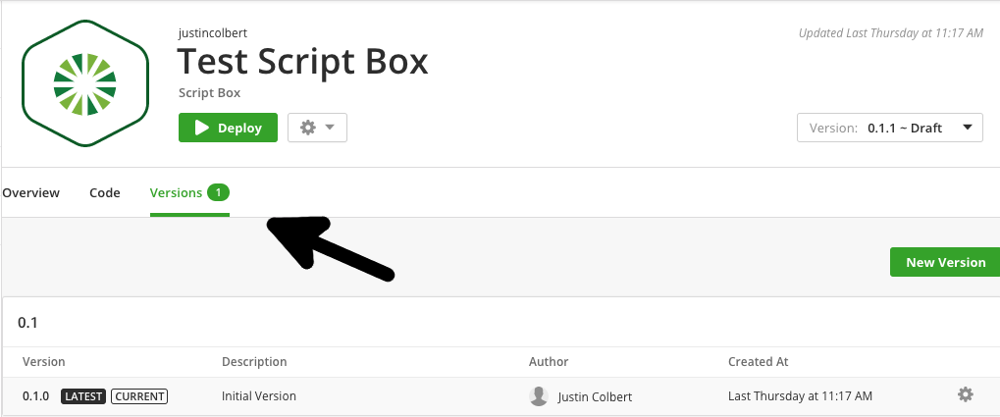
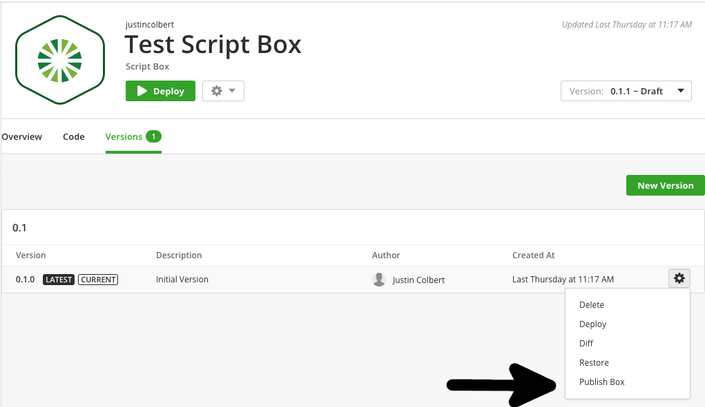
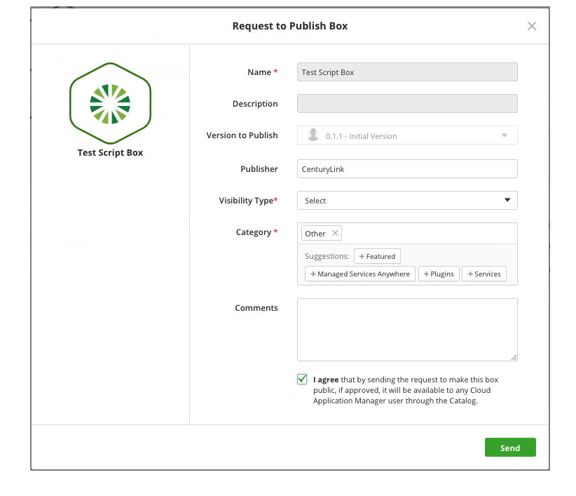

{{{
"title": "Request to Publish Boxes to the Public Catalog",
"date": "12-19-2017",
"author": "Justin Colbert",
"attachments": [],
"contentIsHTML": false
}}}

### Audience

This article is meant to assist users of Cloud Application Manager with getting Application or Script boxes added to the public catalog.

### Requesting a Box be published

Select the box that you would like to publish and go to the versions tab

Click on the gear next to the version of your application that you would like to make public and select "Publish Box"

Fill out the "Request to Publish Box" form. The "Publisher" field should be either your name, your team's name, or your company name. The "Category" field will specify what section of the catalog your box will be displayed under. Add any additional comments that you would like to be submitted to the Cloud Application Manager administrators, check the "I agree" box and hit send.

Once you have hit send, you will receive an email acknowledging that your box has been submitted for review. After your box has been reviewed by the CenturyLink team, you will receive an email notifying you whether your box has been accepted to the public catalog or denied.
